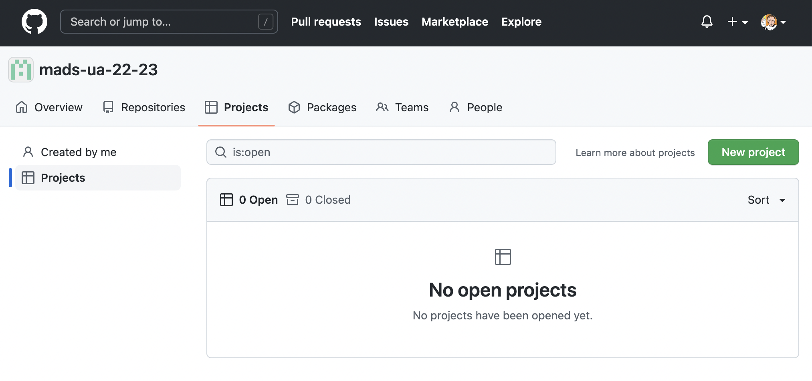
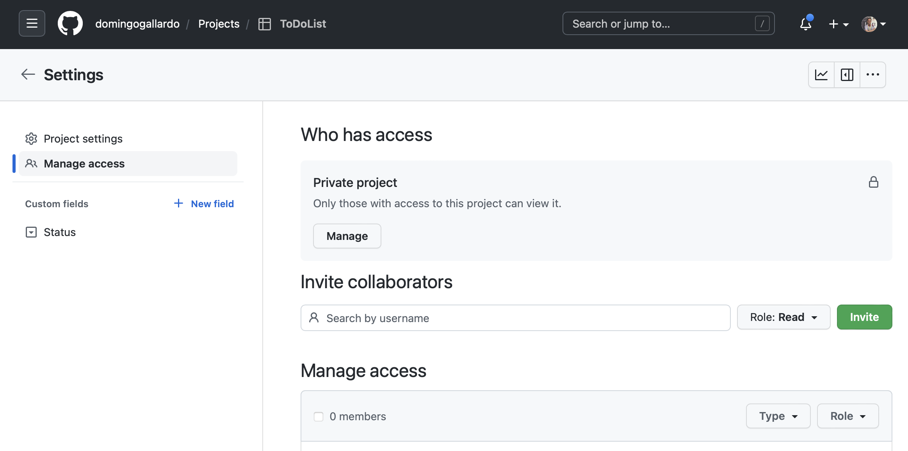
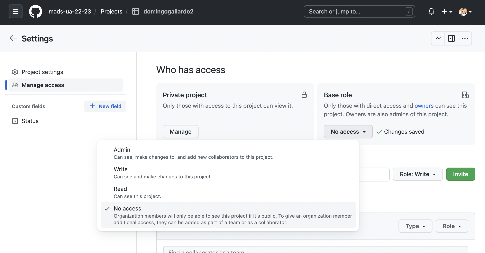
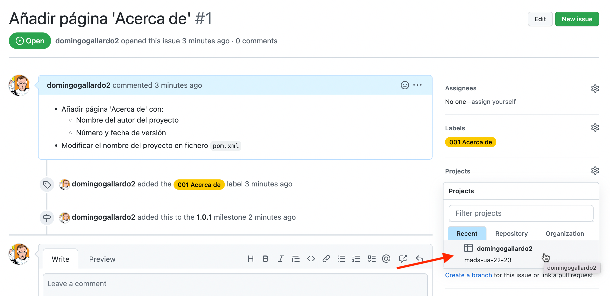
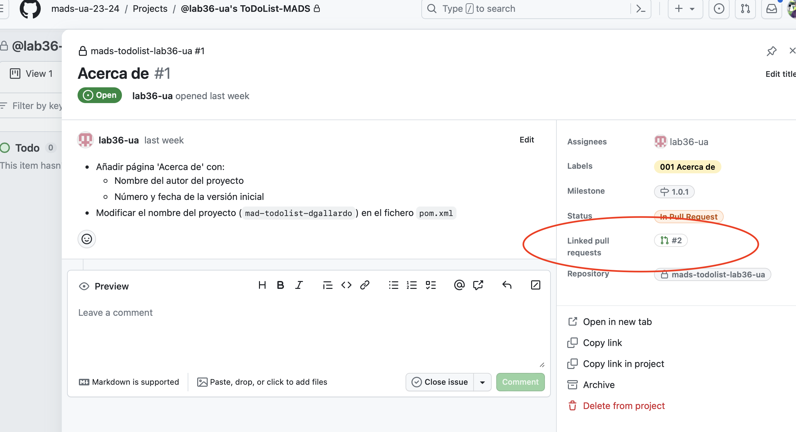

# Práctica 2: Aplicación ToDoList

## 1. Objetivos

En práctica 2 vamos a trabajar sobre la aplicación inicial
[domingogallardo/mads-todolist-inicial](https://github.com/domingogallardo/mads-todolist-inicial).

Esta parte tendrá una duración de cuatro semanas. Deberás realizarla de
forma individual, siguiendo las indicaciones que encontrarás en este
documento. Tendrás que desarrollar código y trabajar en GitHub
desarrollando _issues_, _pull requests_, _releases_ y actualizando los
tableros del proyecto (en Trello y en GitHub).

Al igual que en la práctica 1 usaremos GitHub Classroom para crear un
repositorio individual con el que realizarás la práctica. El proyecto
base será la aplicación inicial
[domingogallardo/mads-todolist-inicial](https://github.com/domingogallardo/mads-todolist-inicial). En
este repositorio se ha seguido una metodología similar a la que vamos
a utilizar en este práctica y puedes examinarlo para ver distintos
elementos:

- [Issues cerrados](https://github.com/domingogallardo/mads-todolist-inicial/issues?q=is%3Aissue+is%3Aclosed)
- [Pull Requests mezclados](https://github.com/domingogallardo/mads-todolist-inicial/pulls?q=is%3Apr+is%3Aclosed)
- [Tablero de issues](https://github.com/domingogallardo/mads-todolist-inicial/projects/1)
- [Tablero Trello de historias de usuario](https://trello.com/b/5zWOT6uO/todolist-inicial)

Debes leer la [introducción a Spring
Boot](../01-intro-spring-boot/intro-spring-boot.md) para entender los
conceptos fundamentales del framework.

## 2. Aplicación inicial ##

La aplicación con la que vamos a trabajar es una típica aplicación
ToDo que sirve para gestionar tareas pendientes. Se pueden registrar y
logear usuarios y los usuarios registrados pueden añadir, modificar y
borrar tareas pendientes de hacer.

A continuación puedes ver dos de las pantallas de la aplicación.

<table>
<tr>
<td></td>
</tr>
<tr>
<td align="center"> Pantalla de login </td>
</table>


<table>
<tr>
<td></td>
</tr>
<tr>
<td align="center"> Pantalla con listado de tareas </td>
</table>

Iremos desarrollando características adicionales de la aplicación a lo
largo de las prácticas. El nombre de la aplicación es **mads-todolist**.


## 3. La aplicación ToDoList ##

La aplicación
[mads-todolist-inicial](https://github.com/domingogallardo/mads-todolist-inicial)
es la versión inicial de la aplicación que se va a desarrollar
durante toda la asignatura.

Es una aplicación bastante más compleja que la vista en la
práctica 1. Entre otros, tiene los siguientes elementos:

- Distintos comandos HTTP: GET, POST, DELETE.
- Recogida de datos en formularios HTML y validación de los datos.
- Base de datos gestionada con JPA (_Java Persisence API_), un ORM (_Object Relational
  Mapping_) implementado por la librería Hibernate. Se utiliza una
  capa de persistencia basada en clases _repository_.
- _Capa de servicio_ que proporciona la **lógica de negocio** a los
  controllers.
- Las _clases controller_ sólo se encargan de hacer de interfaz de la
  capa de servicio: 
    - Recoger datos de la petición HTTP,
    - tratar y validar estas entradas, 
    - llamar a la clase de servicio para que se realice la acción
      requerida, y
    - convertir la respuesta obtenida de la aplicación en una vista
      que se devuelve como respuesta de la petición.
- En las plantillas se incluye _Bootstrap_ y scripts JavaScript.
- Las clases de servicio y de _repository_ se obtienen por inyección
  de dependencias.
- Gran número de tests que prueban la capa de servicios y la de presentación.


Vamos a ver con un poco más de detalle dónde puedes encontrar en el
código todos estos elementos.

### Configuración de la aplicación ###

Los distintos parámetros de la aplicación Spring Boot se configuran un
fichero de propiedades. El fichero de propiedades por defecto es
`application.properties`.

```properties title="src/main/resources/application.properties"
spring.application.name = mads-todolist
spring.datasource.url=jdbc:h2:mem:dev
spring.jpa.properties.hibernate.dialect = org.hibernate.dialect.H2Dialect
spring.jpa.hibernate.ddl-auto=update
logging.level.org.hibernate.SQL=debug
logging.level.madstodolist=debug
spring.sql.init.mode=never
spring.h2.console.enabled=true
spring.h2.console.path=/h2-console

# Activamos el perfil dev
spring.profiles.active=dev

# Deshabilitamos Open EntityManager in View
# https://docs.spring.io/spring-boot/docs/current-SNAPSHOT/reference/html/data.html#data.sql.jpa-and-spring-data.open-entity-manager-in-view
# Ver tambien https://docs.spring.io/spring-framework/docs/current/javadoc-api/org/springframework/orm/hibernate5/support/OpenSessionInViewInterceptor.html
# y https://www.baeldung.com/spring-open-session-in-view
spring.jpa.open-in-view=false
```

Entre otras cosas, se define las características de la fuente de datos
con la que trabaja la aplicación (la base de datos en memoria H2):

- El parámetro `spring.jpa.hibernate.ddl-auto=update` hace que
  Hibernate actualice automáticamente los esquemas de la base de
  datos, construyéndolos a partir de las clases `Entity`. En un
  entorno de producción el valor de esta propiedad deberá ser
  `validate` para no modificar la base de datos de producción.
- El parámetro `spring.profiles.active=dev` define el perfil que se activa por
  defecto al lanzar la aplicación, el perfil de desarrollo (`dev`). En prácticas
  posteriores veremos cómo es útil usar distintos perfiles (por ejemplo,
  desarrollo y producción) para configurar qué bases de datos se van a usar.

Los datos iniciales de la aplicación se cargan mediante el servicio
`InitDbService`. Sólo se cargan si el perfil activo es `dev`.

```java title="src/main/java/madstodolist/service/InitDbService.java"
@Service
// Se ejecuta solo si el perfil activo es 'dev'
@Profile("dev")
public class InitDbService {

    @Autowired
    private UsuarioRepository usuarioRepository;
    @Autowired
    private TareaRepository tareaRepository;

    // Se ejecuta tras crear el contexto de la aplicación
    // para inicializar la base de datos
    @PostConstruct
    public void initDatabase() {
        Usuario usuario = new Usuario("user@ua");
        usuario.setNombre("Usuario Ejemplo");
        usuario.setPassword("123");
        usuarioRepository.save(usuario);

        Tarea tarea1 = new Tarea(usuario, "Lavar coche");
        tareaRepository.save(tarea1);

        Tarea tarea2 = new Tarea(usuario, "Renovar DNI");
        tareaRepository.save(tarea2);
    }

}
```

!!! Note "Base de datos H2 en memoria en desarrollo"
    En esta práctica vamos a trabajar únicamente con la base de datos en
    memoria. Esto significa que los datos que introduzcamos van a estar
    presentes mientras que la aplicación esté funcionando. Cuando matemos
    la aplicación y la volvamos a reiniciar sólo estarán los datos
    iniciales, los datos que se cargan con el servicio `InitDbService`.

    En la práctica 3 utilizaremos una base de datos real, que deberemos
    gestionar también en producción. En concreto, se tratará de una base
    de datos PostgresSQL.
    
Por último, el parámetro `spring.jpa.open-in-view=false` deshabilita
una característica de Spring denominada _open in view_ que mantiene
abierta la conexión de la base de datos de forma automática en cada
petición HTTP. Se trata de una característica que facilita el trabajo
con las relaciones _lazy_ entre entidades, pero puede introducir
errores no deseados al permitir acceder a la base de datos en la capa
_controller_. Al deshabilitar esta característica tendremos que
gestionar manualmente las relaciones _lazy_, recuperándolas en la capa
de servicio, en donde sí que mantenemos abierta la conexión con la
base de datos. Lo veremos más adelante con más detalle.

#### Otras configuraciones ####

Es posible definir otras configuraciones e indicar en el comando de
ejecución de la aplicación Spring Boot qué fichero de configuración
usar. Lo veremos en la práctica 3.

En esta práctica se define otra configuración en el directorio de
test, que es la que se carga cuando se lanzan los tests:

```properties title="src/test/resources/application.properties"
spring.datasource.url=jdbc:h2:mem:test
spring.jpa.properties.hibernate.dialect = org.hibernate.dialect.H2Dialect
spring.jpa.hibernate.ddl-auto=create
logging.level.org.hibernate.SQL=debug
spring.sql.init.mode=never

# obligamos a que Hibernate inicialice los esquemas de datos
# https://github.com/spring-projects/spring-boot/wiki/Spring-Boot-2.5-Release-Notes#sql-script-datasource-initialization
spring.jpa.defer-datasource-initialization=true

# Deshabilitamos Open EntityManager in View
# https://docs.spring.io/spring-boot/docs/current-SNAPSHOT/reference/html/data.html#data.sql.jpa-and-spring-data.open-entity-manager-in-view
# Ver tambien https://docs.spring.io/spring-framework/docs/current/javadoc-api/org/springframework/orm/hibernate5/support/OpenSessionInViewInterceptor.html
# y https://www.baeldung.com/spring-open-session-in-view
spring.jpa.open-in-view=false
```

Una diferencia con el fichero de configuración de desarrollo es el
nombre de la fuente de datos, el modo del
`spring.jpa.hibernate.ddl-auto`, que es `create` y el fichero de datos
iniciales que se carga al ejecutar los tests.

La otra diferencia es que no se activa el perfil `dev`, por lo que no se carga
ningún dato en la aplicación para los tests. Ya veremos más adelante que los
datos para los tests se cargan en los propios tests.

### Gestión de persistencia con JPA ###

Para la gestión de la persistencia de los datos en la aplicación
Spring Boot usaremos [Spring Data
JPA](https://docs.spring.io/spring-data/jpa/docs/2.6.x/reference/html/). Se
trata de un API de Spring Boot que se construye sobre JPA (_Java
Persistence API_), el ORM (_Object Relational Mapping_) estándar de
Java. La implementación de JPA que utiliza Spring Boot es [Hibernate](https://docs.jboss.org/hibernate/orm/5.6/userguide/html_single/Hibernate_User_Guide.html).

Spring Data JPA usa todos los conceptos de JPA y añade algunos
adicionales que facilitan aun más su utilización, como es la
definición de interfaces `Repository` con métodos CRUD estándar para
las entidades.

#### Definición del modelo de datos ####

El framework JPA permite definir el esquema de la base de datos usando
anotaciones en las clases denominadas de entidad. Para cada clase de
entidad se define una tabla en la base de datos, con columnas que se
mapean con sus atributos.

Por ejemplo, la clase `Usuario` que se lista a continuación define la
tabla `usuarios` en la base de datos. Los distintos atributos (`login`,
`email`, ...) se corresponden con las columnas de la tabla.

El atributo `id` se corresponde con la clave primaria de la tabla. JPA
define varias estrategias para obtener esa clave primera, y se ha
escogido la estrategia `@GeneratedValue(strategy =
GenerationType.IDENTITY)` que define una columna que se autoincrementa
en cada operación de inserción de un nuevo registro en la tabla.

Además de los atributos, en la clase se define un constructor con los
atributos obligatorios para definir un usuario (en nuestro caso el
correo electronico), los _getters_ y _setters_ de todas las
propiedades (necesario para JPA) y los métodos `equals` y `hashCode`
para comparar usuarios. 

Los métodos `equals` y `hashCode` son necesarios para buscar
instancias de la entidad en colecciones y JPA los usa para no incluir
instancias repetidas en los resultados de las queries. El método
`equals` proporcionado no es el que genera IntelliJ por defecto, sino
que hay que considerar si la instancia ha sido ya vinculada a la base
de datos o no. En el caso en que la instancia ya esté vinculada a la
base de datos, tendrá una clave primaria asignada y ésta será la que
se usará para comparar. En el caso en que la instancia no esté
vinculada (se acaba de crear o la estamos usando para alguna parte de
la lógica de negocio y no se va a persistir) se comparan los atributos
obligatorios (en este caso el correo electrónico).

```java title="src/main/java/madstodolist/model/Usuario.java"
package madstodolist.model;

// Imports 
...

@Entity
@Table(name = "usuarios")
public class Usuario implements Serializable {

    private static final long serialVersionUID = 1L;

    @Id
    @GeneratedValue(strategy = GenerationType.IDENTITY)
    private Long id;
    @NotNull
    private String email;
    private String nombre;
    private String password;
    @Column(name = "fecha_nacimiento")
    @Temporal(TemporalType.DATE)
    private Date fechaNacimiento;

    // La relación es lazy por defecto,
    // es necesario acceder a la lista de tareas para que se carguen
    @OneToMany(mappedBy = "usuario")
    Set<Tarea> tareas = new HashSet<>();

    // Constructor vacío necesario para JPA/Hibernate.
    // No debe usarse desde la aplicación.
    public Usuario() {}

    // Constructor público con los atributos obligatorios. En este caso el correo electrónico.
    public Usuario(String email) {
        this.email = email;
    }

    // Getters y setters atributos básicos
    ...
    
    // Getters y setters de la relación

    public Set<Tarea> getTareas() {
        return tareas;
    }
    
    // Método helper para añadir una tarea a la lista y establecer la relación inversa
    public void addTarea(Tarea tarea) {
        // Si la tarea ya está en la lista, no la añadimos
        if (tareas.contains(tarea)) return;
        // Añadimos la tarea a la lista
        tareas.add(tarea);
        // Establecemos la relación inversa del usuario en la tarea
        if (tarea.getUsuario() != this) {
            tarea.setUsuario(this);
        }
    }

    @Override
    public boolean equals(Object o) {
        if (this == o) return true;
        if (o == null || getClass() != o.getClass()) return false;
        Usuario usuario = (Usuario) o;
        if (id != null && usuario.id != null)
            // Si tenemos los ID, comparamos por ID
            return Objects.equals(id, usuario.id);
        // si no comparamos por campos obligatorios
        return email.equals(usuario.email);
    }

    @Override
    public int hashCode() {
        // Generamos un hash basado en los campos obligatorios
        return Objects.hash(email);
    }
}
```

En la definición de la entidad también se incluyen relaciones con
otras entidades. En este caso un `Usuario` tiene muchas `Tarea`s (una
relación una-a-muchos).

La relación uno-a-muchos se representa en la base de datos con una
clave ajena. El atributo `mappedBy` indica que la clave ajena se va a
guardar en la columna correspondiente con el atributo `usuario` de la
entidad `Tarea`.

La definición de `Tarea` es la siguiente:

```java title="src/main/java/madstodolist/model/Tarea.java"
package madstodolist.model;

// Imports
...

@Entity
@Table(name = "tareas")
public class Tarea implements Serializable {

    private static final long serialVersionUID = 1L;

    @Id
    @GeneratedValue(strategy = GenerationType.IDENTITY)
    private Long id;
    @NotNull
    private String titulo;

    @NotNull
    // Relación muchos-a-uno entre tareas y usuario
    @ManyToOne
    // Nombre de la columna en la BD que guarda físicamente
    // el ID del usuario con el que está asociado una tarea
    @JoinColumn(name = "usuario_id")
    private Usuario usuario;

    // Constructor vacío necesario para JPA/Hibernate.
    // No debe usarse desde la aplicación.
    public Tarea() {}

    // Al crear una tarea la asociamos automáticamente a un usuario
    public Tarea(Usuario usuario, String titulo) {
        this.titulo = titulo;
        setUsuario(usuario); // Esto añadirá la tarea a la lista de tareas del usuario
    }

    // Getters y setters atributos básicos
    ...
    
    // Getters y setters de la relación

    public Usuario getUsuario() {
        return usuario;
    }
    
    // Método para establecer la relación con el usuario

    public void setUsuario(Usuario usuario) {
        // Comprueba si el usuario ya está establecido
        if(this.usuario != usuario) {
            this.usuario = usuario;
            // Añade la tarea a la lista de tareas del usuario
            usuario.addTarea(this);
        }
    }

    @Override
    public boolean equals(Object o) {
        if (this == o) return true;
        if (o == null || getClass() != o.getClass()) return false;
        Tarea tarea = (Tarea) o;
        if (id != null && tarea.id != null)
            // Si tenemos los ID, comparamos por ID
            return Objects.equals(id, tarea.id);
        // si no comparamos por campos obligatorios
        return titulo.equals(tarea.titulo) &&
                usuario.equals(tarea.usuario);
    }

    @Override
    public int hashCode() {
        return Objects.hash(titulo, usuario);
    }
}
```

#### Recuperación de colecciones _lazy_ ####

Como hemos visto anteriormente, en la aplicación se define la relación
_uno-a-muchos_ entre usuarios y tareas: un usuario tiene muchas
tareas.

Por defecto, todas las relaciones _a-muchos_ en JPA se definen de
tipo `LAZY`. 

La característica de los atributos marcados como _lazy_ en JPA es que
no se traen a memoria cuando se recupera la entidad, sino cuando se
consultan explícitamente accediendo al atributo. Para que se traigan a
memoria debe accederse a la colección de la entidad **estando abierta la
conexión con la base de datos**. Normalmente esto se hace en la capa de servicio
marcando en los métodos en los que se accede a las entidades con la anotación
`@Transactional`. 

Las entidades que usemos en estos métodos estarán conectadas a la base de datos
y podremos recuperar sus relaciones _lazy_, accediendo a la colección. Si
queremos obtener todos los datos de la relación podemos por ejemplo llamar al
método `size()` de la misma, o convertirla en un objeto DTO (`TareaData`) para devolverla al
controller, tal y como se hace en el código de la aplicación:

```java
@Transactional(readOnly = true)
public List<TareaData> allTareasUsuario(Long idUsuario) {
    logger.debug("Devolviendo todas las tareas del usuario " + idUsuario);
    Usuario usuario = usuarioRepository.findById(idUsuario).orElse(null);
    if (usuario == null) {
        throw new TareaServiceException("Usuario " + idUsuario + " no existe al listar tareas ");
    }
    // Hacemos uso de Java Stream API para mapear la lista de entidades a DTOs.
    List<TareaData> tareas = usuario.getTareas().stream()
            .map(tarea -> modelMapper.map(tarea, TareaData.class))
            .collect(Collectors.toList());
    // Ordenamos la lista por id de tarea
    Collections.sort(tareas, (a, b) -> a.getId() < b.getId() ? -1 : a.getId() == b.getId() ? 0 : 1);
    return tareas;
}
```

Si devolviéramos al controller directamente una entidad que contiene una
colección _lazy_ sin haberla inicializado, cuando se intentar acceder a ella se
produciría un error por estar fuera del método anotado con
`@Transactional`.

La otra forma de definir una relación es usar el tipo _eager_, en el que JPA
traerá siempre a memoria todos los elementos cuando se recupere cualquier
entidad. En general, no es conveniente definir una relación como _eager_ porque
puede provocar problemas de rendimiento en el caso en que haya muchos elementos
relacionados. Por ello, por defecto solo se definen como _eager_ las relaciones
uno-a-uno.

En la práctica 3 veremos más ejemplo de trabajo con relaciones _lazy_.

#### Clases Repository ####

Spring define la clase genérica `CrudRepository` que contienen métodos por
defecto para actualizar las entidades y realizar _queries_ sobre
ellas. Para dejar abierta la posibilidad de cambiar la implementación,
se definen con interfaces.

```java
public interface CrudRepository<T, ID extends Serializable>  extends Repository<T, ID> {
  <S extends T> S save(S entity);
  Optional<T> findById(ID primaryKey); 
  Iterable<T> findAll();
  long count();
  void delete(T entity);
  boolean existsById(ID primaryKey);
  // … more functionality omitted.
}
```

Para usar estos métodos con nuestras entidades basta con definir
interfaces que extienden esta clase genérica. Lo hemos hecho en el package
`repository`.

Por ejemplo, la interfaz `UsuarioRepository`:

```java title="src/main/java/madstodolist/repository/UsuarioRepository.java"
package madstodolist.repository;

import madstodolist.model.Usuario;
import org.springframework.data.repository.CrudRepository;

import java.util.Optional;

public interface UsuarioRepository extends CrudRepository<Usuario, Long> {
    Optional<Usuario> findByEmail(String s);
}
```

En la interfaz se añade un método `findByEmail` que hace que
Spring construya automáticamente una consulta sobre  la base de datos. Al
usar como nombre del método el nombre de la propiedad de la entidad
(`email`), Spring puede generar automáticamente la consulta.


Puedes consultar una lista completa de las traducciones de nombres de
métodos a consultas a la base de datos en [este
enlace](https://docs.spring.io/spring-data/jpa/docs/current/reference/html/#jpa.query-methods.query-creation)
de la documentación de Spring Boot.

También es posible definir explícitamente en el Repository la consulta
a realizar a la base de datos utilizando la anotación `@Query`. Puedes encontrar varios ejemplos en [este enlace](https://docs.spring.io/spring-data/jpa/docs/current/reference/html/#jpa.query-methods.at-query).

Una vez definida la interfaz, ya podemos inyectar una instancia de
_repository_ y usarla en las clases de servicio. Por ejemplo,
mostramos el método de servicio que registra un usuario:

```java
@Service
public class UsuarioService {

    @Autowired
    private UsuarioRepository usuarioRepository;
    @Autowired
    private ModelMapper modelMapper;

    ...
    
    // Se añade un usuario en la aplicación.
    // El email y password del usuario deben ser distinto de null
    // El email no debe estar registrado en la base de datos
    @Transactional
    public UsuarioData registrar(UsuarioData usuario) {
        Optional<Usuario> usuarioBD = usuarioRepository.findByEmail(usuario.getEmail());
        if (usuarioBD.isPresent())
            throw new UsuarioServiceException("El usuario " + usuario.getEmail() + " ya está registrado");
        else if (usuario.getEmail() == null)
            throw new UsuarioServiceException("El usuario no tiene email");
        else if (usuario.getPassword() == null)
            throw new UsuarioServiceException("El usuario no tiene password");
        else {
            Usuario usuarioNuevo = modelMapper.map(usuario, Usuario.class);
            usuarioNuevo = usuarioRepository.save(usuarioNuevo);
            return modelMapper.map(usuarioNuevo, UsuarioData.class);
        }
    }
    
    ...
}
```

En el cuerpo del método se llama al método `findByEmail` del
repositorio que realiza una búsqueda en la base de datos y al método
`save` que actualiza el valor de la entidad.

La anotación `@Transactional` hace dos cosas. En primer lugar, abre
una conexión con la base de datos y hace que todas las llamadas a las
clases repository se realicen usando esa conexión. Las entidades están
conectadas a la base de datos durante todas las sentencias que se
ejecutan dentro del método anotado y cualquier cambio en ellas se
propaga a la base de datos (en este caso el título de la
tarea). Además, y muy importante, las relaciones _lazy_ pueden
recuperarse sin problemas accediendo a los atributos correspondientes
de las entidades. 

En segundo lugar, la anotación `@Transactional`, como su nombre
indica, hace que las acciones sobre la base de datos se ejecuten de
forma transaccional. Se abre la transacción al del método y se cierra
al final. Si sucede alguna excepción durante su ejecución la
transacción se deshace.

La interfaz `TareaRepository` es similar.

### DTOs (Data Transfer Objects) ###

Los Data Transfer Objects (DTOs) son una práctica efectiva para separar la
representación de datos que usa la capa de negocio de la que se expone a través
de la API. En el mundo de Spring, los DTOs resultan especialmente útiles para
manipular y transferir datos entre distintas capas de la aplicación, como de los
repositorios a los servicios o de los servicios a los controladores. 

Los DTOs permiten separar la representación de datos utilizada en la capa de
negocio de la que se expone a través de la API. Esto es particularmente útil
cuando tienes una entidad con múltiples campos pero, en ciertas circunstancias,
sólo necesitas un subconjunto de ellos. Usar un DTO en estos casos permite
transferir solo los datos necesarios, lo que hace la operación más eficiente y
segura. 

Además, los DTOs proporcionan un desacoplamiento con la base de datos. A
diferencia de las entidades que se obtienen directamente de los repositorios,
los DTOs están desacoplados de la base de datos. Mientras que cualquier cambio
en un objeto de entidad podría propagarse a la base de datos si estás dentro de
un contexto transaccional, los cambios en un DTO no tienen ningún efecto en la
base de datos. Por ello es recomendado que sean este tipo de objetos los
devueltos por los servicios, para que los controllers no puedan realizar
modificaciones en la base de datos.

En nuestra aplicación todas las clases DTO están en el paquete `dto`:

- `LoginData`
- `RegistroData`
- `TareaData`
- `UsuarioData`

Las clases `LoginData` y `RegistroData` transportan los datos entre las
plantillas de la vista y el controller. Y las clases `TareaData` y `UsuarioData`
se usan para devolver datos del servicio al controller.

#### ModelMapper ####

`ModelMapper` es una biblioteca de mapeo de objetos en Java que agiliza y
estandariza la conversión entre entidades de base de datos y Data Transfer
Objects (DTOs). Al usarla, puedes evitar el tedio y los posibles errores de
escribir código de mapeo manual. Además, te brinda una gran flexibilidad
mediante diversas estrategias de coincidencia y configuraciones
personalizables. 

Por ejemplo, si tienes una clase `Estudiante` con campos como `nombre`, `edad` y
`numeroMatricula`, y un DTO llamado `EstudianteDTO` que solo necesita nombre y edad,
podrías encontrarte escribiendo un código manual para asignar cada campo de la
entidad al DTO correspondiente: 

```java
Estudiante estudiante = new Estudiante("Ana", 20, "123ABC");
EstudianteDTO estudianteDTO = new EstudianteDTO();
estudianteDTO.setNombre(estudiante.getNombre());
estudianteDTO.setEdad(estudiante.getEdad());
```

Con ModelMapper, esta tarea se condensa en unas pocas líneas:

```java
ModelMapper modelMapper = new ModelMapper();
Estudiante estudiante = new Estudiante("Ana", 20, "123ABC");
EstudianteDTO estudianteDTO = modelMapper.map(estudiante, EstudianteDTO.class);
```

El uso de `ModelMapper` no solo hace que tu código sea más sencillo de escribir y
mantener, sino que también proporciona un enfoque coherente para el mapeo de
objetos en tu aplicación, lo cual es de mucha importancia en proyectos de gran
envergadura.

Para poder trabajar con `ModelMapper` en la aplicación lo declaramos como una
dependencia en el fichero POM y creamos un `Bean` de Spring para poder usarlo con
inyección de dependencias:

```java title="src/main/java/madstodolist/config/ModelMapperConfig.java"
package madstodolist.config;

// Imports
...

@Configuration
public class ModelMapperConfig {

    @Bean
    public ModelMapper modelMapper() {
        return new ModelMapper();
    }
}
```

#### Ejemplos de DTOs en nuestra aplicación ####

Veamos dos ejemplos de construcción de DTOs como objetos devueltos por métodos
de servicios de nuestra aplicación.

Primer ejemplo:

```java
@Transactional(readOnly = true)
public TareaData findById(Long tareaId) {
    logger.debug("Buscando tarea " + tareaId);
    Tarea tarea = tareaRepository.findById(tareaId).orElse(null);
    if (tarea == null) return null;
    else return modelMapper.map(tarea, TareaData.class);
}
```

En este primer ejemplo, el método `findById` se encarga de buscar una tarea
específica en la base de datos utilizando su `tareaId`. Si la tarea no se
encuentra, devuelve `null`. En caso contrario, utiliza `ModelMapper` para convertir
la entidad `Tarea` a su representación DTO `TareaData`. 

Segundo ejemplo:

```java
@Transactional(readOnly = true)
public List<TareaData> allTareasUsuario(Long idUsuario) {
    logger.debug("Devolviendo todas las tareas del usuario " + idUsuario);
    Usuario usuario = usuarioRepository.findById(idUsuario).orElse(null);
    if (usuario == null) {
        throw new TareaServiceException("Usuario " + idUsuario + " no existe al listar tareas ");
    }
    // Hacemos uso de Java Stream API para mapear la lista de entidades a DTOs.
    List<TareaData> tareas = usuario.getTareas().stream()
            .map(tarea -> modelMapper.map(tarea, TareaData.class))
            .collect(Collectors.toList());
    // Ordenamos la lista por id de tarea
    Collections.sort(tareas, (a, b) -> a.getId() < b.getId() ? -1 : a.getId() == b.getId() ? 0 : 1);
    return tareas;
}
```

El segundo ejemplo muestra cómo listar todas las tareas de un usuario
específico. Se obtiene el usuario con el método `findById` y, si no se encuentra,
se lanza una excepción. Si el usuario existe, se hace uso de la Java Stream API
para transformar la lista de tareas del usuario (entidades) en una lista de DTOs
`TareaData`. Finalmente, la lista se ordena por el id de la tarea. 


### Servicios ###

Aunque ya hemos visto ejemplos de servicios en la sección anterior, vamos a
detallar algo más la utilidad de esta capa. 

La capa de servicios es la capa intermedia entre la capa de _controllers_ y la
de _repository_. Es la capa que implementa toda la lógica de negocio de la
aplicación. En determinados contextos, también utilizamos objetos de
transferencia de datos, o DTOs, para devolver información a los _controllers_ de
manera más eficiente. 

La responsabilidad principal de la capa de servicios es crear, obtener o
modificar los objetos entidad necesarios para cada funcionalidad a partir de los
datos que envía la capa _controller_. Estos objetos entidad se trabajan en
memoria y, cuando es necesario, se hacen persistentes los cambios utilizando la
capa _repository_. Cuando la funcionalidad lo requiere, los datos se transforman
a DTOs para su retorno al _controller_, añadiendo un nivel de desacoplamiento y
eficiencia. 

La capa de servicios también gestionará errores y lanzará excepciones cuando no
se pueda realizar alguna funcionalidad. Los servicios obtienen instancias de
_Repository_ y de _ModelMapper_ para la conversión entre entidades y DTOs,
cuando sea necesario, mediante la inyección de dependencias. 

Como hemos comentado anteriormente, los métodos de la capa de servicios estarán
anotados con `@Transactional` actualizar correctamente la base de datos y las
conexiones _lazy_ y para garantizar la transaccionalidad.

Por ejemplo, la clase `UsuarioService` se define como se muestra a
continuación.

```java title="src/main/java/madstodolist/service/UsuarioService.java"
package madstodolist.service;

// Imports
...

@Service
public class UsuarioService {

    Logger logger = LoggerFactory.getLogger(UsuarioService.class);

    public enum LoginStatus {LOGIN_OK, USER_NOT_FOUND, ERROR_PASSWORD}

    @Autowired
    private UsuarioRepository usuarioRepository;
    @Autowired
    private ModelMapper modelMapper;

    @Transactional(readOnly = true)
    public LoginStatus login(String eMail, String password) {
        Optional<Usuario> usuario = usuarioRepository.findByEmail(eMail);
        if (!usuario.isPresent()) {
            return LoginStatus.USER_NOT_FOUND;
        } else if (!usuario.get().getPassword().equals(password)) {
            return LoginStatus.ERROR_PASSWORD;
        } else {
            return LoginStatus.LOGIN_OK;
        }
    }

    // Se añade un usuario en la aplicación.
    // El email y password del usuario deben ser distinto de null
    // El email no debe estar registrado en la base de datos
    @Transactional
    public UsuarioData registrar(UsuarioData usuario) {
        Optional<Usuario> usuarioBD = usuarioRepository.findByEmail(usuario.getEmail());
        if (usuarioBD.isPresent())
            throw new UsuarioServiceException("El usuario " + usuario.getEmail() + " ya está registrado");
        else if (usuario.getEmail() == null)
            throw new UsuarioServiceException("El usuario no tiene email");
        else if (usuario.getPassword() == null)
            throw new UsuarioServiceException("El usuario no tiene password");
        else {
            Usuario usuarioNuevo = modelMapper.map(usuario, Usuario.class);
            usuarioNuevo = usuarioRepository.save(usuarioNuevo);
            return modelMapper.map(usuarioNuevo, UsuarioData.class);
        }
    }

    @Transactional(readOnly = true)
    public UsuarioData findByEmail(String email) {
        Usuario usuario = usuarioRepository.findByEmail(email).orElse(null);
        if (usuario == null) return null;
        else {
            return modelMapper.map(usuario, UsuarioData.class);
        }
    }

    @Transactional(readOnly = true)
    public UsuarioData findById(Long usuarioId) {
        Usuario usuario = usuarioRepository.findById(usuarioId).orElse(null);
        if (usuario == null) return null;
        else {
            return modelMapper.map(usuario, UsuarioData.class);
        }
    }
}
```

```java title="src/main/java/madstodolist/service/UsuarioServiceException.java"
package madstodolist.service;

public class UsuarioServiceException extends RuntimeException {

    public UsuarioServiceException(String message) {
        super(message);
    }
}
```

Estudia con detalle esta clase y la otra clase de servicio, `TareaService`.

#### Ventajas de utilizar una capa de servicios ####

Al utilizar clases de servicios, podemos aislar la lógica de negocio de la
aplicación utilizando métodos y objetos Java, sin preocuparnos de cómo obtener
los datos de la interfaz de usuario ni de cómo mostrar los resultados. De esta
manera, si se necesita modificar la interfaz de usuario de la aplicación, o
convertirla en un servicio REST que devuelva JSON en lugar de HTML, solo
tendremos que tocar las clases _controller_, no las de servicio. 

Además, al no tener ninguna dependencia con la interfaz de usuario, estas clases
de servicios también podrán ser fácilmente testeadas. La mayoría de los tests
automáticos los haremos sobre ellas. 


### Controllers ###

Los _controllers_ son el punto de entrada a la lógica de negocio de la
aplicación. Actúan como intermediarios entre las peticiones HTTP del usuario y
la capa de servicios. Su rol es recibir datos de la petición, invocar el
servicio apropiado para procesar la lógica de negocio y, finalmente, devolver la
vista o los datos adecuados. 

En esta aplicación, tenemos dos controladores principales:

- `LoginController`: gestiona el registro y el inicio de sesión de los
  usuarios.
- `TareasController`: se encarga de las operaciones CRUD relacionadas con las
  tareas del usuario. 

Para facilitar la manipulación de los datos del formulario, los _controllers_
emplean clases auxiliares como `LoginData` y `RegistroData`. Estas clases ayudan
a recopilar los datos del usuario en un formato más manejable. 

**Ejemplo de `LoginController`**

El siguiente fragmento de código muestra un ejemplo de cómo se implementa un
controlador en nuestra aplicación: 

```java title="src/main/java/madstodolist/controller/LoginController.java"
// Importaciones y anotaciones
...

@Controller
public class LoginController {

    @Autowired
    UsuarioService usuarioService;

    @Autowired
    ManagerUserSession managerUserSession;

    @GetMapping("/login")
    public String loginForm(Model model) {
        model.addAttribute("loginData", new LoginData());
        return "formLogin";
    }

    // ... más código para gestionar el inicio de sesión y el registro
}
```

Y el siguiente código muestra la implementación de la clase `LoginData` que se
usará para recoger los datos del formulario rellenado por el usuario.

```java title="src/main/java/madstodolist/dto/LoginData.java"
package madstodolist.dto;

public class LoginData {
    private String eMail;
    private String password;

    public String geteMail() {
        return eMail;
    }

    public void seteMail(String eMail) {
        this.eMail = eMail;
    }

    public String getPassword() {
        return password;
    }

    public void setPassword(String password) {
        this.password = password;
    }
}
```

En este caso, el método `loginForm` se encarga de manejar las peticiones GET a
la URL `/login`. Crea una nueva instancia de la clase `LoginData` y la añade al
modelo, que posteriormente se pasará a la vista para ser completado por el
usuario. 

Los controllers suelen interactuar con varios servicios y componentes, como se
muestra en los ejemplos de `UsuarioService` y `ManagerUserSession`, que se inyectan
en LoginController.

Las clases auxiliares como `LoginData` o `RegistroData` facilitan la validación
y el manejo de datos en el controller. Estos objetos se llenan automáticamente
con los datos del formulario, y permiten que los métodos del controller sean más
limpios y más fáciles de leer. 


#### Peticiones y rutas ####

Las rutas (_endpoints_) que se definen en los controllers para realizar las acciones
de la aplicación son:

**`LoginController`**

- `GET /login`: devuelve el formulario de login
- `POST /login`: realiza el login
- `GET /registro`: devuelve el formulario de registro
- `POST /registro`: realiza el registro
- `GET /logout`: realiza la salida del usuario de la aplicación

**`TareaController`**

- `GET /usuarios/{id}/tareas/nueva`: devuelve el formulario para
añadir una tarea al usuario con identificador `{id}`
- `POST /usuarios/{id}/tareas/nueva`: añade una tarea nueva a un usuario
- `GET /usuarios/{id}/tareas`: devuelve el listado de tareas de un usuario
- `GET /tareas/{id}/editar"`: devuelve el formulario para editar una tarea
- `POST /tareas/{id}/editar`: añade una tarea modificada 
- `DELETE /tareas/{id}`: realiza el borrado de una tarea


### Vistas ###

Todas las vistas de la aplicación comparten la misma cabecera y pie de
página. Para centralizar estos elementos se usa la característica de
fragmentos de Thymeleaf. Los fragmentos comunes se definen en el
fichero `fragments.html`.

```html title="src/main/resources/templates/fragments.html"
<!DOCTYPE html>
<html xmlns:th="http://www.thymeleaf.org">

<head th:fragment="head (titulo)">
    <meta charset="UTF-8"/>
    <title th:text="${titulo}"></title>
    <link rel="stylesheet" th:href="@{/css/bootstrap.min.css}">
</head>

<div th:fragment="javascript">
    <script th:src="@{/js/jquery.min.js}"></script>
    <script th:src="@{/js/popper.min.js}"></script>
    <script th:src="@{/js/bootstrap.min.js}"></script>
</div>
/html>
```

Vemos que las vistas usan el framework CSS _Bootstrap_ (en concreto,
la versión [Bootstrap
4.6](https://getbootstrap.com/docs/4.6/getting-started/introduction/))
y varias librerías JavaScript. Ambos se encuentran en el directorio
`src/main/resources/static/`, el directorio por defecto en el que se
guardan los recursos estáticos de una aplicación Spring Boot.

La vista principal de la aplicación es el listado de tareas que vemos
a continuación.

```html title="src/main/resources/templates/listaTareas.html"
<!DOCTYPE html>
<html xmlns:th="http://www.thymeleaf.org">

<head th:replace="fragments :: head (titulo='Login')"></head>

<body>
<div class="container-fluid">

    <div class="row mt-3">
        <div class="col">
            <h2 th:text="'Listado de tareas de ' + ${usuario.nombre}"></h2>
        </div>
    </div>

    <div class="row mt-3">
        <div class="col">
            <table class="table table-striped">
                <thead>
                <tr>
                    <th>Id</th>
                    <th>Tarea</th>
                    <th>Acción</th>
                </tr>
                </thead>
                <tbody>
                <tr th:each="tarea: ${tareas}">
                    <td th:text="${tarea.id}"></td>
                    <td th:text="${tarea.titulo}"></td>
                    <td><a class="btn btn-primary btn-xs" th:href="@{/tareas/{id}/editar(id=${tarea.id})}"/>editar</a>
                        <a class="btn btn-danger btn-xs" href="#" onmouseover="" style="cursor: pointer;"
                           th:onclick="'del(\'/tareas/' + ${tarea.id} + '\')'">borrar</a>
                    </td>
                </tr>
                </tbody>
            </table>
            <p><a class="btn btn-primary" th:href="@{/usuarios/{id}/tareas/nueva(id=${usuario.id})}"> Nueva tarea</a>
            <a class="btn btn-link" href="/logout">Salir</a></p>
        </div>
    </div>
    <div class="row mt-2">
        <div class="col">
            <div class="alert alert-success alert-dismissible fade show" role="alert" th:if="${!#strings.isEmpty(mensaje)}">
                <span th:text="${mensaje}"></span>
                <button type="button" class="close" data-dismiss="alert" aria-label="Close">
                    <span aria-hidden="true">&times;</span>
                </button>
            </div>
        </div>
    </div>
</div>


</div>

<div th:replace="fragments::javascript"/>


<!-- Ejemplo de uso de Ajax para lanzar una petición DELETE y borrar una tarea -->

<script type="text/javascript">
    function del(urlBorrar) {
        if (confirm('¿Estás seguro/a de que quieres borrar la tarea?')) {
            $.ajax({
                url: urlBorrar,
                type: 'DELETE',
                success: function (results) {
                    //refresh the page
                    location.reload();
                }
            });
        }
    }
</script>

</body>
</html>
```

- La plantilla recibe una lista de tareas, un usuario y un mensaje
(consultar en el controller `TareasController` cómo se obtienen esos
datos). 
- Define un script JavaScript en el que se realiza una petición
  `DELETE` a la URL que se le pasa como parámetro (se utilizará para
  lanzar la acción de borrar una tarea).
- Utiliza una instrucción de iteración sobre la lista de tares para
  construir los elementos de la tabla de tareas.
- En las acciones de añadir y editar tareas se construyen las URLs a
  las que hacer la petición usando el identificador de la tarea.

#### Autenticación y control de acceso ####

En la aplicación se realiza una autenticación y un control de acceso
muy sencillo usando la sesión HTTP (clase `HttpSession`). Esta sesión
se implementa en Spring Boot con una cookie que se pasa desde el
navegador hasta el servidor en cada petición.

El manejo de la clase `HttpSession` es muy sencillo: es un diccionario en el que
podemos añadir datos. En el servidor podemos obtener los datos de la
sesión consultando el diccionario.

La implementación de la autenticación y del control de acceso se
realiza con en la clase `ManagerUserSesion`:

```java title="src/main/java/madstodolist/authentication/ManagerUserSesion.java"
package madstodolist.authentication;

// Imports
...

@Component
public class ManagerUserSession {

    @Autowired
    HttpSession session;

    // Añadimos el id de usuario en la sesión HTTP para hacer
    // una autorización sencilla. En los métodos de controllers
    // comprobamos si el id del usuario logeado coincide con el obtenido
    // desde la URL
    public void logearUsuario(Long idUsuario) {
        session.setAttribute("idUsuarioLogeado", idUsuario);
    }

    public Long usuarioLogeado() {
        return (Long) session.getAttribute("idUsuarioLogeado");
    }

    public void logout() {
        session.setAttribute("idUsuarioLogeado", null);
    }
}
```

Se implementa como un componente Spring con la anotación
`@Component`. La referencia a la clase `HttpSession` se obtiene por
inyección de dependencias con la anotación de spring Boot `@Autowired`.

La anotación `@Component` permite inyectar un `ManagerUserSession` en
los controllers para gestionar allí el usuario que está logeado y
mockearlo en los tests.

### Pruebas manuales y automáticas ###

Durante el desarrollo de la práctica será necesario realizar **pruebas
manuales** de la aplicación, introducir datos en sus pantallas y
comprobar que los cambios que vamos introduciendo funcionan correctamente.

Para estas pruebas manuales recomendamos utilizar la configuración de
ejecución trabajando sobre una base de datos con valores
iniciales. Como hemos visto en la configuración de la aplicación, estos valores
iniciales se cargan al arrancar la aplicación cuando el perfil activo es `dev`
(se configura en la variable `spring.profiles.active` del fichero
`application.properties`.

Sin embargo, en los tests automáticos no se activa este perfil, por lo que no se
carga ningún dato automáticamente. En cada test hay que cargar manualmente los
datos de prueba al comienzo de cada test. Por ejemplo, el siguiente código:

```java

    // Método para inicializar los datos de prueba en la BD
    // Devuelve un mapa con los identificadores del usuario y de la primera tarea añadida
    Map<String, Long> addUsuarioTareasBD() {
        UsuarioData usuario = new UsuarioData();
        usuario.setEmail("user@ua");
        usuario.setPassword("123");

        // Añadimos un usuario a la base de datos
        UsuarioData usuarioNuevo = usuarioService.registrar(usuario);

        // Y añadimos dos tareas asociadas a ese usuario
        TareaData tarea1 = tareaService.nuevaTareaUsuario(usuarioNuevo.getId(), "Lavar coche");
        tareaService.nuevaTareaUsuario(usuarioNuevo.getId(), "Renovar DNI");

        // Devolvemos los ids del usuario y de la primera tarea añadida
        Map<String, Long> ids = new HashMap<>();
        ids.put("usuarioId", usuarioNuevo.getId());
        ids.put("tareaId", tarea1.getId());
        return ids;
    }
```

Es importante que al terminar la ejecución de cada test se limpie la base de
datos y se borren todos los datos existentes, para que la ejecución de un test
no interfiera con la de otro. Una forma de hacer esto en SpringBoot es usando la
anotación `@Sql`, con la que se define un script de SQL a realizar después de
cada test:

```java
@Sql(scripts = "/clean-db.sql", executionPhase = AFTER_TEST_METHOD)
public class TareaTest {
...
```

```sql title="src/test/resources/clean-db.sql"
DELETE FROM tareas;
DELETE FROM usuarios;
```

#### Tests de las entidades y de la capa repository ####

Se realizan tests automáticos sobre las entidades y repository:

- `TareaTest.java`
- `UsuarioTest.java`:

Veamos, por ejemplo, el fichero `TareaTest.java`:

```java title="src/test/java/madstodolist/repository/TareaTest.java"
package madstodolist.repository;

// Imports
...

@SpringBootTest
@Sql(scripts = "/clean-db.sql")
public class TareaTest {

    @Autowired
    UsuarioRepository usuarioRepository;

    @Autowired
    TareaRepository tareaRepository;

    //
    // Tests modelo Tarea en memoria, sin la conexión con la BD
    //

    @Test
    public void crearTarea() {
        // GIVEN
        // Un usuario nuevo creado en memoria, sin conexión con la BD,

        Usuario usuario = new Usuario("juan.gutierrez@gmail.com");

        // WHEN
        // se crea una nueva tarea con ese usuario,

        Tarea tarea = new Tarea(usuario, "Práctica 1 de MADS");

        // THEN
        // el título y el usuario de la tarea son los correctos.

        assertThat(tarea.getTitulo()).isEqualTo("Práctica 1 de MADS");
        assertThat(tarea.getUsuario()).isEqualTo(usuario);
    }

    @Test
    public void laListaDeTareasDeUnUsuarioSeActualizaEnMemoriaConUnaNuevaTarea() {
        // GIVEN
        // Un usuario nuevo creado en memoria, sin conexión con la BD,

        Usuario usuario = new Usuario("juan.gutierrez@gmail.com");

        // WHEN
        // se crea una tarea de ese usuario,

        Set<Tarea> tareas = usuario.getTareas();
        Tarea tarea = new Tarea(usuario, "Práctica 1 de MADS");

        // THEN
        // la tarea creada se ha añadido a la lista de tareas del usuario.

        assertThat(usuario.getTareas()).contains(tarea);
        assertThat(tareas).contains(tarea);
    }

    @Test
    public void comprobarIgualdadTareasSinId() {
        // GIVEN
        // Creadas tres tareas sin identificador, y dos de ellas con
        // la misma descripción

        Usuario usuario = new Usuario("juan.gutierrez@gmail.com");
        Tarea tarea1 = new Tarea(usuario, "Práctica 1 de MADS");
        Tarea tarea2 = new Tarea(usuario, "Práctica 1 de MADS");
        Tarea tarea3 = new Tarea(usuario, "Pagar el alquiler");

        // THEN
        // son iguales (Equal) las tareas que tienen la misma descripción.

        assertThat(tarea1).isEqualTo(tarea2);
        assertThat(tarea1).isNotEqualTo(tarea3);
    }

    @Test
    public void comprobarIgualdadTareasConId() {
        // GIVEN
        // Creadas tres tareas con distintas descripciones y dos de ellas
        // con el mismo identificador,

        Usuario usuario = new Usuario("juan.gutierrez@gmail.com");
        Tarea tarea1 = new Tarea(usuario, "Práctica 1 de MADS");
        Tarea tarea2 = new Tarea(usuario, "Lavar la ropa");
        Tarea tarea3 = new Tarea(usuario, "Pagar el alquiler");
        tarea1.setId(1L);
        tarea2.setId(2L);
        tarea3.setId(1L);

        // THEN
        // son iguales (Equal) las tareas que tienen el mismo identificador.

        assertThat(tarea1).isEqualTo(tarea3);
        assertThat(tarea1).isNotEqualTo(tarea2);
    }

    //
    // Tests TareaRepository.
    // El código que trabaja con repositorios debe
    // estar en un entorno transactional, para que todas las peticiones
    // estén en la misma conexión a la base de datos, las entidades estén
    // conectadas y sea posible acceder a colecciones LAZY.
    //

    @Test
    @Transactional
    public void guardarTareaEnBaseDatos() {
        // GIVEN
        // Un usuario en la base de datos.

        Usuario usuario = new Usuario("user@ua");
        usuarioRepository.save(usuario);

        Tarea tarea = new Tarea(usuario, "Práctica 1 de MADS");

        // WHEN
        // salvamos la tarea en la BD,

        tareaRepository.save(tarea);

        // THEN
        // se actualiza el id de la tarea,

        assertThat(tarea.getId()).isNotNull();

        // y con ese identificador se recupera de la base de datos la tarea
        // con los valores correctos de las propiedades y la relación con
        // el usuario actualizado también correctamente (la relación entre tarea
        // y usuario es EAGER).

        Tarea tareaBD = tareaRepository.findById(tarea.getId()).orElse(null);
        assertThat(tareaBD.getTitulo()).isEqualTo(tarea.getTitulo());
        assertThat(tareaBD.getUsuario()).isEqualTo(usuario);
    }

    @Test
    @Transactional
    public void salvarTareaEnBaseDatosConUsuarioNoBDLanzaExcepcion() {
        // GIVEN
        // Un usuario nuevo que no está en la BD
        // y una tarea asociada a ese usuario,

        Usuario usuario = new Usuario("juan.gutierrez@gmail.com");
        Tarea tarea = new Tarea(usuario, "Práctica 1 de MADS");

        // WHEN // THEN
        // se lanza una excepción al intentar salvar la tarea en la BD

        Assertions.assertThrows(Exception.class, () -> {
            tareaRepository.save(tarea);
        });
    }

    @Test
    @Transactional
    public void unUsuarioTieneUnaListaDeTareas() {
        // GIVEN
        // Un usuario con 2 tareas en la base de datos
        Usuario usuario = new Usuario("user@ua");
        usuarioRepository.save(usuario);
        Long usuarioId = usuario.getId();

        Tarea tarea1 = new Tarea(usuario, "Práctica 1 de MADS");
        Tarea tarea2 = new Tarea(usuario, "Renovar el DNI");
        tareaRepository.save(tarea1);
        tareaRepository.save(tarea2);

        // WHEN
        // recuperamos el ususario de la base de datos,

        Usuario usuarioRecuperado = usuarioRepository.findById(usuarioId).orElse(null);

        // THEN
        // su lista de tareas también se recupera, porque se ha
        // definido la relación de usuario y tareas como EAGER.

        assertThat(usuarioRecuperado.getTareas()).hasSize(2);
    }

    @Test
    @Transactional
    public void añadirUnaTareaAUnUsuarioEnBD() {
        // GIVEN
        // Un usuario en la base de datos
        Usuario usuario = new Usuario("user@ua");
        usuarioRepository.save(usuario);
        Long usuarioId = usuario.getId();

        // WHEN
        // Creamos una nueva tarea con el usuario recuperado de la BD
        // y la salvamos,

        Usuario usuarioBD = usuarioRepository.findById(usuarioId).orElse(null);
        Tarea tarea = new Tarea(usuarioBD, "Práctica 1 de MADS");
        tareaRepository.save(tarea);
        Long tareaId = tarea.getId();

        // THEN
        // la tarea queda guardada en la BD asociada al usuario

        Tarea tareaBD = tareaRepository.findById(tareaId).orElse(null);
        assertThat(tareaBD).isEqualTo(tarea);
        assertThat(tarea.getUsuario()).isEqualTo(usuarioBD);

        // y si recuperamos el usuario se obtiene la nueva tarea
        usuarioBD = usuarioRepository.findById(usuarioId).orElse(null);
        assertThat(usuarioBD.getTareas()).contains(tareaBD);
    }


    @Test
    @Transactional
    public void cambioEnLaEntidadEnTransactionalModificaLaBD() {
        // GIVEN
        // Un usuario y una tarea en la base de datos
        Usuario usuario = new Usuario("user@ua");
        usuarioRepository.save(usuario);
        Tarea tarea = new Tarea(usuario, "Práctica 1 de MADS");
        tareaRepository.save(tarea);

        // Recuperamos la tarea
        Long tareaId = tarea.getId();
        tarea = tareaRepository.findById(tareaId).orElse(null);

        // WHEN
        // modificamos la descripción de la tarea

        tarea.setTitulo("Esto es una prueba");

        // THEN
        // la descripción queda actualizada en la BD.

        Tarea tareaBD = tareaRepository.findById(tareaId).orElse(null);
        assertThat(tareaBD.getTitulo()).isEqualTo(tarea.getTitulo());
    }
}
```

Te recomiendo que leas con cuidado los tests y sus comentarios. Son
muy útiles para entender el funcionamiento de la aplicación (en este
caso de las entidades y de la capa _repository_).

Utilizamos el formato _GIVEN, WHEN, THEN_ para estructurar el test. En
la parte _GIVEN_ se preparan los datos, en la parte _WHEN_ se lanza el
método o métodos que se quieren probar y en la parte _THEN_ se
comprueban los resultados.

Se realizan distintos tipos de tests dentro de la misma clase:

- Pruebas sobre las entidades por si solas, sin conexión con la
  base de datos. Son lo que se denomina tests del modelo.
- Pruebas sobre la capa _repository_, en las que se comprueban que las
  operaciones de búsqueda y actualización funcionan correctamente
  sobre la base de datos. En muchas de estas pruebas se necesita
  realizar más de una sentencia con la misma conexión a la base de
  datos o acceder a atributos _lazy_. Para esto es necesario usar la
  anotación `@Transactional`.

#### Tests de la capa de servicios ####

También se realizan tests sobre la capa de servicio: 

- `TareaServiceTest.java`
- `UsuarioServiceTest.java`

Estos tests comprueban que los métodos de servicio funcionan
correctamente y modifican la base de datos tal y como se pretende en
cada operación.

Veamos, por ejemplo, el fichero `TareaServiceTest.java`:

```java title="src/test/java/madstodolist/service/TareaServiceTest.java"
package madstodolist.service;

// Imports
...

// Hemos eliminado todos los @Transactional de los tests
// y usado un script para limpiar la BD de test después de
// cada test
// https://dev.to/henrykeys/don-t-use-transactional-in-tests-40eb

@SpringBootTest
@Sql(scripts = "/clean-db.sql")
public class TareaServiceTest {

    @Autowired
    UsuarioService usuarioService;

    @Autowired
    TareaService tareaService;

    // Método para inicializar los datos de prueba en la BD
    // Devuelve un mapa con los identificadores del usuario y de la primera tarea añadida
    Map<String, Long> addUsuarioTareasBD() {
        UsuarioData usuario = new UsuarioData();
        usuario.setEmail("user@ua");
        usuario.setPassword("123");

        // Añadimos un usuario a la base de datos
        UsuarioData usuarioNuevo = usuarioService.registrar(usuario);

        // Y añadimos dos tareas asociadas a ese usuario
        TareaData tarea1 = tareaService.nuevaTareaUsuario(usuarioNuevo.getId(), "Lavar coche");
        tareaService.nuevaTareaUsuario(usuarioNuevo.getId(), "Renovar DNI");
        
        // Devolvemos los ids del usuario y de la primera tarea añadida
        Map<String, Long> ids = new HashMap<>();
        ids.put("usuarioId", usuarioNuevo.getId());
        ids.put("tareaId", tarea1.getId());
        return ids;
    }

    @Test
    public void testNuevaTareaUsuario() {
        // GIVEN
        // Un usuario en la BD

        Long usuarioId = addUsuarioTareasBD().get("usuarioId");

        // WHEN
        // creamos una nueva tarea asociada al usuario,
        TareaData nuevaTarea = tareaService.nuevaTareaUsuario(usuarioId, "Práctica 1 de MADS");

        // THEN
        // al recuperar la lista de tareas del usuario, la nueva tarea
        // está en la lista de tareas del usuario.

        List<TareaData> tareas = tareaService.allTareasUsuario(usuarioId);

        assertThat(tareas).hasSize(3);
        assertThat(tareas).contains(nuevaTarea);
    }

    @Test
    public void testBuscarTarea() {
        // GIVEN
        // Una tarea en la BD

        Long tareaId = addUsuarioTareasBD().get("tareaId");

        // WHEN
        // recuperamos una tarea de la base de datos a partir de su ID,

        TareaData lavarCoche = tareaService.findById(tareaId);

        // THEN
        // los datos de la tarea recuperada son correctos.

        assertThat(lavarCoche).isNotNull();
        assertThat(lavarCoche.getTitulo()).isEqualTo("Lavar coche");
    }

    @Test
    public void testModificarTarea() {
        // GIVEN
        // Un usuario y una tarea en la BD

        Map<String, Long> ids = addUsuarioTareasBD();
        Long usuarioId = ids.get("usuarioId");
        Long tareaId = ids.get("tareaId");

        // WHEN
        // modificamos la tarea correspondiente al identificador,

        tareaService.modificaTarea(tareaId, "Limpiar los cristales del coche");

        // THEN
        // al buscar por el identificador en la base de datos se devuelve la tarea modificada

        TareaData tareaBD = tareaService.findById(tareaId);
        assertThat(tareaBD.getTitulo()).isEqualTo("Limpiar los cristales del coche");

        // y el usuario tiene también esa tarea modificada.
        List<TareaData> tareas = tareaService.allTareasUsuario(usuarioId);
        assertThat(tareas).contains(tareaBD);
    }

    @Test
    public void testBorrarTarea() {
        // GIVEN
        // Un usuario y una tarea en la BD

        Map<String, Long> ids = addUsuarioTareasBD();
        Long usuarioId = ids.get("usuarioId");
        Long tareaId = ids.get("tareaId");

        // WHEN
        // borramos la tarea correspondiente al identificador,

        tareaService.borraTarea(tareaId);

        // THEN
        // la tarea ya no está en la base de datos ni en las tareas del usuario.

        assertThat(tareaService.findById(tareaId)).isNull();

        List<TareaData> tareas = tareaService.allTareasUsuario(usuarioId);
        assertThat(tareas).hasSize(1);
    }

    @Test
    public void asignarEtiquetaATarea(){

        Map<String, Long> ids = addUsuarioTareasBD();
        Long usuarioId = ids.get("usuarioId");
        Long tareaId = ids.get("tareaId");

        assertThat(tareaService.usuarioContieneTarea(usuarioId,tareaId)).isTrue();
    }

}
```

Para conseguir que los tests sean independientes y evitar que datos
introducidos o modificados en un test afecten a otros tests, limpiamos
las tablas de la base de datos al final de cada test usando la anotación `@Sql`:

```java
@Sql(scripts = "/clean-db.sql", executionPhase = AFTER_TEST_METHOD)
public class TareaServiceTest {
```

Los datos de prueba se introducen al principio de cada test.

#### Tests de la capa controller ####

Por último, también realizamos tests sobre los controllers:

- `UsuarioWebTest.java`
- `TareaWebTest.java`

En estos tests se comprueba que el resultado de realizar un `GET` o un
`POST` sobre los endpoints correspondientes devuelven un HTML que
contiene alguna cadena que coincide con lo esperado.

Existen dos enfoques a la hora de definir estos tests. 

- Podemos, al igual que hemos hecho en los tests de servicio,
  introducir los datos de prueba al comienzo de cada test.
- Podemos _mockear_ los servicios para que devuelvan los datos que nos
  interesan.

Utilizamos ambos enfoques para que aprendas a trabajar con los dos. En
la clase `TareaWebTest` se utilizan los datos de prueba de la base de
datos y en la clase `UsuarioWebTest` se mockean los servicios.

La utilización de _mocks_ es muy útil también para poder testear los
métodos que tienen un acceso restringido al usuario que hace la
operación. Por ejemplo, la consulta o modificación de una
tarea. Mockeamos el `managerUserSession` para simular que el usuario
está logeado.

Mostramos a continuación los ficheros de test de controllers.

Para los tests de tareas se añaden datos de prueba a la base de datos y después
se comprueba que los controllers devuelven páginas HTML que contienen los
resultados esperados.

```java title="src/test/java/madstodolist/controller/TareaWebTest.java"
package madstodolist.controller;

// Imports
...

@SpringBootTest
@AutoConfigureMockMvc
@Sql(scripts = "/clean-db.sql")
public class TareaWebTest {

    @Autowired
    private MockMvc mockMvc;

    // Declaramos los servicios como Autowired
    @Autowired
    private TareaService tareaService;

    @Autowired
    private UsuarioService usuarioService;

    // Moqueamos el managerUserSession para poder moquear el usuario logeado
    @MockBean
    private ManagerUserSession managerUserSession;

    // Método para inicializar los datos de prueba en la BD
    // Devuelve un mapa con los identificadores del usuario y de la primera tarea añadida

    Map<String, Long> addUsuarioTareasBD() {
        // Añadimos un usuario a la base de datos
        UsuarioData usuario = new UsuarioData();
        usuario.setEmail("user@ua");
        usuario.setPassword("123");
        usuario = usuarioService.registrar(usuario);

        // Y añadimos dos tareas asociadas a ese usuario
        TareaData tarea1 = tareaService.nuevaTareaUsuario(usuario.getId(), "Lavar coche");
        tareaService.nuevaTareaUsuario(usuario.getId(), "Renovar DNI");

        // Devolvemos los ids del usuario y de la primera tarea añadida
        Map<String, Long> ids = new HashMap<>();
        ids.put("usuarioId", usuario.getId());
        ids.put("tareaId", tarea1.getId());
        return ids;

    }

    @Test
    public void listaTareas() throws Exception {
        // GIVEN
        // Un usuario con dos tareas en la BD
        Long usuarioId = addUsuarioTareasBD().get("usuarioId");

        // Moqueamos el método usuarioLogeado para que devuelva el usuario 1L,
        // el mismo que se está usando en la petición. De esta forma evitamos
        // que salte la excepción de que el usuario que está haciendo la
        // petición no está logeado.
        when(managerUserSession.usuarioLogeado()).thenReturn(usuarioId);

        // WHEN, THEN
        // se realiza la petición GET al listado de tareas del usuario,
        // el HTML devuelto contiene las descripciones de sus tareas.

        String url = "/usuarios/" + usuarioId.toString() + "/tareas";

        this.mockMvc.perform(get(url))
                .andExpect((content().string(allOf(
                        containsString("Lavar coche"),
                        containsString("Renovar DNI")
                ))));
    }

    @Test
    public void getNuevaTareaDevuelveForm() throws Exception {
        // GIVEN
        // Un usuario con dos tareas en la BD
        Long usuarioId = addUsuarioTareasBD().get("usuarioId");

        // Ver el comentario en el primer test
        when(managerUserSession.usuarioLogeado()).thenReturn(usuarioId);

        // WHEN, THEN
        // si ejecutamos una petición GET para crear una nueva tarea de un usuario,
        // el HTML resultante contiene un formulario y la ruta con
        // la acción para crear la nueva tarea.

        String urlPeticion = "/usuarios/" + usuarioId.toString() + "/tareas/nueva";
        String urlAction = "action=\"/usuarios/" + usuarioId.toString() + "/tareas/nueva\"";

        this.mockMvc.perform(get(urlPeticion))
                .andExpect((content().string(allOf(
                        containsString("form method=\"post\""),
                        containsString(urlAction)
                ))));
    }

    @Test
    public void postNuevaTareaDevuelveRedirectYAñadeTarea() throws Exception {
        // GIVEN
        // Un usuario con dos tareas en la BD
        Long usuarioId = addUsuarioTareasBD().get("usuarioId");

        // Ver el comentario en el primer test
        when(managerUserSession.usuarioLogeado()).thenReturn(usuarioId);

        // WHEN, THEN
        // realizamos la petición POST para añadir una nueva tarea,
        // el estado HTTP que se devuelve es un REDIRECT al listado
        // de tareas.

        String urlPost = "/usuarios/" + usuarioId.toString() + "/tareas/nueva";
        String urlRedirect = "/usuarios/" + usuarioId.toString() + "/tareas";

        this.mockMvc.perform(post(urlPost)
                        .param("titulo", "Estudiar examen MADS"))
                .andExpect(status().is3xxRedirection())
                .andExpect(redirectedUrl(urlRedirect));

        // y si después consultamos el listado de tareas con una petición
        // GET el HTML contiene la tarea añadida.

        this.mockMvc.perform(get(urlRedirect))
                .andExpect((content().string(containsString("Estudiar examen MADS"))));
    }

    @Test
    public void deleteTareaDevuelveOKyBorraTarea() throws Exception {
        // GIVEN
        // Un usuario con dos tareas en la BD
        Map<String, Long> ids = addUsuarioTareasBD();
        Long usuarioId = ids.get("usuarioId");
        Long tareaLavarCocheId = ids.get("tareaId");

        // Ver el comentario en el primer test
        when(managerUserSession.usuarioLogeado()).thenReturn(usuarioId);

        // WHEN, THEN
        // realizamos la petición DELETE para borrar una tarea,
        // se devuelve el estado HTTP que se devuelve es OK,

        String urlDelete = "/tareas/" + tareaLavarCocheId.toString();

        this.mockMvc.perform(delete(urlDelete))
                .andExpect(status().isOk());

        // y cuando se pide un listado de tareas del usuario, la tarea borrada ya no aparece.

        String urlListado = "/usuarios/" + usuarioId + "/tareas";

        this.mockMvc.perform(get(urlListado))
                .andExpect(content().string(
                        allOf(not(containsString("Lavar coche")),
                                containsString("Renovar DNI"))));
    }

    @Test
    public void editarTareaActualizaLaTarea() throws Exception {
        // GIVEN
        // Un usuario con dos tareas en la BD
        Map<String, Long> ids = addUsuarioTareasBD();
        Long usuarioId = ids.get("usuarioId");
        Long tareaLavarCocheId = ids.get("tareaId");

        // Ver el comentario en el primer test
        when(managerUserSession.usuarioLogeado()).thenReturn(usuarioId);

        // WHEN, THEN
        // realizamos una petición POST al endpoint para editar una tarea

        String urlEditar = "/tareas/" + tareaLavarCocheId + "/editar";
        String urlRedirect = "/usuarios/" + usuarioId + "/tareas";

        this.mockMvc.perform(post(urlEditar)
                        .param("titulo", "Limpiar cristales coche"))
                .andExpect(status().is3xxRedirection())
                .andExpect(redirectedUrl(urlRedirect));

        // Y si realizamos un listado de las tareas del usuario
        // ha cambiado el título de la tarea modificada

        String urlListado = "/usuarios/" + usuarioId + "/tareas";

        this.mockMvc.perform(get(urlListado))
                .andExpect(content().string(containsString("Limpiar cristales coche")));
    }
}

```

Para los tests de usuarios usamos el enfoque de moquear los servicios con los
datos que queremos que devuelvan (no tocamos la base de datos) y, al igual que
antes, comprobamos que los controllers devuelven las páginas HTML con los datos
correctos.

```java title="src/test/java/madstodolist/controller/UsuarioWebTest.java"
package madstodolist.controller;

// Imports
...

@SpringBootTest
@AutoConfigureMockMvc
//
// A diferencia de los tests web de tarea, donde usábamos los datos
// de prueba de la base de datos, aquí vamos a practicar otro enfoque:
// moquear el usuarioService.
public class UsuarioWebTest {

    @Autowired
    private MockMvc mockMvc;

    // Moqueamos el usuarioService.
    // En los tests deberemos proporcionar el valor devuelto por las llamadas
    // a los métodos de usuarioService que se van a ejecutar cuando se realicen
    // las peticiones a los endpoint.
    @MockBean
    private UsuarioService usuarioService;

    @Test
    public void servicioLoginUsuarioOK() throws Exception {
        // GIVEN
        // Moqueamos la llamada a usuarioService.login para que
        // devuelva un LOGIN_OK y la llamada a usuarioServicie.findByEmail
        // para que devuelva un usuario determinado.

        UsuarioData anaGarcia = new UsuarioData();
        anaGarcia.setNombre("Ana García");
        anaGarcia.setId(1L);

        when(usuarioService.login("ana.garcia@gmail.com", "12345678"))
                .thenReturn(UsuarioService.LoginStatus.LOGIN_OK);
        when(usuarioService.findByEmail("ana.garcia@gmail.com"))
                .thenReturn(anaGarcia);

        // WHEN, THEN
        // Realizamos una petición POST al login pasando los datos
        // esperados en el mock, la petición devolverá una redirección a la
        // URL con las tareas del usuario

        this.mockMvc.perform(post("/login")
                        .param("eMail", "ana.garcia@gmail.com")
                        .param("password", "12345678"))
                .andExpect(status().is3xxRedirection())
                .andExpect(redirectedUrl("/usuarios/1/tareas"));
    }

    @Test
    public void servicioLoginUsuarioNotFound() throws Exception {
        // GIVEN
        // Moqueamos el método usuarioService.login para que devuelva
        // USER_NOT_FOUND
        when(usuarioService.login("pepito.perez@gmail.com", "12345678"))
                .thenReturn(UsuarioService.LoginStatus.USER_NOT_FOUND);

        // WHEN, THEN
        // Realizamos una petición POST con los datos del usuario mockeado y
        // se debe devolver una página que contenga el mensaja "No existe usuario"
        this.mockMvc.perform(post("/login")
                        .param("eMail","pepito.perez@gmail.com")
                        .param("password","12345678"))
                .andExpect(content().string(containsString("No existe usuario")));
    }

    @Test
    public void servicioLoginUsuarioErrorPassword() throws Exception {
        // GIVEN
        // Moqueamos el método usuarioService.login para que devuelva
        // ERROR_PASSWORD
        when(usuarioService.login("ana.garcia@gmail.com", "000"))
                .thenReturn(UsuarioService.LoginStatus.ERROR_PASSWORD);

        // WHEN, THEN
        // Realizamos una petición POST con los datos del usuario mockeado y
        // se debe devolver una página que contenga el mensaja "Contraseña incorrecta"
        this.mockMvc.perform(post("/login")
                        .param("eMail","ana.garcia@gmail.com")
                        .param("password","000"))
                .andExpect(content().string(containsString("Contraseña incorrecta")));
    }
}
```

## 4. Metodología de desarrollo ##

En cuanto a la metodología de desarrollo, en esta práctica
repasaremos e introduciremos el uso de:

- [Git](https://git-scm.com) como sistema de control de versiones que nos permitirá
  registrar paso a paso los cambios realizados en el desarrollo,
  realizando e integrando ramas de _features_ en las que
  desarrollaremos pequeños incrementos que añadirán poco a poco las
  funcionalidades necesarias en la aplicación.
- [GitHub](https://github.com) como servicio en el que publicaremos los cambios e
  integraremos las ramas usando pull requests (PRs). Utilizaremos un
  gran número de características de GitHub para realizar el
  seguimiento del desarrollo del proyecto: issues, labels,
  milestones, etc.
- JUnit y las [características de testing de Spring
  Boot](https://docs.spring.io/spring-boot/docs/current/reference/html/boot-features-testing.html)
  para realizar continuamente pruebas unitarias que
  validen el desarrollo.

El objetivo es desarrollar software de una forma similar a cómo se
hace en cientos de proyectos punteros de desarrollo _open
source_. 

Existen muchos proyectos que tienen un desarrollo abierto,
transparente, en GitHub. Podemos aprender de sus metodologías
estudiándolos. A continuación listamos ejemplos de repositorios en
GitHub interesantes, en los que podemos estudiar los procesos de _pull
requests_, issues, tableros, etc. y las dinámicas de comunicación
que utilizan.

- [CartoDB](https://github.com/CartoDB/cartodb). Software español para
  representación visual de datos geográficos.
- [Vapor](https://github.com/vapor/vapor). Framework web en Swift.
- [Guice](https://github.com/google/guice). Framework de inyección de
  dependencias en Java.
- [swift-nio](https://github.com/apple/swift-nio). Framework asíncrono
  de entrada-salida en Swift. 
- [Spring
  Boot](https://github.com/spring-projects/spring-boot). Framework web
  en Java.

### Git ###

Git es el sistema de control de versiones más utilizado en la
actualidad. Es muy flexible, distribuido, adaptable a múltiples flujos
de trabajo e ideal para una metodología de desarrollo en
equipo. Suponemos que ya tienes cierta experiencia con su uso. Puedes
usar los siguientes enlaces para repasar su funcionamiento.

- [Resumen de comandos de Git](../01-intro-spring-boot/comandos-git.md): Resumen de comandos
  principales para empezar a trabajar con Git.
- [Atlassian Git Tutorials](https://www.atlassian.com/git/tutorials/):
  Tutoriales muy orientados al uso de Git con gran cantidad de
  ejemplos. Es recomendable repasar los tutoriales básicos [Getting
  Started](https://www.atlassian.com/git/tutorials/setting-up-a-repository)
  y los tutoriales
  [Syncing](https://www.atlassian.com/git/tutorials/syncing) y [Using
  Branches](https://www.atlassian.com/git/tutorials/using-branches) en
  el apartado _Collaborating_.
- [Libro de Scott Chacon](https://git-scm.com/book/en/v2): Completo
  manual con todos los detalles de todos los comandos de Git.

Cuando utilicemos git es muy importante realizar unos mensajes de
_commit_ claros. Un mensaje de _commit_ es la forma de comunicar a los
compañeros del equipo qué cambios se han introducido en la aplicación
y ponerlos en contexto (explicar por qué se han hecho, dar algún
detalle de implementación, etc.). El post
[How to Write a Git Commit Message](http://chris.beams.io/posts/git-commit/)
explica muy bien esto.


### Flujo de trabajo ###

Desarrollaremos la aplicación de forma iterativa, utilizando
inicialmente un flujo de trabajo Git denominado _feature branch_
(consultar la
[guía de GitHub](https://guides.github.com/introduction/flow/)) en el
que cada característica nueva se implementa en una rama separada que
después se mezcla con la rama principal de desarrollo. Más adelante
veremos otros flujos de trabajo. Puedes ver una introducción a
distintos flujos de trabajo básicos con Git en este
[documento de Atlassian](https://www.atlassian.com/git/tutorials/comparing-workflows).

Para implementar este flujo de trabajo utilizaremos los siguientes
instrumentos de GitHub que facilitan la comunicación entre los
miembros del equipo:

- **Issues** (_incidencias_): GitHub permite abrir issues
  (incidencias o tareas), asignarlos a personas, realizar comentarios,
  asignar etiquetas y cerrarlos cuando la implementación ha
  terminado. Consultar
  [Mastering Issues](https://guides.github.com/features/issues/).

    

    Definiremos distintos tipos de issues en función de su
    propósito: _bug_, _technical_, _enhancement_. Los issues que
    implementan una historia de usuario los etiquetaremos con el
    código de la historia de usuario. Puede haber más de un issue
    asociado con una historia de usuario y de esta forma podemos
    agruparlos.
  
    
  
    Cada issue se desarrollará en una rama de Git y se integrará en la
    rama _main_ haciendo un pull request.


- **Pull Requests**: Un pull request permite avisar al equipo de que
  se va a integrar en la rama principal una rama con un desarrollo
  nuevo. Cuando creamos un PR, GitHub crea una página en la que se
  pueden realizar comentarios, revisiones de código o definir
  políticas de aceptación del PR. Consultar
  [About pull requests](https://help.github.com/articles/about-pull-requests/).
  
    Implementaremos cada issue en una rama separada de git y la
    integraremos en la rama `main` haciendo un _pull
    request_. Cuando se mezcle el PR en `main` el issue se
    cerrará.
  
    

    Más adelante añadiremos otra rama de largo recorrido `releases` para
    incluir en ella las releases del proyecto.

- **Milestones** y **Releases**: Etiquetaremos cada issue con el
  _milestone_ en el que queremos que se lance. Para identificar el
  milestone usaremos el [versionado semántico](https://semver.org):
  MAJOR.MINOR.PATCH. 
  
    
  
    Usaremos la funcionalidad de GitHub _Releases_ para etiquetar los
    commits en los que queramos marcar una versión nueva del
    proyecto. Podemos añadir información sobre las novedades de la
    versión (normalmente serán enlaces a los issues ese milestone).
  
    

- **Tablero de proyecto**: Un tablero de proyecto en GitHub nos
  ayudará a hacer un seguimiento de en qué estado se encuentra cada
  issue: cuáles han sido implementados, cuáles faltan por asignar,
  implementar, probar, etc. Vamos a utilizar la funcionalidad propia
  de GitHub llamada _Projects_. Consultar [Quickstart for Projects](https://docs.github.com/en/issues/planning-and-tracking-with-projects/learning-about-projects/quickstart-for-projects)

    

    Cuando se crea un pull request que resuelve un issue enlazaremos
    el issue con el pull request. Podremos ver en el tablero que bajo
    el issue aparece su PR enlazado y podremos desplegarlo en la
    propia tarjeta (funcionalidad nueva de GitHub).
    
    
    

También utilizaremos un panel de [Trello](https://trello.com/) para representar las
historias de usuario que se van implementando en el proyecto. 


Cada historia de usuario tendrá un código numérico y podrá
implementarse con uno o más issues. En GitHub crearemos una etiqueta
por cada historia de usuario y se la asignaremos a los issues que se
usen para implementarla.

!!! Important "Importante"
    Puede parecer redundante el uso de dos tableros, uno para las
    historias de usuario y otro para los issues y _PR_. La
    justificación es que los objetivos de ambos tableros son distintos
    (y los contenidos también). El
    tablero Trello es un **tablero de funcionalidades de usuario**, que
    es gestionado por el _product owner_, usado por el equipo de
    desarrollo y puede ser compartido también con clientes y
    gerencia. En la terminología de Scrum será el _product
    backlog_. Mientras que el tablero de GitHub será un **tablero
    técnico** gestionado por el equipo de desarrollo. En terminología
    de Scrum será el _sprint backlog_. 

La documentación en Trello y en GitHub (en los issues, en los PRs y
en el propio `README.md` del proyecto) hay que escribirla en
**Markdown**, un lenguaje de marcado muy popular y sencillo de
dominar. Si no has trabajado todavía con él puedes leer estas [guías
de GitHub](https://help.github.com/categories/writing-on-github/).

!!! Note "Nota"
    Existen herramientas y servicios más avanzados para gestionar
    todos estos elementos del desarrollo. Por ejemplo
    [Jira](https://www.atlassian.com/software/jira),
    [YouTrack](https://www.jetbrains.com/youtrack/) o
    [Confluence](https://www.atlassian.com/software/confluence). Pero
    la combinación de GitHub + Trello es suficiente para lo que vamos a
    realizar en la asignatura y para aprender los objetivos y el
    funcionamiento de estos tipos de sistemas basados en incidencias.

## 5. Antes de empezar la práctica

1. Una vez logeado en GitHub, copia el enlace con una invitación que
   compartiremos en el foro de Moodle. Con esa invitación se creará
   automáticamente tu repositorio `mads-todolist-<usuario>` en la
   organización [mads-ua](https://github.com/mads-ua-23-24). Al igual
   que el repositorio de la primera parte de la práctica es un
   repositorio privado al que tienes acceso tú y el profesor. Contiene
   el código inicial de un proyecto base (es una copia del repositorio
   [domingogallardo/mads-todolist-inicial](https://github.com/domingogallardo/mads-todolist-inicial))
   en la que se han comprimido todos los commits en uno.

    Es importante que tengas en cuenta que el repositorio recién
    creado no reside en tu cuenta, sino en la organización
    `mads-ua-23-24`. Puedes acceder a él desde el _dashboard_ de GitHub que
    aparece cuando te logeas.
   
2. Descarga el proyecto y comprueba que se compila y ejecuta
   correctamente:
   
    ```
    $ git clone https://github.com/mads-ua/mads-todolist-<usuario>.git
    $ cd mads-todolist-<usuario>
    $ ./mvnw spring-boot:run
    ```
   
    Comprueba que la aplicación está funcionando en
    <http://localhost:8080/login> en la máquina host.
   
    
  
    Para la aplicación haciendo CTR+C en el terminal.
    
3. Importa el proyecto en IntelliJ para trabajar, ejecutar los tests y
   lanzar la aplicación desde este entorno.
 
4. Es posible examinar el esquema de la base de datos y los datos
   accediendo a la base de datos H2 en memoria añadiendo las
   siguientes preferencias:
    
    ```java
    spring.h2.console.enabled=true
    spring.h2.console.path=/h2-console
    ```

    Una vez lanzada la aplicación, podemos acceder a
    <http://localhost:8080/h2-console> introduciendo como `JDBC URL`
    la dirección de la fuente de datos `jdbc:h2:mem:dev` y como
    `User name` la cadena `sa`
    
    

    Y examinar tablas en concreto:

    

## 6. Desarrollo de la práctica

En esta primera práctica vamos a desarrollar las siguientes historias de usuario o features:

1. Página _Acerca de_
2. Barra de menú
3. Página listado de usuarios
4. Página descripción de usuario
5. Usuario administrador (opcional)
6. Protección del listado y descripción de usuarios (opcional)
7. Bloqueo de usuarios por el usuario administrador (opcional)

La práctica va a consistir en la realización en tu proyecto de todos
los elementos necesarios para implementar estas features : tablero Trello,
issues, pull requests (con sus _commits_ en los que se desarrolla paso a paso
cada issue) y tablero del proyecto. 

Haremos paso a paso la historia de usuario 1, creando la primera
versión 1.0.1 de la aplicación. Las siguientes características las
deberás desarrollar tu mismo y entregar la versión 1.1.0.

### Versión 1.0.1 ###

Para que veas la metodología de desarrollo, vamos a desarrollar una **versión
1.0.1** en la que se implementa la primera característica: **Página _Acerca
de_**. Todo el resto de funcionalidades las deberás incorporar en la **versión
1.1.0**, que deberás desarrollar durante las cuatro semanas que dura esta práctica.

!!! Important "No hay que hacer versiones 1.0.2, 1.0.3, etc."
    No hay que hacer un release nuevo para cada nueva característica. El
    milestone 1.1.0 tiene que contener todas las nuevas funcionalidades de la
    práctica y el release de la versión 1.1.0 se hace al final, cuando se
    entregue la práctica. La versión 1.0.1 la usamos solo como ejemplo, para
    explicar el proceso de lanzar una nueva versión. Por ello no hay que hacer
    versiones 1.0.2, 1.0.3, etc., solo la 1.1.0.

#### Tablero Trello ####

Crea un en Trello un **tablero público** llamado `ToDoList MADS`. Va a servir
como _backlog_ de las historias de usuario que debes realizar en
la práctica.  Añade en él 3 columnas, tal y se explica en el
apartado anterior de metodología de desarrollo.

Añade el enlace en el README del repositorio GitHub, para que el profesor pueda
acceder a consultar el estado del proyecto.

!!! Important "El tablero Trello debe ser público"
    Para evitar tener que gestionar invitaciones de colaboración en tableros
    Trello, debéis hacer público el tablero. El profesor podrá acceder al
    tablero a través del enlace en el README del proyecto. El proyecto es
    privado, por lo que solo vosotros y el profesor tendréis acceso al tablero.

Un ejemplo de tablero es el [Trello del proyecto
mads-todolist-inicial](https://trello.com/b/5zWOT6uO/todolist-inicial). 

Utilizaremos el tablero Trello para documentar las características a
desarrollar en la aplicación. Deberá haber una tarjeta para cada
característica. Cada característica deberá tener un número y un título.


Añade la descripción de la característica **Página _Acerca de_**:


Cuando empecemos a trabajar en la historia de usuario moveremos la
tarjeta a _En marcha_ y cuando la hayamos terminado de testear e
integrar en la rama principal la moveremos a _Terminadas_.

#### Tablero de GitHub ####

GitHub ha cambiado recientemente la forma de gestionar visualmente los
_issues_ para hacerla mucho más flexible y potente.

En la versión actual, la funcionalidad se denomina _Proyectos_. Un
proyecto está asociado a un usuario de GitHub y puede contener issues de más de
un repositorio. Un usuario puede crear los proyectos que considere
necesarios. También se pueden crear proyectos asociados a
organizaciones.

En cuanto a la forma de visualizar los issues, podemos seleccionar dos
formas: como un tablero o como una hoja de cálculo. La primera forma
es más sencilla y la segunda más potente. En la asignatura usaremos la primera.

Puedes encontrar más información sobre los GitHub Projects en [este
enlace](https://docs.github.com/en/issues/planning-and-tracking-with-projects/learning-about-projects/quickstart-for-projects).

En la asignatura vamos a usar los proyectos de GitHub para mostrar, en
forma de tablero, los issues del repositorio de la práctica. También
podremos acceder a los pull requests desde cada uno de los issues
(enlazaremos los issues a su pull request).

!!! Note "Aviso"
    Aunque se han añadido en los apuntes las nuevas imágenes sobre el
    proceso de creación de un proyecto, no se han actualizado todas
    las imágenes en las que aparece el tablero de proyectos, por lo
    que puede que alguna imagen no represente fielmente la aparencia
    real que tiene en la actualidad.

Lo primero que debes hacer es crear un proyecto desde el enlace
`Projects` en la organización [mads-ua-23-24](https://github.com/mads-ua-23-24).



Selecciona la opción **Board** y ponle como nombre **tu usuario de GitHub**:


Define una columna adicional _In Pull Request_, entre _In Progress_ y
_Done_:


En las columnas colocaremos los issues del proyecto (y los PRs estarán
enlazados en ellos). GitHub permite automatizar el movimiento de las
tarjetas de una columna a otra.

Activa dos flujos de trabajo. Uno para que cuando un issue nuevo se
añada al proyecto se coloque en la columna _To Do_:


Y otro para que cuando se cierre un issue se mueva a la columna de _Done_:


El resto de cambios de los issues los tendrás que hacer
manualmente. Por ejemplo, cuando crees el _pull request_ asociado a un
issue tendrás que mover el issue a la columna de _In Pull Request_.

En resumen, las condiciones de las fichas que habrá en cada columna
son las siguientes: 

- Columna `To do`: Nuevos issues añadidos al proyecto. Cuando
  añadimos el proyecto al issue (en la página del issue) GitHub
  lo coloca automáticamente en esta columna.
- Columna `In progress`: issues que se han comenzado a implementar
  (se ha creado una rama su desarrollo). Manual.
- Columna `In pull request`: moveremos a esta columna el issue abramos
  un PR y lo enlacemos con el issue. Manual.
  GitHub lo coloca automáticamente en esta columna. implementado por el pull request manualmente.
- Columna `Done`: pull requests cerrados. GitHub lo detecta automáticamente.

Por último, en la opción _Settings > Manage access_ comparte el
tablero con mi usuario de GitHub `domingogallardo`, para que pueda
revisarlo:



Y cambia el _base role_ a modo _No access_ para solo tengan acceso al
tablero las personas colaboradoras.



Por último, desde la página _Projects_ del repositorio, añade el
proyecto al repositorio:


#### Issues ####

Añade en el proyecto las etiquetas que vamos a usar inicialmente.


Crea el primer issue, correspondiente a la _feature_ a desarrollar
**Página _Acerca de_**. 


Crea el milestone 1.0.1. Y, desde la página del issue, añade el
milestone y el proyecto. Automáticamente se añadirá en la columna `To Do`.



En el listado de issues del repositorio debe aparecer este recién creado:


#### Desarrollo ####

Para desarrollar el issue abriremos una rama en Git, realizaremos
commits sobre ella hasta estar terminado y después crearemos un _pull
request_ en GitHub para realizar la integración con la rama `main`.

Mueve en el tablero la tarjeta con el issue a la columna `In
progress`.


Empezamos el desarrollo importando el proyecto en IntelliJ y abriendo
un terminal para trabajar con Git:


En el terminal escribimos los comandos para crear la rama en la que
desarrollaremos la feature y subirla:

```text
(main) $ git checkout -b acerca-de
(acerca-de) $ git push -u origin acerca-de
```

##### Primer commit #####

Hacemos un primer commit.

Cambia en `pom.xml` el nombre del proyecto (`artifactId`) a `mads-todolist-<tu-nombre>` y
la versión a `1.0.1-SNAPSHOT`. El sufijo `SNAPSHOT` indica _en
desarrollo_. Cuando hagamos el release de la versión 1.0.1
eliminaremos el sufijo.

Realiza el commit y súbelo a GitHub:
   
```text hl_lines="1 13 14 15"
(acerca-de) $ git status (comprobamos los ficheros que han cambiado)
On branch acerca-de
Your branch is up to date with 'origin/acerca-de'.

Changes not staged for commit:
  (use "git add <file>..." to update what will be committed)
  (use "git checkout -- <file>..." to discard changes in working directory)

	modified:   README.md
	modified:   pom.xml

no changes added to commit (use "git add" and/or "git commit -a")
(acerca-de) $ git add .
(acerca-de) $ git status (comprobamos que está listo para añadirse en el commit)
(acerca-de) $ git commit -m "Cambiado el nombre del proyecto y empezamos versión 1.0.1"
On branch acerca-de
Your branch is up to date with 'origin/acerca-de'.

Changes to be committed:
  (use "git reset HEAD <file>..." to unstage)

	modified:   README.md
	modified:   pom.xml
(acerca-de) $ git push
```

Consulta en GitHub que el _commit_ se ha subido en GitHub:


   
De esta forma habrás comprobado que tienes permiso de escritura en
el repositorio y que ya puedes comenzar a realizar la práctica.
   
##### Segundo commit #####

En el segundo commit incluiremos el desarrollo de los elementos
necesarios para la página _acerca de_:

- Acción en controller
- Vista

Añade los siguientes ficheros:

**Controller**

```java title="main/java/madstodolist/controller/HomeController.java"
package madstodolist.controller;

import org.springframework.stereotype.Controller;
import org.springframework.ui.Model;
import org.springframework.web.bind.annotation.GetMapping;

@Controller
public class HomeController {

    @GetMapping("/about")
    public String about(Model model) {
        return "about";
    }

}
```

**Vista**:

```html title="main/resources/templates/about.html"
<!DOCTYPE html>
<html xmlns:th="http://www.thymeleaf.org">

<head th:replace="fragments :: head (titulo='Acerca de')"></head>

<body>
<div class="container-fluid">
    <div class="container-fluid">
        <h1>ToDoList</h1>
        <ul>
            <li>Desarrollada por TU NOMBRE </li>
            <li>Versión 1.0.1 (en desarrollo)</li>
            <li>Fecha de release: pendiente de release</li>
        </ul>
    </div>

</div>

<div th:replace="fragments::javascript"/>

</body>
</html>
```

Prueba la página accediendo a la url
<http://localhost:8080/about>. 


Añade un test que automatiza la comprobación de que la URL `/about`
debe devolver el nombre de la aplicación.

**Test**:

```java title="test/java/madstodolist/AcercaDeWebTest.java"
package madstodolist;

import org.junit.jupiter.api.Test;
import org.springframework.beans.factory.annotation.Autowired;
import org.springframework.boot.test.autoconfigure.web.servlet.AutoConfigureMockMvc;
import org.springframework.boot.test.context.SpringBootTest;
import org.springframework.test.web.servlet.MockMvc;

import static org.hamcrest.Matchers.containsString;
import static org.springframework.test.web.servlet.request.MockMvcRequestBuilders.get;
import static org.springframework.test.web.servlet.result.MockMvcResultMatchers.content;

@SpringBootTest
@AutoConfigureMockMvc
public class AcercaDeWebTest {

    @Autowired
    private MockMvc mockMvc;

    @Test
    public void getAboutDevuelveNombreAplicacion() throws Exception {
        this.mockMvc.perform(get("/about"))
                .andExpect(content().string(containsString("ToDoList")));
    }
}
```

Puedes lanzar el test pulsando en IntelliJ con el botón derecho en el
fichero (en el panel del proyecto) y seleccionando la opción _Run
AcercaDeWebTest_.

Puedes lanzar también todos los tests en el terminal para comprobar
que no se ha roto nada.

```hl_lines="1"
(acerca-de) $ ./mvnw test
...
[INFO] 
[INFO] Tests run: 34, Failures: 0, Errors: 0, Skipped: 0
[INFO] 
[INFO] ------------------------------------------------------------------------
[INFO] BUILD SUCCESS
[INFO] ------------------------------------------------------------------------
[INFO] Total time:  21.879 s
```


Por último, confirma el commit en la rama y súbelo a GitHub. En el
panel `Git`:

```text hl_lines="1 2 3 4"
(acerca-de) $ git add .
(acerca-de) $ git status (comprueba que se han añadido los ficheros)
(acerca-de) $ git commit -m "Añadida vista y controller 'about'"
(acerca-de) $ git push
```

##### Tercer commit #####

En el tercer commit pondremos un enlace a la página _acerca de_ en la página de
login de la aplicación.

Realiza el siguiente cambio:

```diff title="formLogin.html"
                         <a class="btn btn-link" href="/registro">Ir a registro</a>
+                        <a class="btn btn-link" href="/about">Acerca de</a>
                     </div>
             </form>
```

Prueba que funciona correctamente, prueba los tests, haz el commit y
súbelo a GitHub:

```text hl_lines="1 2 3 4"
(acerca-de) $ git status
(acerca-de) $ git add .
(acerca-de) $ git commit -m "Añadido enlace a página 'about' en página 'login'"
(acerca-de) $ git push
```

#### Pull request ####

Una vez terminada la implementación de la feature en la rama,
creamos un pull request en GitHub para indicar que estamos listos
para mezclar la rama con la feature con la rama principal de
desarrollo (_main_).

##### Creación del pull request #####

Accede en GitHub a la rama `acerca-de` y comprueba que se han subido
todos los cambios pulsando `Compare`.


Aparecerá la siguiente página, con la información de los cambios que
introducen todos los commits de la rama:


Pulsa después el botón _Create pull request_ para crear el pull request.

Escribe como título del PR: `Añadida página 'Acerca de'` y en el comentario escribe:

```text
Closes #1
```

Verás que al escribir `#1` aparecerá el nombre del issue. Si escribes
sólo `#` verás una lista de los últimos issues. 

De esta forma estamos enlazando el PR con el issue. Cuando se cierre
el pull request se cerrará automáticamente el issue. También podremos
acceder desde el issue al PR enlazado.

Pulsa en el botón para crear el pull request. Debe quedar la
siguiente pantalla en la que informa del PR recién creado:


En el proyecto mueve la tarjeta con el issue a la columna `In
Pull Request`. Verás que se ha añadido en la parte inferior de la
tarjeta un desplegable con la información sobre el PR enlazado.



En este momento los compañeros del equipo podrían revisar el pull
request y el código que se va a introducir. En la propia página del
pull request es posible conversar y realizar comentarios que puede
aclarar el autor del PR. Y también es posible subir nuevos commits con
modificaciones o ampliaciones correspondientes a las sugerencias
indicadas.

Haremos esto en futuras prácticas.

Podemos ver que GitHub informa de que no hay conflictos con la rama
`main` y que es posible hacer el merge en GitHub.

Antes de pulsar el botón para realizar el merge, lanzamos los tests
(estando en la rama) para comprobar que no se ha roto nada y que los
tests que se han añadido pasan correctamente (en este caso no hemos
añadido ninguno).

```text hl_lines="1"
(acerca-de) $ ./mvnw test
...
[INFO] 
[INFO] Tests run: 34, Failures: 0, Errors: 0, Skipped: 0
[INFO] 
[INFO] ------------------------------------------------------------------------
[INFO] BUILD SUCCESS
[INFO] ------------------------------------------------------------------------
[INFO] Total time:  21.879 s
```

Veremos en la próxima práctica cómo configurar GitHub para que esta
comprobación se haga de forma automática en GitHub.

Aunque deberíamos también comprobar que los tests pasan correctamente
después de mezclar la rama con `main`, dejamos de hacer esta
comprobación porque a partir de la próxima práctica lo haremos también
de forma automática en GitHub.

<!--

##### Comprobación de tests en main #####

Antes de pulsar el botón para que GitHub mezcle la rama `acerca-de` en
la rama `main` debemos comprobar que todos los tests pasarían
correctamente después de la mezcla. Podría ser que algún test
funcionara en la rama, pero se rompiera después de hacer la mezcla en
`main` porque fuera incompatible con alguna modificación de código que
se ha hecho esa rama. 

Veremos en la próxima práctica cómo configurar GitHub para que esta
comprobación se haga de forma automática, pero en esta práctica vamos
a hacerlo manualmente en nuestro ordenador.

Una opción sería mezclar la rama `acerca-de` en `main`, lanzar los
tests y después deshacer la mezcla. Pero vamos a usar otra opción:
mezclaremos la rama `main` en la rama `acerca-de` y lanzaremos los
tests ahí. Así dejamos la rama `main` limpia y no tenemos que deshacer
nada. El código de `main` en la rama de `acerca-de` no va a molestar
porque Git lo identifica correctamente como un código que no es de la
rama `acerca-de` y en el caso de tener que hacer algún commit
adicional y subirlo a GitHub, en GitHub se va a mostrar correctamente
sólo el código adicional (no el de la rama `main`).

Vamos a verlo paso a paso.

Mezclamos la rama `main` en la rama de desarrollo `acerca-de`, para
probar que no se ha roto nada (todos los tests deben seguir pasando) y
que los tests que hemos añadido también funcionan correctamente (en
este caso no hemos añadido ninguno).

En el terminal:

```text
(acerca-de) $ git checkout main
(main) $ git pull (bajamos cambios que se hayan subido main. En
                     este caso no habrá ninguno, pero los habrán cuando
                     trabajemos en equipo)
(main) $ git checkout acerca-de
(acerca-de) $ git merge main (actualizamos la rama de desarrollo con los
                         cambios que se hayan incluido en la rama
                         principal. En este caso no habrá ninguno,
                         pero los habrán cuando trabajemos en equipo)
```

Lanzamos los tests (lo podemos hacer en el terminal o en IntelliJ):

```text
(main) $ ./mvnw test
...
[INFO] 
[INFO] Tests run: 31, Failures: 0, Errors: 0, Skipped: 0
[INFO] 
[INFO] ------------------------------------------------------------------------
[INFO] BUILD SUCCESS
[INFO] ------------------------------------------------------------------------
[INFO] Total time:  21.879 s
```

Si algún test fallara, debemos corregirlo en la rama de desarrollo y
subir el commit a la rama. Veremos que se actualizará el pull request
y aparecerá la información del nuevo commit.

Una vez que hemos comprobados que los tests pasan correctamente
podemos confirmar la mezcla del PR en GitHub.

-->

Pulsa el botón de `Merge pull request` (con la opción por defecto
`Create a merge commit`) y confírmalo. 


Borra la rama en GitHub, pulsando el botón correspondiente.


Este _merge_ lo has hecho en GitHub. Debes por último integrarlo en tu
repositorio local. En el terminal:

```text hl_lines="1 2 3 4 5"
(acerca-de) $ git checkout main
(main) $ git pull (bajamos los cambios)
(main) $ git branch -d acerca-de (borramos la rama)
(main) $ git remote prune origin (borramos referencias a rama remota)
(main) $ git log --oneline --graph --all
    *   9527ae2 (HEAD -> main, origin/main, origin/HEAD) Merge pull request #2 from mads-ua-18/acerca-de
    |\  
    | * 672c28f Añadido enlace a página 'about' en página 'login'
    | * 3fdfb83 Añadida ruta, vista y controller 'about'
    | * a332017 Cambiado el nombre del proyecto y empezamos versión 1.0.0
    |/  
    * 6767016 Commit inicial
```

Comprobamos también la historia de _commits_ en GitHub. Aparecerá el
_commit_ de _merge_ introducido por el pull request.


De esta forma hemos cerrado el PR e integrado su código en la rama
principal de desarrollo. El issue ligado al PR se habrá cerrado
automáticamente y en el tablero de proyecto debe haber cambiado
la tarjeta a la columna `Done`.

#### Actualizamos tablero Trello ####

Actualizamos el tablero Trello moviendo la historia de usuario a la
columna _Terminadas_.


#### Release 1.0.1 ####

Vamos a ver por último cómo crear un _release_ y poner en producción
la aplicación. Lo vamos a hacer ahora como ejemplo, creando el release
1.0.1 y tendrás que hacerlo otra vez más al final de la práctica, creando el
release 1.1.0.

Para hacer el release haremos un commit directamente sobre la rama
`main` (más adelante explicaremos una forma más elaborada de hacer un
release, cuando expliquemos el flujo de trabajo de GitFlow).

Crea un commit con la confirmación del número de versión y fecha en
los ficheros `pom.xml` y `about.html`

```diff title="pom.xml"
     <groupId>es.ua.mads</groupId>
     <artifactId>mads-todolist-dgallardo</artifactId>
-    <version>1.0.1-SNAPSHOT</version>
+    <version>1.0.1</version>
 
```

```diff title="about.html"
    <h1>ToDo List</h1>
        <ul>
         <h1>ToDo List</h1>
         <ul>
             <li>Desarrollada por Domingo Gallardo</li>
-            <li>Versión 1.0.1 (en desarrollo)</li>
-            <li>Fecha de release: pendiente de release</li>
+            <li>Versión 1.0.1</li>
+            <li>Fecha de release: 17/9/2018</li>
         </ul>
}
```

Añadimos el commit y lo subimos a GitHub

```text hl_lines="1 2 3"
(main) $ git add .
(main) $ git commit -m "Cambio de versión a 1.0.1"
(main) $ git push
```

Y creamos la versión 1.0.1 en GitHub pulsando en el enlace `Create a new release` en la página principal: 


Un release en GitHub se guarda como una una etiqueta Git, junto con
información asociada. Se suelen indicar las nuevas features añadidas
en el release mediante enlaces a los pull requests
añadidos. 


El resultado será:


#### Puesta en producción ####

Debes por último poner simular la puesta en producción de la nueva versión.

Para crear la imagen Docker primero debes crear el fichero JAR con la
aplicación:

```
$ ./mvnw package
$ ls -l target/*.jar
target/mads-todolist-domingogallardo-1.0.1.jar
```

Y después construir la imagen docker:

```
$ docker build -t <usuario-docker>/mads-todolist .
```

Prueba que la imagen funciona correctamente:

```
$ docker run --rm -p 8080:8080 <usuario-docker>/mads-todolist
```

Y sube la máquina a Docker Hub (automáticamente se etiquetara como
`latest`). Y etiqueta la máquina docker con la versión `1.0.1` y
súbela también.

```
$ docker push <usuario-docker>/mads-todolist 
Using default tag: latest
$ docker tag <usuario-docker>/mads-todolist <usuario-docker>/mads-todolist:1.0.1
$ docker push <usuario-docker>/mads-todolist:1.0.1
```

Una vez subida la imagen docker prueba a descargarla en tu máquina y comprobar
que funciona correctamente.

```
$ docker image ls -a
$ docker image rm <id-imagen>
$ docker pull <usuario-docker>/mads-todolist:1.0.1
$ docker run --rm -p 8080:8080 <usuario-docker>/mads-todolist
```

### Resto de la práctica (versión 1.1.0) ###

El resto de la práctica consistirá en desarrollar la versión 1.1.0,
usando la misma metodología vista anteriormente.

Deberás desarrollar tres características nuevas obligatorias y 3 opcionales:

- (Obligatoria) Barra de menú
- (Obligatoria) Página de listado de usuarios
- (Obligatoria) Página de descripción de un usuario
- (Opcional) Usuario administrador 
- (Opcional) Protección listado y descripción de usuario
- (Opcional) Administrador puede bloquear el acceso a usuarios

Deberás implementar cada característica siguiendo la metodología que
hemos usado anteriormente. En la implementación, deberás añadir el
código necesario en cada una de las capas de la aplicación:

- Capa de presentación (vista)
- Nuevo método en la capa de controller
- Métodos necesarios en la capa de servicio y de repository
  
En cada característica deberás también incluir **tests** que prueben los
nuevos métodos añadidos en la capa de servicio, así como los nuevos
controllers y vistas añadidos.

#### Barra de menú ####

- La aplicación deberá tener una barra de menú común a todas sus
  páginas, menos en las páginas de login y registro.

- La barra de menú estará situada en la parte superior de la página y
será un [Navbar](https://getbootstrap.com/docs/4.0/components/navbar/)
de Bootstrap.

- La barra de menú tendrá como mínimo los siguientes elementos (de izquierda a derecha):
   - `ToDoList`: enlace a la página _acerca de_.
   - `Tareas`: enlace a la página de tareas, con la lista de tareas
  pendientes del usuario.
   - _Nombre usuario_: A la derecha de la página. Desplegable con las opciones:
      - `Cuenta`: Futura página para gestionar la cuenta
      - `Cerrar sesión <nombre usuario>`: cierra la sesión y lleva a la
     página de login.

- En la página _acerca de_ se debe cambiar la barra de menú
  dependiendo de si el usuario está o no logeado. Si está logeado será
  la barra común con el resto de las páginas. Si el usuario no está
  logeado, aparecerán enlaces a las páginas de login y registro.

#### Listado de usuarios ####

- Si se introduce la URL `/registrados` aparecerá un listado de los
  usuarios registrados (identificador y correo electrónico).

#### Descripción de usuario ####

- En la lista de usuarios habrá un enlace para acceder a su descripción.
- En la descripción de un usuario aparecerán todos sus datos, menos la contraseña.
- La ruta para obtener la descripción de un usuario registrado será `/registrados/:id`. 

#### Usuario administrador (opcional) ####

Al realizar el registro será posible darse de alta como usuario
administrador.

- Para darse de alta como administrador se deberá activar un _check
  box_ en la página de registro.
- Sólo puede haber un administrador. Si ya existe un administrador, no
  debe aparecer el _check box_ en la página de registro.
- El usuario administrador accederá directamente a la lista de usuarios.

#### Protección de listado de usuario y descripción de usuario (opcional) ####

- Proteger las páginas con el listado de usuarios y la descripción de
usuario para que sólo las pueda consultar el administrador. En el caso
en que un usuario no administrador intente acceder a esas páginas,
devolver un código de error HTTP "No autorizado" y un mensaje
indicando que no se tiene suficiente permiso (de forma similar a como
se gestionan los accesos a las páginas de tareas sin estar logeado).

#### Bloqueo de usuarios por usuario administrador (opcional) ####

- Añadir en el listado de usuarios un botón para que el
  administrador pueda bloquear o habilitar el acceso a cada uno de los
  usuarios. 
- Si el usuario tiene bloqueado el acceso cuando intente logearse
  aparecerá un mensaje de error indicándoselo.

## 7. Documentación, entrega y evaluación ##

Deberás añadir una página documentación `/doc/practica2.md` en la que
debes realizar una breve **documentación técnica** de entre 500 y 800
palabras.

Debes suponer que estás trabajando con un equipo de desarrollo y que
debes dejar una breve documentación para que el resto del equipo sepa
cómo ha evolucionado la implementación de la aplicación. **No debe ser
una manual de usuario, no es una documentación para el cliente, sino para los
compañeros desarrolladores del equipo**.

Por ejemplo, la documentación podría contener:

- Listado de nuevas clases y métodos implementados.
- Listado de plantillas thyemeleaf añadidas.
- Explicación de los tests implementados.
- Explicación de código fuente relevante de las nuevas funcionalidades
  implementadas.
  
Obligatoriamente debes incluir en la documentación algún ejemplo de
código fuente que has añadido y que consideres interesante y su
explicación.

Deberás escribir esta documentación en Markdown. Tienes disponible en
GitHub una breve pero útil [introducción a
Markdown](https://guides.github.com/features/mastering-markdown/).

- La práctica tiene una duración de 4 semanas y debe estar terminada
  el martes 17 de octubre.
- La parte obligatoria puntúa sobre 6 y la opcional sobre 4 puntos.
- La calificación de la práctica tiene un peso de un 25% en la nota
  final de prácticas.
- Para realizar la entrega se debe subir a Moodle un ZIP que contenga
  todo el proyecto, incluyendo el directorio `.git` que contiene la
  historia Git. Para ello comprime tu directorio local del proyecto
  **después de haber hecho un `./mvnw clean`** para eliminar el
  directorio `target` que contiene los binarios compilados. Debes
  dejar también en Moodle la URL del repositorio en GitHub.

Para la evaluación se tendrá en cuenta:

- Desarrollo continuo (los _commits_ deben realizarse a lo largo de
  las 4 semanas y no dejar todo para la última semana).
- Correcto desarrollo de la metodología.
- Diseño e implementación del código y de los tests de las
  características desarrolladas. Correcto funcionamiento.
- Documentación.
