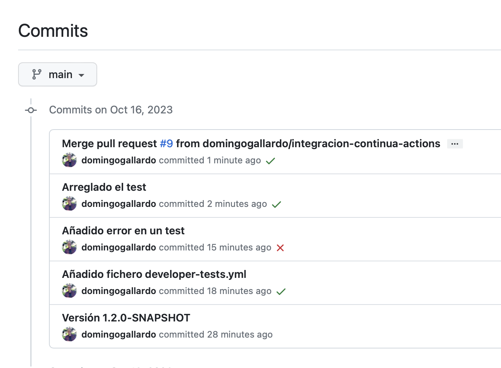
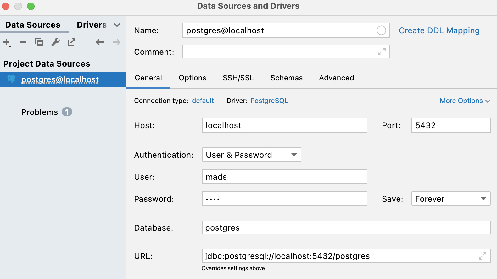
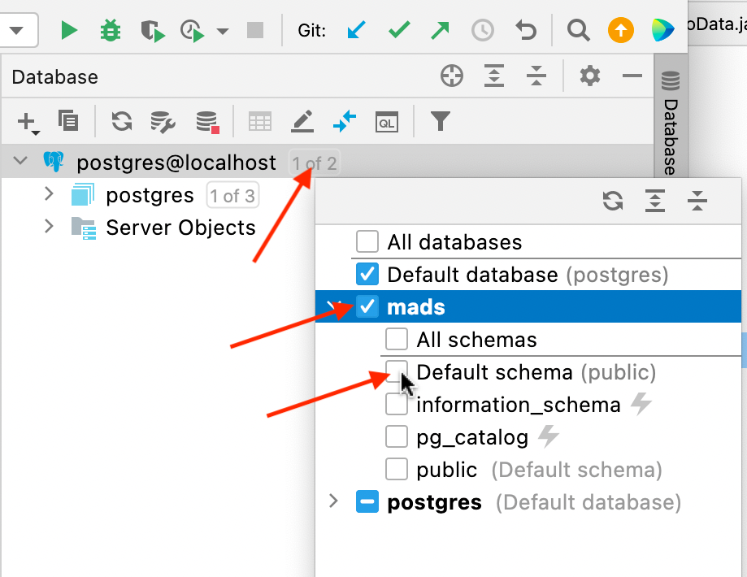
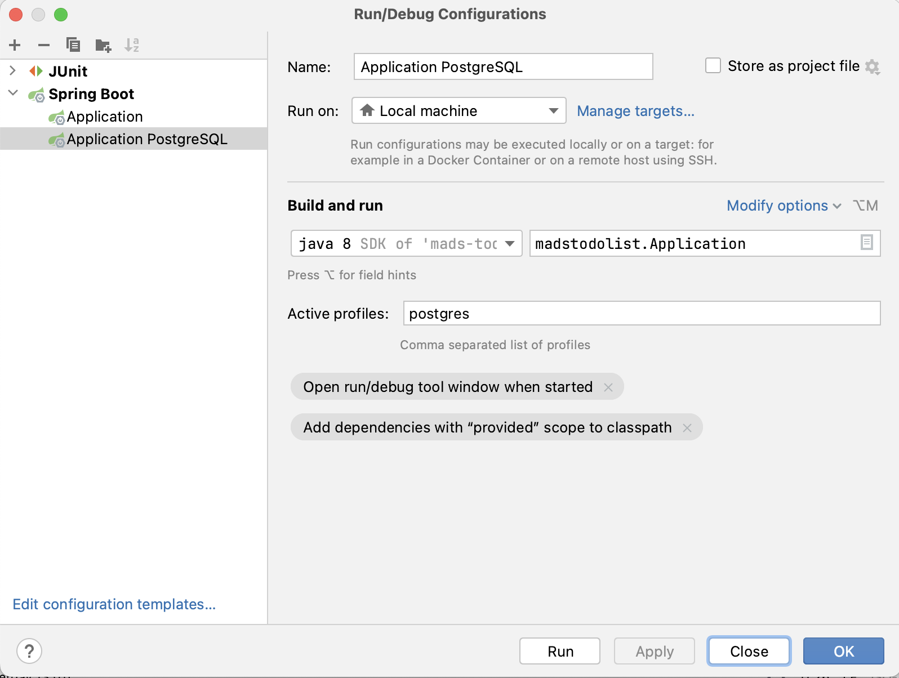
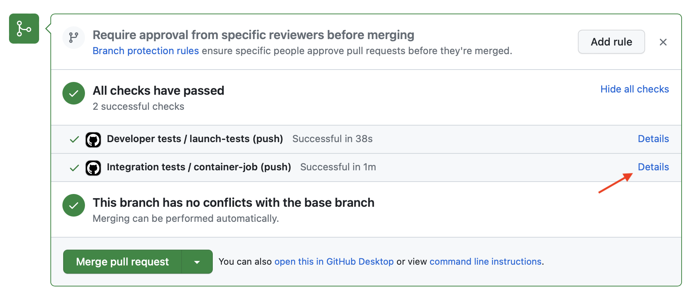

# Práctica 3: Integración con GitHub Actions y TDD

En esta práctica 3 de la asignatura realizaremos dos tareas principales:

- Configuraremos un sistema de integración continua usando las
  _actions_ del repositorio de GitHub. En este sistema se lanzarán los
  tests automáticamente en cada _pull request_. Después definiremos
  una nueva configuración del proyecto en la que se lanzarán los tests
  sobre la base de datos [PostgreSQL](https://www.postgresql.org).
- Añadiremos nuevas funcionalidades usando la práctica XP de TDD
  (_Test Driven Design_).

!!! Important "Importante"
    Lee con cuidado todo el enunciado y dedica especial atención a los
    apartados con el título `Pasos a seguir`. Ahí están
    especificadas las acciones que debes realizar en la práctica.

La duración de la práctica es de 3 semanas y la fecha límite de
entrega es el día 8 de noviembre.

## 1. Desarrollo de la _release_ 1.2.0 ##

En esta práctica vamos a desarrollar la versión 1.2.0 de la aplicación
`ToDoList`. A todos los _issues_ y _pull requests_ les debes poner este
_milestone_, indicando que el objetivo es resolverlos y entregarlos en
esta _release_.

### Pasos a seguir ###

- Cambia el número de versión (en el fichero _Acerca De_ y en el
  `pom.xml`) a `1.2.0-SNAPSHOT` para indicar que lo que hay en main
  es la versión 1.2.0 **en progreso**. Esta versión la lanzaremos al
  final del desarrollo de la práctica, en su entrega.


## 2. Integración continua con GitHub Actions ##

[GitHub
Actions](https://docs.github.com/en/free-pro-team@latest/actions) es
un servicio de GitHub que permite realizar integración continua
en su propia web, sin necesidad de configurar un servidor propio de integración
continua.

Puedes consultar el funcionamiento de GitHub Actions leyendo su documentación,
comenzando por las páginas [Quickstart for GitHub
Actions](https://docs.github.com/en/free-pro-team@latest/actions/quickstart),
[Introduction to GitHub
Actions](https://docs.github.com/en/free-pro-team@latest/actions/learn-github-actions/introduction-to-github-actions)
y [Building and testing Java with
Maven](https://docs.github.com/en/free-pro-team@latest/actions/guides/building-and-testing-java-with-maven). 

En la práctica vamos a comenzar configurando GitHub Actions para que
todos los _pull requests_ deban pasar los tests de integración antes
de realizar el _merge_ con `main`.

### Tests en los pull requests ###

Usando GitHub Actions es posible configurar el repositorio de GitHub
para que todos los _pull requests_ deban pasar los tests de
integración en el servicio.

En la siguiente imagen vemos el aspecto en GitHub de un _pull request_
estando activa la integración con Actions. Una vez abierto el PR,
se lanzan los flujos de trabajo (_workflows_) definidos en 
el directorio `.github/workflows`. 

GitHub comprueba si la integración de main con la rama pasa los tests
definidos en el workflow. Sólo si los tests pasan es posible realizar
el _merge_ del PR en main.


### El fichero de configuración  ###

Para configurar GitHub Actions basta con añadir un fichero de flujo de
trabajo en el directorio `.github/workflows`.

El fichero con el flujo de trabajo inicial lo llamaremos `developer-tests.yml`:

```yml title=".github/workflows/developer-tests.yml"
name: Tests

on: push

jobs:
  # El nombre del job es launch-test
  launch-tests:
    runs-on: ubuntu-latest
    # Todos los pasos se ejecutan en el contenedor openjda:8-jdk-alpine
    container: openjdk:8-jdk-alpine

    steps:
      # Hacemos un checkout del código del repositorio 
      - uses: actions/checkout@v2
      # Y lanzamos los tests
      - name: Launch tests with Maven
        run:  ./mvnw test
```

Puntos interesantes a destacar:

- El nombre del flujo de trabajo es `Tests`.
- El nombre del job es `launch-tests`.
- Con la palabra clave `on` se define el evento que causa que se lance
  el flujo de trabajo. Es en cualquier commit subido a GitHub  (push).
- En `jobs` se definen los trabajos en paralelo a realizar por el
  flujo de trabajo. En nuestro caso sólo habrá uno.
- En `runs-on` se define la máquina base sobre la que se van a
  ejecutar los siguientes pasos del flujo.
- En `container` se especifica el contenedor Docker que se va a usar
  para ejecutar los pasos del flujo de trabajo.
- En `uses: actions/checkout@v2` se especifica que se obtenga la
  versión 2 de la acción llamada `actions/checkout`. Esta acción se
  descarga el repositorio en la máquina especificada anteriormente y
  lo deja listo para ejecutar los tests o cualquier otra acción.
- Por último, con el comando `run: ./mvnw test` se indica que el flujo
  de trabajo debe lanzar este comando, que es el que lanza los
  tests. 
- Los nombres `Tests` y `launch-tests` son nombres arbitrarios que
  indicamos y que después aparecen en la interfaz de Actions y nos
  sirven para localizar los distintos pasos.
  

### Builds en Actions ###

En la pestaña `Actions` de GitHub tenemos toda la información de los
_builds_. Es posible visualizarla mientras que se está realizando el
build o cuando ya ha terminado. Allí podremos ver el detalle de la
ejecución de los tests y consultar la salida de los mismos para
comprobar su resultado.

En la siguiente imagen se ha capturado el build en ejecución. El color
naranja significa que el proceso está en ejecución.


### Pasos a seguir ###

- Crea un _issue_ llamado `Integración continua con GitHub
  Actions`. Abre una rama `integracion-continua-actions` y súbela a GitHub. 
  
- Añade el fichero anterior `.github/workflows/developer-tests.yml`. Haz un
  commit, súbelo a GitHub y abre un pull request con el nombre `Integración
 continua con GitHub Actions".

- Comprueba que se pasan los tests y que se marca como correcto el
  _pull request_.
  
- Modifica un test para que falle y sube un nuevo commit. Recarga la
  página del pull request y comprueba que el commit aparece como
  erróneo en GitHub cuando el _build_ falla. Pincha en el enlace
  _details_ para comprobar la descripción del fallo.
  
- Corrige el test que falla, vuelve a subir el commit y comprueba que
  el nuevo commit y el PR pasan correctamente.

- Cierra el _pull request_, mezclándolo con `main`. Se volverán a
  lanzar los tests en GitHub y el commit aparecerá marcado como
  correcto. 
  
    En el listado de commits de la rama `main` aparecerá junto a cada commit el
    indicador de si en ese commit los tests han pasado correctamente o no. 

    

  
- Baja los cambios al repositorio local y borra la rama.

    ```
    $ (integracion-continua-actions) git checkout main
    $ (main) git pull
    $ (main) git branch -d integracion-continua-actions
    $ (main) git remote prune origin
    ```

## 3. Configuración de la aplicación para usar una BD PostgreSQL ##

Hasta ahora hemos trabajado con la aplicación en una configuración
local con nuestro ordenador de desarrollo trabajando sobre una base de
datos H2 en memoria. Pero el objetivo final es poner la aplicación en
producción, en un servidor en Internet y usando una base de datos
PostgreSQL en producción. 

Además, te habrás dado cuenta de que es muy engorroso probar la
aplicación con la base de datos de memoria. Tienes que volver a
introducir todos los datos de prueba cada vez que paramos y ponemos en
marcha la aplicación.

En esta práctica vamos a ver cómo configurar la aplicación para poder
trabajar con una base datos PostgreSQL, tanto en su ejecución como en
los tests.

Para configurar la aplicación vamos a utilizar los denominados
_perfiles_. Definiremos, además del perfil base, un perfil adicional
para lanzar la aplicación y los tests usando la base de datos
PostgreSQL.

La configuración de tests con base de datos PostgreSQL la utilizaremos
para ejecutar los tests de integración sobre la base de datos PostgreSQL
en el proceso de integración continua de GitHub Actions.

Para lanzar un servidor de base de datos PostgreSQL usaremos Docker, de
forma que no tendremos que realizar ninguna instalación en nuestro
ordenador.


### Ficheros de configuración de la aplicación ###

Ya hemos comentado que la configuración de la aplicación se define en
el fichero `application.properties`. Ahí se definen distintas
propiedades de la ejecución de la aplicación que se pueden modificar
(puerto en el que se lanza la aplicación, base de datos con la que
conectarse, etc.). 

Tenemos dos ficheros `application.properties`: uno en el directorio
`src/main/resources` que define la configuración de ejecución y otro
en el directorio `src/test/resources` que define la configuración que
se carga cuando se lanzan los tests.

Spring Boot permite definir ficheros de configuración adicionales
que pueden **sobreescribir y añadir propiedades** a las definidas en el
fichero de configuración por defecto. El nombre de estos ficheros de
configuración debe ser `application-xxx.properties` donde `xxx` define
el nombre del perfil. En nuestro caso definiremos los ficheros
`application-postgres.properties` (uno en el directorio `main` y otro
en `test`) para definir las configuraciones de ejecución y de test con
PostgreSQL.

Estos ficheros de configuración adicionales se cargan (cuando se lanza la
aplicación con el perfil específico) después de cargar la configuración por
defecto definida en `application.properties`. Recordemos que en este perfil por
defecto se define el perfil como perfil activo `dev`:

```
# Activamos el perfil dev
spring.profiles.active=dev
```

Cuando se lance un perfil específico, el perfil activo ya no será ese, sino el
especificado por el perfil específico.

### Pasos a seguir ###

1. Crea un nuevo _issue_ llamado `Añadir perfiles y permitir trabajar
  con PostgreSQL`. Crea una rama nueva (llámala `perfiles`, por ejemplo) y
  abre un pull request. 
  
    ```
    $ (main) git checkout -b perfiles
    $ (perfiles) git push -u origin perfiles
    ```

2. Copia el siguiente fichero en `src/main/resources/application-postgres.properties`:

    ```
    spring.datasource.url=jdbc:postgresql://localhost:5432/mads
    spring.datasource.username=mads
    spring.datasource.password=mads
    spring.jpa.properties.hibernate.dialect = org.hibernate.dialect.PostgreSQL9Dialect
    ```

    Este va a ser el perfil que activemos para utilizar la conexión
    con la BD PostgreSQL.
    
    En este fichero de configuración se define la URL de conexión a la
    base de datos `mads`, su usuario (`mads`) y contraseña (`mads`) y
    el dialecto que se va a utilizar para trabajar desde JPA con la
    base de datos (`org.hibernate.dialect.PostgreSQL9Dialect`). La base de datos
    PostgreSQL debe estar funcionando en el puerto `5432` del `localhost`.

3. Vamos ahora a añadir el perfil de test. Copia el siguiente fichero
  en `src/test/resources/application-postgres.properties`:
    
    ```
    spring.datasource.url=jdbc:postgresql://localhost:5432/mads_test
    spring.datasource.username=mads
    spring.datasource.password=mads
    spring.jpa.properties.hibernate.dialect = org.hibernate.dialect.PostgreSQL9Dialect
    ```
     
    En este perfil la conexión se hace con una base de datos
    diferente: `mads_test`, para no sobreescribir la base de datos
    definida en el perfil de ejecución.

    Recuerda que en el perfil por defecto
    `resources/application.properties` se define el valor de
    `spring.jpa.hibernate.ddl-auto` como `create`. De esta forma la
    base de datos se inicializa antes de cargar los datos de los tests
    y de ejecutarlos. También usamos una base de datos distinta
    (`mads_test`) para no sobreescribir la base de datos definida en
    el perfil de ejecución.

4. Añade la siguiente dependencia en el fichero `pom.xml` para que se
   descargue el driver `postgresql:42.2.22`. También añade las líneas
   para poder especificar perfiles desde línea de comando. La variable
   `profiles` se definirá desde línea de comando cuando se llame a
   Maven:

    Fichero `pom.xml`:

    ```xml hl_lines="4 5 6 7 8 17 18 19"
                <artifactId>h2</artifactId>
                 <scope>runtime</scope>
             </dependency>
             <dependency>
                 <groupId>org.postgresql</groupId>
                 <artifactId>postgresql</artifactId>
                 <version>42.2.22</version>
             </dependency>
             <dependency>
                 <groupId>org.springframework.boot</groupId>

            ...
            
                <plugin>
                    <groupId>org.springframework.boot</groupId>
                    <artifactId>spring-boot-maven-plugin</artifactId>
                    <configuration>
                        <profiles>${profiles}</profiles>
                    </configuration>
                </plugin>
    ```

5. Para lanzar la aplicación necesitarás un servidor PostgreSQL en el
   puerto 5432 con el usuario `mads`, la contraseña `mads` y la base
   de datos `mads`. Es muy sencillo descargarlo y ejecutarlo si tienes
   instalado Docker. Ejecuta desde el terminal:

    ```
    docker run -d -p 5432:5432 --name postgres-develop -e POSTGRES_USER=mads -e POSTGRES_PASSWORD=mads -e POSTGRES_DB=mads postgres:13
    ```

    Docker se descarga la imagen `postgres:13` y lanza el contenedor (una
    instancia en marcha de una imagen) conectado al puerto 5432 (no debe
    estar ocupado) y sobre la base de datos `mads`. Le da como nombre
    `postgres-develop`.
   
    Puedes ejecutar los siguientes comandos de Docker:
    
      ```
      $ docker container ls -a (comprueba todos los contenedores en marcha)
      $ docker container stop <nombre o id de contenedor> (para un contenedor)
      $ docker container start <nombre o id de contenedor> (pone en marcha un contenedor)
      $ docker container logs <mombre o id de contenedor> (muestra logs del contenedor)
      $ docker container rm nombre o id de contenedor> (elimina un contenedor)
      ```

6. Arranca la aplicación con el siguiente comando:

    ```
    ./mvnw spring-boot:run -D profiles=postgres
    ```

    Se activará el perfil `postgres` y se cargarán las preferencias de
    `src/main/resource/application.properties` y
    `src/main/resource/application-postgres.properties`.
    
    Al lanzarse la aplicación con el perfil activo `postgres` no se ejecutará el
    servicio `InitDbService` que añade datos por defecto en la
    aplicación. Ahora ya no tiene sentido trabajar con datos por defecto porque
    los datos van a ser grabados en la base de datos real.

    Prueba a introducir datos en la aplicación y comprueba que se
    están guardando en la base de datos utilizando por ejemplo el
    panel `Database` de _IntelliJ_. Deberás añadir una _Data Source_
    de tipo _PostgreSQL_, configurando el usuario y contraseña de
    acceso a `mads`:
    
    
    
    Añade la conexión con la base de datos `mads` pulsando en el
    pequeño recuadro junto al nombre de la fuente de datos:
    
    

    Y después ya podrás examinar la base de datos `mads`, pulsando en
    la tabla que quieras y seleccionando con el botón derecho _Edit Data_:
    
    

7. Cierra la aplicación y vuelve a abrirla. Comprueba que los datos
   que se han creado en la ejecución anterior siguen estando. 
   
    Podemos también parar el contenedor y volverlo a reiniciar y los
    datos se conservarán. Al parar el contenedor no se eliminan los
    datos, sólo al borrarlo.

8.  También podemos arrancar la aplicación con el perfil de postgres
    lanzando directamente el fichero JAR de la siguiente forma:
    
    ```
    $ ./mvnw package
    $ java -Dspring.profiles.active=postgres -jar target/*.jar 
    ```

    Para lanzar la aplicación desde _IntelliJ_ trabajando con el nuevo
    perfil podemos seleccionar la opción `Edit Configurations...` del
    menú de configuraciones, duplicar la configuración `Application`,
    renombrándola por `Application PostgreSQL` y añadir en el campo
    `Active profiles` el nombre del perfil nuevo que acabamos de crear
    `postgres`. Es posible que debas recargar el proyecto Maven para
    actualizar las dependencias.

    

9. Cierra la aplicación. Paramos el contenedor con la base de datos de
   desarrollo haciendo `docker container stop postgres-develop`:

    ```
    $ docker container ls -a 
    CONTAINER ID        IMAGE        ...    NAME
    520fee61d51e        posgres:13   ...    postgres-develop
    $ docker container stop postgres-develop
    ```

    Además de por línea de comando, también es posible gestionar los
    contenedores usando la aplicación _Docker Desktop_ que se
    encuentra en la propia instalación de Docker.

10. Vamos ahora a ver cómo lanzar los tests sobre una base de datos
   PostgreSQL. Lanzamos ahora otro contenedor con la base de datos de test (`mads_test`):

    ```
    docker run -d -p 5432:5432 --name postgres-test -e POSTGRES_USER=mads -e POSTGRES_PASSWORD=mads -e POSTGRES_DB=mads_test postgres:13
    ```

    Y lanzamos los tests usando el perfil `postgres` con la base de datos PostgreSQL con el siguiente comando:
  
      ```
      ./mvnw -D spring.profiles.active=postgres test
      ```
  
11. Podemos lanzar también los tests desde _IntelliJ_ editando la
    configuración de lanzamiento de test y añadiendo la variable de
    entorno `spring.profiles.active=postgres`. Podríamos, por ejemplo,
    llamar a esta configuración `Tests con PostgreSQL`.

12. Dado que las configuraciones de test y de ejecución utilizan
    distintas bases de datos, debemos tener en funcionamiento la base
    de datos correspondiente a lo que queremos hacer en cada
    momento. Esto es muy fácil usando los contenedores de Docker. Por
    ejemplo, podemos parar el contenedor PostgreSQL con la base de datos
    de test y arrancar el contenedor con la base de datos de
    desarrollo:
  
    ```
    $ docker container ls -a 
    $ docker container stop postgres-test
    $ docker container start postgres-develop
    ```

13. Realiza un commit con los cambios, súbelos a la rama y cierra el
    pull request para integrarlo en `main`:
  
      ```
      $ (perfiles) git add .
      $ (perfiles) git commit -m "Añadidos perfiles para trabajar con PostgreSQL"
      $ (perfiles) git push
      // Mezclamos el Pull Request en GitHub
      $ (perfiles) git checkout main
      $ (main) git pull
      $ (main) git branch -d perfiles
      $ (main) git remote prune origin
      ```

## 4. Tests de integración en GitHub Actions ##

Vamos a modificar la configuración de GitHub Actions para conseguir un
sistema de integración continua que ejecute los tests de integración
usando la base de datos real PostgreSQL.

La ejecución de los tests usando la base de datos de memoria H2 será
responsabilidad del desarrollador y se hará en el entorno de trabajo
local, tal y como se ha hecho desde la primera práctica.

### Tests del desarrollador vs. tests de integración ###

Podemos considerar los tests que usan la base de datos real como
_tests de integración_ y los tests que usan la base de datos en
memoria como _tests del desarrollador_.

No usamos el nombre de _tests unitarios_ de forma consciente, para
evitar conflictos con la nomenclatura. Cuando hablamos de _tests del
desarrollador_ nos referimos a tests que van a ejecutar continuamente
los desarrolladores en su equipo local cuando están trabajando con la
aplicación y añadiendo funcionalidades. Son tests rápidos, que se
pueden lanzar desde el propio IDE, y que deben ser ejecutados antes de
cada commit.

Frente a estos tests, los tests de integración necesitan una
configuración adicional (poner en marcha la base de datos de test en
nuestro caso) y se ejecutan menos frecuentemente.

Vamos a actualizar GitHub Actions para que se lancen allí los tests
que usan la base de datos PostgreSQL y nos ahorremos el trabajo de
realizarlos en local.

Seguiremos lanzando en local los tests que usan la BD de memoria
mientras hacemos el desarrollo.

Dejaremos también en GitHub Actions los tests que usan la BD de
memoria. Quizás sean redundantes con los que usan la BD de Postgres,
pero su ejecución no cuesta demasiado y no está de más lanzarlos
también. Podríamos prescindir de ellos si en algún momento comprobamos
que el tiempo de ejecución de los tests en GitHub se hace muy largo.

### Acción para lanzar los tests con la BD postgres ###

Para lanzar los tests de integración en GitHub debemos modificar el
fichero de configuración del flujo de trabajo para que lance un
contenedor de PostgreSQL y después se ejecuten los tests sobre ese
contenedor.

Para tener más flexibilidad en la configuración de la conexión con
PostgreSQL vamos a modificar el perfil de Spring Boot, añadiendo unas
variables con unos valores por defecto que se pueden modificar
definiendo su valor en variables de entorno con el mismo nombre.

En concreto, definimos las variables `POSTGRES_HOST`, `POSTGRES_PORT`,
`DB_USER` y `DB_PASSWD`.

```title="src/test/resources/application-postgres.properties"
POSTGRES_HOST=localhost
POSTGRES_PORT=5432
DB_USER=mads
DB_PASSWD=mads
spring.datasource.url=jdbc:postgresql://${POSTGRES_HOST}:${POSTGRES_PORT}/mads_test
spring.datasource.username=${DB_USER}
spring.datasource.password=${DB_PASSWD}
spring.jpa.properties.hibernate.dialect = org.hibernate.dialect.PostgreSQL9Dialect
```

Ya podemos añadir un nuevo fichero de flujo de trabajo. Lo llamamos `integration-tests.yml`

```yml title=".github/workflows/integration-tests.yml"
name: Integration tests

on: push

jobs:
  container-job:
    runs-on: ubuntu-latest
    container: openjdk:8-jdk-alpine
    services:
      # Etiqueta usada para acceder al contenedor del servicio
      postgres:
        # Imagen Docker Hub
        image: postgres:13
        # Variables para arrancar PostgreSQL
        env:
          POSTGRES_USER: mads
          POSTGRES_PASSWORD: mads
          POSTGRES_DB: mads_test
        # Definimos chequeos para esperar hasta que postgres ya ha comenzado
        options: >-
          --health-cmd pg_isready
          --health-interval 10s
          --health-timeout 5s
          --health-retries 5

    steps:
      - uses: actions/checkout@v2
      - name: Launch tests with Maven
        run:  ./mvnw test -D spring.profiles.active=postgres
        env:
          POSTGRES_HOST: postgres
```

- Se especifica el servicio `postgres` que se va a usar en el flujo de
  trabajo. Para configurar este servicio se define la imagen docker
  (`postgres:13`) y las variables de entorno que se van a proporcionar
  al arrancar, para configurar la base de datos (usuario, contraseña y
  base de datos). Estamos definiendo un contenedor docker similar al
  que hemos usado con los tests cuando hicimos la prueba en local.

- El nuevo comando de test activa el perfil `postgres`. Es el mismo
  comando que usamos cuando hicimos la prueba en local.

- En la última línea se actualiza el parámetro `POSTGRES_HOST` para
  que la conexión se realice con el host `postgres` que es el que
  nombre que se ha definido en el servicio.

### Pasos a seguir ###

1. Crea un nuevo issue llamado `Tests de integración en GitHub
Actions`. Crea la rama `integracion-gh-actions`.

    ```
    $ git checkout -b integracion-gh-actions
    $ git push -u origin integracion-gh-actions
    ```
    
    
2. Modifica el fichero del perfil postgres de test tal y como se
   indica anteriormente, para usar variables de configuración que
   puedan ser definidas mediante variables de entorno.

3. Comprueba que siguen funcionando los tests lanzados sobre la base
   de datos usando los valores por defecto de las variables de
   entorno.
   
    ```
    // Nos aseguramos de que la base de datos que está en marcha
    // es la de test
    $ docker container ls
    CONTAINER ID   IMAGE         PORTS                    NAMES
    411d8f2ea46c   postgres:13   0.0.0.0:5432->5432/tcp   postgres-test
    ./mvnw -D spring.profiles.active=postgres test
    ```

4. Comprueba que podemos modificar los parámetros definidos en las
   variables de entorno. Por ejemplo, si se cambia el nombre del host
   de la conexión con la base de datos los tests deben de fallar:
   
    ```
    $ ./mvnw -D spring.profiles.active=postgres -D POSTGRES_HOST=postgres test
    // Aparecerán errores debidos a que no se puede conectar con el
    // host postgres:
    org.postgresql.util.PSQLException: El intento de conexión falló.
    ...
    Caused by: java.net.UnknownHostException: postgres
    ```
   
5. Crea un commit, súbelo a GitHub y crea el Pull Request

    ```
    $ git add .
    $ git commit -m "Añadidas variables al perfil de test postgres"
    $ git push
    ```

6. Añade el fichero del flujo de trabajo de la acción de GitHub,
   tal y como se indica anteriormente. Haz un commit, súbelo a GitHub
   y comprueba que los tests pasan correctamente y se lanzan allí
   usando la base de datos postgres.

    

    

    

    

7. Una vez comprobado que funcionan los tests de integración en
   GitHub, mezclamos el pull request y lo descargamos a
   local. Comprobamos que también se lanzan los tests en el commit de
   merge en GitHub. 
   
8. Con esto ya tenemos completado un sistema de integración continua y
   GitHub se encargará de ejecutar todos los tests en un modo de
   integración, usando la base de datos PostgreSQL.


## 5. TDD ##

En la segunda parte de la práctica desarrollaremos, usando TDD (_Test
Driven Design_), una nueva _feature_ de la aplicación: la posibilidad
de definir definir equipos a los que puedan pertenecer los usuarios.

Descomponemos la _feature_ en las siguientes historias de usuario.

- 008 Listado de equipos
- 009 Gestionar pertenencia al equipo
- 010 Gestión de equipos (opcional)

**008 Listado de equipos**: Como usuario podré consultar el listado de
los equipos existentes y los participantes en cada uno de ellos para
poder consultar la estructura de la empresa y los proyectos en marcha
y comprobar si estoy en los equipos correctos.

**009 Gestionar pertenencia al equipo**: Como usuario podré crear
nuevos equipos y añadirme y eliminarme de cualquiera de ellos para poder
participar y dejar de participar en ellos.

**010 Gestión de equipos (opcional)**: Como administrador podré
cambiar el nombre y eliminar los equipos para adaptarlos a los
proyectos y estructura de la empresa.

Vamos a hacer de forma guiada la primera historia y dejamos las
siguientes para que las hagas por tu cuenta.

### 008 Listado de equipos ###

La descripción de la historia de usuario es la siguiente:

```text
Listado de equipos

Como usuario podré consultar el listado de
los equipos existentes y los participantes en cada uno de ellos para
poder consultar la estructura de la empresa y los proyectos en marcha
y comprobar si estoy en los equipos correctos.

Detalles

    * En el menú aparcerá una opción `Equipos` que llevará a un
    listado con los nombres de todos los equipos existentes.
    * El listado de equipos estará ordenado por orden alfabético.
    * Pinchando en el enlace del nombre del equipo nos iremos a una
    página con un listado de todos los usuarios que lo componen.
    * Un usuario podrá pertenecer a más de un equipo.
```

Vamos a utilizar la técnica de TDD para construir la funcionalidad
**de dentro a fuera** (desde el repository hasta el
controller). Comenzaremos con tests que construyan la capa de modelo
(clases de entidad y repository) y después pasaremos a tests que
construyan la capa de servicio. 

Por último, una vez implementados los métodos de servicios necesarios,
deberás implementar (lo haremos sin tests) las vistas y
controllers. Las vistas y controllers los probaremos de forma manual,
sin tests automáticos.

!!! Important "Importante"

    Los controllers no deben implementar ningún código adicional, sólo
    llamar al método de servicio necesario. De esta forma nos
    aseguramos que todo el código importante para la funcionalidad está
    testeado y ha sido creado mediante TDD.

Probaremos los tests usando la base de datos de memoria y dejaremos
que sea la acción de GitHub la que pruebe los tests con la base de
datos Postgres.

Recuerda que los pasos seguir la técnica de TDD:

- **Test**: Primero debes escribir el test.
- **Code**: Después debes escribir el código que hace pasar el test (**únicamente el código
necesario, no puedes escribir código de más**)
- **Refactor**: Y, si es necesario, realizar una refactorización del código (los
  tests deben seguir pasando después de la refactorización).

Deberás hacer **un commit por cada fase Test-Code**. Si haces
refactorización deberás hacerlo en otro commit adicional.


### Pasos a seguir ###

- Crea la historia de usuario `008 Listado de equipos` en el tablero Trello.

- Crea dos _issues_ correspondientes a esta historia:
    - Servicio y modelo listado de equipos.
    - Vista y controller listado de equipos.

- Crea una rama para desarrollar el primer _issue_ (llámala
  `servicio-equipos`, por ejemplo) y pásalo en el
  tablero a `In progress`.
  
    ```
    $ git checkout -b servicio-equipos
    $ git push -u origin servicio-equipos
    ```

Este primer _issue_ lo haremos de forma guiada usando TDD con los
tests que enumeraremos a continuación. El otro _issue_ lo deberás
implementar por ti mismo. 

#### Primer commit - Clase `Equipo` ####

El primer test es para crear la entidad `Equipo`. Por ahora sólo
creamos la clase Java, sin las anotaciones JPA. Un equipo

```java title="src/test/java/madstodolist/EquipoTest.java"
package madstodolist;

import org.junit.jupiter.api.Test;
import org.springframework.boot.test.context.SpringBootTest;
import org.springframework.test.context.jdbc.Sql;

import static org.assertj.core.api.Assertions.assertThat;
import static org.springframework.test.context.jdbc.Sql.ExecutionPhase.AFTER_TEST_METHOD;

@SpringBootTest
@Sql(scripts = "/clean-db.sql", executionPhase = AFTER_TEST_METHOD)
public class EquipoTest {

    @Test
    public void crearEquipo() {
        Equipo equipo = new Equipo("Proyecto P1");
        assertThat(equipo.getNombre()).isEqualTo("Proyecto P1");
    }
}
```

Escribe el código necesario para que pase el test. **No debes escribir
código de más, sólo el código mínimo para que el test pase**. 

Haz un _commit_ que contenga el test y el código y súbelo a la rama
remota. Pon como descripción del commit el mismo título de esta
sección: _Primer commit - Clase Equipo_.

```
$ git add .
$ git commit -m "Primer commit - Clase Equipo"
```

Crea el pull request para comprobar que el test pasa correctamente
cuando se ejecuta sobre la base de datos Postgres. Liga el pull
request con el issue, para que cuando se mezcle el PR se cierre el
issue.

!!! Important "Importante"
    Debes incluir en el commit tanto el código del test como el código
    que soluciona el test, de forma que el commit aparezca como
    correcto en GitHub.

#### Segundo test - Añadir y buscar equipo en la base de datos ####

Con el segundo test queremos conseguir que funcione JPA con la entidad
`Equipo` y que podamos usar una tabla de equipos en la base de datos,
en la que podamos guardar entidades `equipo`. 

Para comprobar que la entidad se ha guardado correctamente,
comprobaremos se ha actualizando su identificador y que podemos
recuperarlo de la base de datos.

Lo hacemos añadiendo el test `grabarYBuscarEquipo`. Usaremos la
anotación `@Transactional` siempre que trabajemos con clases
_repository_. De esa forma nos aseguramos que todo el código del test
se ejecuta en la misma transacción. Cuando escribamos el código del
servicio también habrá que usar esta anotación en cada método, tal y
como se hace en las clases de servicio de `Tarea` y `Usuario`.

```java
    @Autowired
    private EquipoRepository equipoRepository;

    @Test
    @Transactional
    public void grabarYBuscarEquipo() {
        // GIVEN
        // Un equipo nuevo
        Equipo equipo = new Equipo("Proyecto P1");

        // WHEN
        // Salvamos el equipo en la base de datos
        equipoRepository.save(equipo);

        // THEN
        // Su identificador se ha actualizado y lo podemos
        // usar para recuperarlo de la base de datos
        Long equipoId = equipo.getId();
        assertThat(equipoId).isNotNull();
        Equipo equipoDB = equipoRepository.findById(equipoId).orElse(null);
        assertThat(equipoDB).isNotNull();
        assertThat(equipoDB.getNombre()).isEqualTo("Proyecto P1");
    }
```

Actualizamos también el fichero `clean-db.sql` para que se borre la
tabla `equipos` al final de cada test.

```sql title="src/test/resources/clean-db.sql"
DELETE FROM tareas;
DELETE FROM equipos;
DELETE FROM usuarios;
```

Escribe el código necesario para pase el test y haz un commit con
el nombre del apartado como descripción. Súbelo a GitHub y comprueba
en el pull request que el test pasa correctamente en el entorno de
integración.

#### Tercer test - Definición de igualdad entre equipos ####

Ahora que hemos introducido el `id` del equipo escribimos un test
para comprobar que dos equipos son iguales. Debes escribir el código
de los métodos `equals` y `hashCode` (necesario este último para que
funcione correctamente la comprobación de igualdades en las
colecciones).

Hacemos los tests para que el `equals` funcione de la siguiente forma:

> Si alguno de los dos equipos no tiene `id` (es `null`), entonces se
> deben comparar sus nombres. Ahora bien, si los dos equipos tienen
> `id`, entonces se deben comparar esos `id`".

Puedes guiarte por la implementación de `equals` y `hashCode` en
`Usuario`.

```java
    @Test
    public void comprobarIgualdadEquipos() {
        // GIVEN
        // Creamos tres equipos sin id, sólo con el nombre
        Equipo equipo1 = new Equipo("Proyecto P1");
        Equipo equipo2 = new Equipo("Proyecto P2");
        Equipo equipo3 = new Equipo("Proyecto P2");

        // THEN
        // Comprobamos igualdad basada en el atributo nombre y que el
        // hashCode es el mismo para dos equipos con igual nombre
        assertThat(equipo1).isNotEqualTo(equipo2);
        assertThat(equipo2).isEqualTo(equipo3);
        assertThat(equipo2.hashCode()).isEqualTo(equipo3.hashCode());

        // WHEN
        // Añadimos identificadores y comprobamos igualdad por identificadores
        equipo1.setId(1L);
        equipo2.setId(1L);
        equipo3.setId(2L);

        // THEN
        // Comprobamos igualdad basada en el atributo nombre
        assertThat(equipo1).isEqualTo(equipo2);
        assertThat(equipo2).isNotEqualTo(equipo3);
    }
```

Escribe el código necesario para que pase el test y haz un commit.

#### Cuarto test - Relación muchos-a-muchos entre equipos y usuarios ####

Vamos ahora a diseñar un test que introduzca la relación entre equipos
y usuarios. Debe ser una relación muchos-a-muchos: un equipo contiene
muchos usuarios y un usuario puede pertenecer a 0, 1 o muchos equipos.

En el test hacemos varias cosas: creamos un equipo y un usuario,
añadimos el usuario al equipo y comprobamos que las relaciones se han
actualizado en la base de datos.

De la misma forma que en un test anterior, añadimos la anotación
`@Transactional` para que todas las llamadas a objetos _repository_ se
hagan en la misma transacción y con la misma conexión a la base de
datos.

```java
    @Autowired
    private UsuarioRepository usuarioRepository;
    
    @Test
    @Transactional
    public void comprobarRelacionBaseDatos() {
        // GIVEN
        // Un equipo y un usuario en la BD
        Equipo equipo = new Equipo("Proyecto 1");
        equipoRepository.save(equipo);

        Usuario usuario = new Usuario("user@ua");
        usuarioRepository.save(usuario);

        // WHEN
        // Añadimos el usuario al equipo

        equipo.addUsuario(usuario);

        // THEN
        // La relación entre usuario y equipo pqueda actualizada en BD

        Equipo equipoBD = equipoRepository.findById(equipo.getId()).orElse(null);
        Usuario usuarioBD = usuarioRepository.findById(usuario.getId()).orElse(null);

        assertThat(equipo.getUsuarios()).hasSize(1);
        assertThat(equipo.getUsuarios()).contains(usuario);
        assertThat(usuario.getEquipos()).hasSize(1);
        assertThat(usuario.getEquipos()).contains(equipo);
    }
```


Para que este test funcione hay que crear la relación muchos-a-muchos
entre equipos y usuarios.  Es necesario definir la anotación
`@ManyToMany` para indicar a JPA cómo construir las tablas en la base
de datos. Vamos a crear esta relación como `LAZY`, porque si fuera
`EAGER` la recuperación de equipos de la base de datos sería muy
costosa, traería a memoria todos sus usuarios (con sus tareas incluidas).

En `Equipo.java` definimos la tabla `equipo_usuario` en la que se va a
guardar la relación, e indicamos el papel de cada una de sus dos
columnas.

También creamos el getter para obtener los usuarios. 

```diff title="src/main/java/madstodolist/model/Equipo.java"
+    private String nombre;
+    // Declaramos el tipo de recuperación como LAZY.
+    // No haría falta porque es el tipo por defecto en una
+    // relación a muchos.
+    // Al recuperar un equipo NO SE RECUPERA AUTOMÁTICAMENTE
+    // la lista de usuarios. Sólo se recupera cuando se accede al
+    // atributo 'usuarios'; entonces se genera una query en la
+    // BD que devuelve todos los usuarios del equipo y rellena el
+    // atributo.
+     
+    @ManyToMany(fetch = FetchType.LAZY)
+    @JoinTable(name = "equipo_usuario",
+            joinColumns = { @JoinColumn(name = "fk_equipo") },
+            inverseJoinColumns = {@JoinColumn(name = "fk_usuario")})
+    Set<Usuario> usuarios = new HashSet<>();

...

    public void setId(Long id) {
        this.id = id;
    }

+    public Set<Usuario> getUsuarios() {
+        return usuarios;
+    }
```

En el fichero `Usuario.java` definimos la parte inversa de la
relación. El `mappedBy` indica que la especificación de la tabla join
está en el otro lado de la relación. Esta relación la definimos como
`EAGER` porque el otro lado de la relación es `LAZY`. Al recuperar un
usuario solo se van a traer a memoria la información de sus equipos.

```diff title="src/main/java/madstodolist/model/Usuario.java"
    @OneToMany(mappedBy = "usuario", fetch = FetchType.EAGER)
    Set<Tarea> tareas = new HashSet<>();

+    @ManyToMany(mappedBy = "usuarios")
+    Set<Equipo> equipos = new HashSet<>();

...

+    public Set<Equipo> getEquipos() {
+        return equipos;
+    }
```

Y por último añadimos en `Equipo.java` el método que actualiza ambos
lados de la relación. Añade el usuario a la colección de usuarios del
equipo y añade el equipo a la colección de equipos del usuario.

```java
    public void addUsuario(Usuario usuario) {
        this.getUsuarios().add(usuario);
        usuario.getEquipos().add(this);
    }
```

También actualizamos el fichero de limpieza de datos al final de cada
test, para añadir la nueva tabla `equipo_usuario`.

```sql title="src/test/resources/clean-db.sql"
DELETE FROM equipo_usuario;
DELETE FROM tareas;
DELETE FROM equipos;
DELETE FROM usuarios;
```

Comprueba el test, haz un commit en la rama y súbelo a GitHub.

#### Quinto test - Listado de equipos ####

Vamos ahora a definir un test para obtener una lista de equipos en el
_repository_. Queremos que el tipo devuelto por el _repository_
sea _List_.

```java
    @Test
    @Transactional
    public void comprobarFindAll() {
        // GIVEN
        // Dos equipos en la base de datos
        equipoRepository.save(new Equipo("Proyecto 2"));
        equipoRepository.save(new Equipo("Proyecto 3"));

        // WHEN
        List<Equipo> equipos = equipoRepository.findAll();

        // THEN
        assertThat(equipos).hasSize(2);
    }
```

La solución consiste en añadir el método `findAll` en la interfaz
p`EquipoRepository`, definiendo el tipo devuelto como _List_. Spring
Boot se encarga de construir automáticamente la implementación de este
método.

```diff title="EquipoRepository.java"
+ import java.util.List;

public interface EquipoRepository extends CrudRepository<Equipo, Long> {
+     public List<Equipo> findAll();
}

```

#### Sexto test - Método de servicio para crear y recuperar equipo ####

¡Y por fin llegamos a la capa de servicio!

Creamos el fichero `EquipoServiceTest.java` con la llamada al método
de servicio para crear un equipo nuevo y a otro método de servicio
para recuperar un equipo por su identificador.

Lo hacemos todo en el método `crearRecuperarTest`. En el test no hay
que añadir la anotación `@Transactional` porque queremos probar el uso
de los métodos de servicio en un contexto similar al que usaremos
cuando los llamemos desde el controller. Cuando llamemos desde el
controller a los métodos de servicio no se usará la anotación
`@Transactional` para evitar en el código del controller se pueda
acceder a los objetos repository y modificar directamente la base de
datos.

```java title="src/test/java/madstodolist/EquipoServiceTest.java"
package madstodolist;

import madstodolist.model.Equipo;
import madstodolist.service.EquipoService;
import org.junit.jupiter.api.Test;
import org.springframework.beans.factory.annotation.Autowired;
import org.springframework.boot.test.context.SpringBootTest;
import org.springframework.test.context.jdbc.Sql;

import static org.assertj.core.api.Assertions.assertThat;
import static org.springframework.test.context.jdbc.Sql.ExecutionPhase.AFTER_TEST_METHOD;

@SpringBootTest
@Sql(scripts = "/clean-db.sql", executionPhase = AFTER_TEST_METHOD)
public class EquipoServiceTest {

    @Autowired
    EquipoService equipoService;

    @Test
    public void crearRecuperarEquipo() {
        Equipo equipo = equipoService.crearEquipo("Proyecto 1");
        Equipo equipoBd = equipoService.recuperarEquipo(equipo.getId());
        assertThat(equipoBd).isNotNull();
        assertThat(equipoBd.getNombre()).isEqualTo("Proyecto 1");
    }
}
```

Para que funcione correctamente el test tenemos que crear la clase
`EquipoService` con los métodos `crearEquipo` y
`recuperarEquipo`. Completa el código en los lugares indicados.

```java title="src/test/java/madstodolist/EquipoServiceTest.java"
package madstodolist.service;

import madstodolist.model.Equipo;
import madstodolist.model.EquipoRepository;
import org.slf4j.Logger;
import org.slf4j.LoggerFactory;
import org.springframework.beans.factory.annotation.Autowired;
import org.springframework.stereotype.Service;
import org.springframework.transaction.annotation.Transactional;

@Service
public class EquipoService {
    Logger logger = LoggerFactory.getLogger(EquipoService.class);

    @Autowired
    EquipoRepository equipoRepository;

    @Transactional
    public Equipo crearEquipo(String nombre) {
        // Completar
    }

    @Transactional(readOnly = true)
    public Equipo recuperarEquipo(Long id) {
        // Completar
    }
}

```

Tal y como hemos comentado, la anotación `@Transactional` se usa en
los métodos de servicio en los que se trabaja con objetos _repository_
para asegurarnos de que todo el código del método se ejecuta en la
misma transacción y usando la misma conexión a la base de datos.

En aquellos métodos en los que no se modifica la base de datos (sólo
se realiza una consulta) es recomendable utilizar la anotación con el
atributo `readOnly = true` para hacer más eficiente la conexión con la
base de datos.


#### Séptimo test - Método de servicio para el listado de equipos ####

Añadimos el test que obliga a crear el método de servicio que recupera
la lista de equipos existentes, ordenada por orden alfabético del
nombre del equipo:

```java title="src/test/java/madstodolist/EquipoServiceTest.java"
    @Test
    public void listadoEquiposOrdenAlfabetico() {
        // GIVEN
        // Dos equipos en la base de datos
        equipoService.crearEquipo("Proyecto BBB");
        equipoService.crearEquipo("Proyecto AAA");

        // WHEN
        // Recuperamos los equipos
        List<Equipo> equipos = equipoService.findAllOrderedByName();

        // THEN
        // Los equipos están ordenados por nombre
        assertThat(equipos).hasSize(2);
        assertThat(equipos.get(0).getNombre()).isEqualTo("Proyecto AAA");
        assertThat(equipos.get(1).getNombre()).isEqualTo("Proyecto BBB");        
    }
}
```

Escribe en el servicio el código estríctamente necesario para que
pase el test. Haz un commit en la rama y súbelo a GitHub.


#### Octavo test - Comprobación de relación lazy entre equipo y usuarios ####

Vamos a centrar este test en la forma de traer a memoria los objetos
que participan en la relación `USUARIO-EQUIPO`. 

En JPA hay dos formas de definir una relación a-muchos:

- `EAGER`: Si una relación a-muchos es `EAGER`, cuando la clase
  repository devuelve un objeto (ya sea al recuperarlo
  individualmente, o en una consulta en la que se recupera una
  colección), se obtienen también de la base de datos todos los
  objetos con los que está relacionado. Por ejemplo, en la práctica
  tenemos definida de esta forma la relación entre usuarios y tareas.

- `LAZY`: Si una relación a-muchos es `LAZY`, cuando la clase
  repository devuelve un objeto, no recupera de la base de datos los
  objetos relacionados. Sólo lo hace cuando se accede a la colección
  que contiene la relación. Entonces es cuando se realiza la consulta
  a la base de datos y se traen estos objetos a memoria. Si estos
  objetos tienen otras relaciones se traerán a memoria o no
  dependiendo de si son `EAGER` o `LAZY`.
  
  Para que funcione la recuperación perezosa debe estar abierta la
  conexión con la base de datos en el momento en que se accede a la
  colección. Para ello es muy importante la etiqueta
  `@Transactional`. Cuando ponemos esta etiqueta en los métodos de las
  clases de servicio se garantiza que todo el método se realiza en una
  única transacción. Por ello, al finalizar el método se cerrará la
  conexión con la base de datos y el objeto que se devolverá al
  _controller_ **estará desconectado de la base de datos**, por lo que
  la recuperación perezosa no funcionará en el _controller_.

En el caso de la relación USUARIO-EQUIPO hemos definido el siguiente
diseño:

- La relación entre un usuario y sus equipos será `EAGER`. Cuando
  recuperamos un usuario, recuperaremos también la información de
  todos los equipos en los que participa. Esta parte de la relación
  está pendiente de implementar. Lo haremos más adelante.
  
- La relación entre un equipo y sus usuarios es `LAZY`. Esto es muy
  importante. Si no lo hiciéramos así ¡podríamos fácilmente traernos a
  memoria toda la base de datos!. Un equipo recuperaría todos sus
  usuarios, que también pueden estar en otros equipos, que a su vez
  también se traerían a memoria. 

Vamos a comprobar que la relación entre equipos y usuarios es
`LAZY`. Para ello debemos comprobar que se lanza una excepción cuando
se intenta acceder a la colección de usuarios de un equipo recuperado:

```java title="src/test/java/madstodolist/EquipoServiceTest.java"
    @Test
    public void accesoUsuariosGeneraExcepcion() {
        // Given
        // Un equipo en la base de datos
        Equipo equipo = equipoService.crearEquipo("Proyecto 1");

        // WHEN
        // Se recupera el equipo
        Equipo equipoBd = equipoService.recuperarEquipo(equipo.getId());

        // THEN
        // Se produce una excepción al intentar acceder a sus usuarios
        assertThatThrownBy(() -> {
            equipoBd.getUsuarios().size();
        }).isInstanceOf(LazyInitializationException.class);
    }
```

Comprueba si hay que modificar el código, haz un commit y súbelo a
GitHub.


#### Noveno test - Método de servicio para añadir un usuario a un equipo ####

Vamos a crear un test que nos obligue a implementar el método de
servicio para añadir un usuario a un equipo. Para comprobar su
funcionamiento deberemos implementar también el método de servicio
para recuperar los usuarios de un equipo.

El test es el siguiente.

```java title="src/test/java/madstodolist/EquipoServiceTest.java"
    @Test
    public void actualizarRecuperarUsuarioEquipo() {
        // GIVEN
        // Un equipo creado en la base de datos y un usuario registrado
        Equipo equipo = equipoService.crearEquipo("Proyecto 1");
        Usuario usuario = new Usuario("user@ua");
        usuario.setPassword("123");
        usuario = usuarioService.registrar(usuario);

        // WHEN
        // Añadimos el usuario al equipo y lo recuperamos
        equipoService.addUsuarioEquipo(usuario.getId(), equipo.getId());
        List<Usuario> usuarios = equipoService.usuariosEquipo(equipo.getId());

        // THEN
        // El usuario se ha recuperado correctamente
        assertThat(usuarios).hasSize(1);
        assertThat(usuarios.get(0).getEmail()).isEqualTo("user@ua");
    }
```

Implementa los métodos de servicio necesarios para que el test pase
correctamente. Haz un commit y súbelo a GitHub.

#### Décimo test - Recuperación _eager_ de equipos ####

Y, por último, hacemos un test para que un usuario recupere de
forma _eager_ sus equipos. Si recuperamos un usuario con cualquier
método de servicio (por ejemplo, `usuarioService.findById`), el
usuario debe ser devuelto con la colección con sus equipos
actualizada.

```java title="src/test/java/madstodolist/EquipoServiceTest.java"
    @Test
    public void comprobarRelacionUsuarioEquipos() {
        // GIVEN
        // Un equipo creado en la base de datos y un usuario registrado
        Equipo equipo = equipoService.crearEquipo("Proyecto 1");
        Usuario usuario = new Usuario("user@ua");
        usuario.setPassword("123");
        usuario = usuarioService.registrar(usuario);

        // WHEN
        // Añadimos el usuario al equipo y lo recuperamos
        equipoService.addUsuarioEquipo(usuario.getId(), equipo.getId());
        Usuario usuarioBD = usuarioService.findById(usuario.getId());

        // THEN
        // Se recuperan también los equipos del usuario,
        // porque la relación entre usuarios y equipos es EAGER
        assertThat(usuarioBD.getEquipos()).hasSize(1);
    }
```

El test fallará, porque debes de cambiar algo en la definición de la
relación entre usuarios y equipos. Modifica el código para que el test
pase, haz un commit y súbelo a GitHub.

#### Cierre del _issue_ ####

Cuando hayas terminado todos los ciclos de TDD anteriores habrás
terminado el _issue_ y testeado e implementado los métodos necesarios
para la clase de servicio que gestiona el listado de equipos y
usuarios de esos equipos.

- Comprueba que el pull request esté listo para mezclar (GitHub
Actions pasa correctamente todos los tests) y realiza la mezcla para
intégralo en `main` en GitHub. Comprueba que el issue asociado se
ha cerrado y baja los cambios al repositorio local.

#### Vista y controller listado de equipos ####

- Abre un nuevo _issue_ para implementar el controller y las vistas
que permitan listar los equipos y consultar sus miembros (por ejemplo,
pulsando en un enlace en el nombre del equipo o con un botón en el listado).

- Realiza el desarrollo del _issue_ usando varios commits en los que
  añadas las funcionalidades poco a poco. No hace falta que hagas TDD,
  pero añade pruebas para cada método del controller.

### Resto de historias de usuario ###

Debes implementar la historia de usuario de la misma forma que hemos
implementado la anterior.

- **009 Gestionar pertenencia al equipo**: Como usuario podré crear
nuevos equipos y añadirme y eliminarme de cualquiera de ellos para poder
participar y dejar de participar en ellos.

Los métodos de servicio para crear equipos o para añadir un usuario a
un equipo ya han sido implementados en la historia anterior, por lo
que puedes usar esta historia para mejorarlos. Por ejemplo, lanzar
excepciones si la cadena del nombre es vacía o si no existe el usuario
o el equipo.

!!! Important "Importante detalle de implementación"
    En una relación muchos-a-muchos como la que
    existe entre `Usuario` y `Equipo` cuando se añade un usuario a un
    equipo hay que actualizar ambos lados de la relación, porque
    JPA/Hibernate no lo hace automáticamente. En el código de
    la historia anterior al añadir el usuario a la colección de 
    usuarios del equipo y también añadíamos el equipo a la colección
    de equipos del usuario. Lo mismo habría que hacer cuando se 
    elimina un usuario de un equipo.
  
- **010 Gestión de equipos (opcional)**: Como administrador puedo
cambiar el nombre y eliminar los equipos para adaptarlos a los
proyectos y estructura de la empresa.

### Pasos a seguir ###

- Implementa cada historia de usuario usando el mismo proceso que
  hemos utilizado para la historia 008. Deberás pensar qué servicios
  son necesarios para la historia y cómo implementarlos haciendo TDD.

  Para cada historia haz dos _issues_: uno con TDD para implementar la
  capa de servicio y repository y otro sin TDD para la capa de
  controller y vista.
  
  Cuando estés haciendo TDD completa el código para pasar los tests,
  uno a uno, **haciendo un commit después de cada fase test-code** y
  otro commit en la fase **refactor** (en el caso en que tengas que
  hacer refactorización). 
  
  Los incrementos de código introducidos por los tests deben ser
  pequeños. Debe haber **entre 15 y 25 líneas de código** añadidas en
  las fases de codificación (sin contar el código de los tests). No
  tomes este número de forma demasiado estricta; si en algún ciclo hay
  que añadir 35 líneas no pasa nada. Tampoco si haces menos
  de 15. Pero estaría mal tener que añadir 70 líneas para resolver un
  test.
  
- Cuando termines las historias de usuario (ve moviéndolas también en
  el tablero de Trello) haz el release 1.2.0 con la entrega final de
  la práctica.

  
## 6. Documentación, entrega y evaluación ##

Deberás añadir una página de documentación `/doc/practica3.md` en la
que, al igual que en la práctica anterior, debes realizar una **breve
documentación técnica** de entre 500 y 800 palabras sobre lo
implementado en las historias de usuario 009 y 010.

En la documentación debes incluir también una **captura de pantalla**
en la que se muestren las tablas de la base de datos de desarrollo
PostgreSQL en la versión final de la aplicación. Puedes mostrar, por
ejempo, una pantalla con el panel `Database` de _IntelliJ_ o la
herramienta que hayas utilizado.

Por ejemplo, puedes incluir en la documentación lo siguiente. Los
puntos 2 en adelante son sobre las **historias de usuario 009 y 010**.

1. Pantalla de la base de datos PostgreSQL.
2. Rutas (endpoints) definidas para las acciones y, para cada endpoint o grupo de endpoints,
   explicación sobre:
    1. Clases y métodos
    2. Plantillas thymeleaf
    3. Tests
3. Explicación de algunos fragmentos de código fuente que consideres
   interesante en las nuevas funcionalidades implementadas.

Intenta que el documento tenga un formato limpio y se pueda leer
fácilmente. Para eso utiliza los bloques de código de Markdown. Puedes
mirar como ejemplo el código Markdown de estas prácticas.

Por ejemplo, el código Markdown de la [introducción a Spring
Boot](https://github.com/domingogallardo/practicas-mads/blob/main/docs/01-intro-spring-boot/intro-spring-boot.md)
se puede ver pulsando el botón `Raw`. Verás el [texto Markdown](https://raw.githubusercontent.com/domingogallardo/practicas-mads/main/docs/01-intro-spring-boot/intro-spring-boot.md).

- La práctica tiene una duración de 3 semanas y la fecha límite de
  entrega es el martes 8 de noviembre.
- La parte obligatoria puntúa sobre 8 y la opcional sobre 2 puntos.
- La calificación de la práctica tiene un peso de un 25% en la nota
  final de prácticas. 
- Para realizar la entrega se debe subir a Moodle un ZIP que contenga
  todo el proyecto, incluyendo el directorio `.git` que contiene la
  historia Git. Para ello comprime tu directorio local del proyecto
  **después de haber hecho un `./mvnw clean`** para eliminar el
  directorio `target` que contiene los binarios compilados. Debes
  dejar también en Moodle la URL del repositorio en GitHub.
- Debes subir a DockerHub la imagen docker con la versión final
  1.2.0. Es la que me descargaré y utilizaré para comprobar el
  funcionamiento final de la práctica.

Para la evaluación se tendrá en cuenta:

- Desarrollo continuo (los _commits_ deben realizarse a lo largo de
  las 3 semanas y no dejar todo para la última semana).
- Correcto desarrollo de la metodología.
- Diseño e implementación del código y de los tests de las
  características desarrolladas.
- Documentación.
