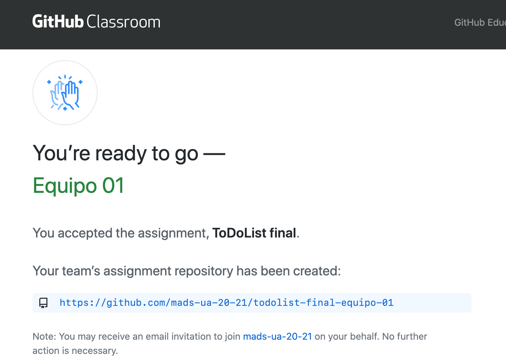
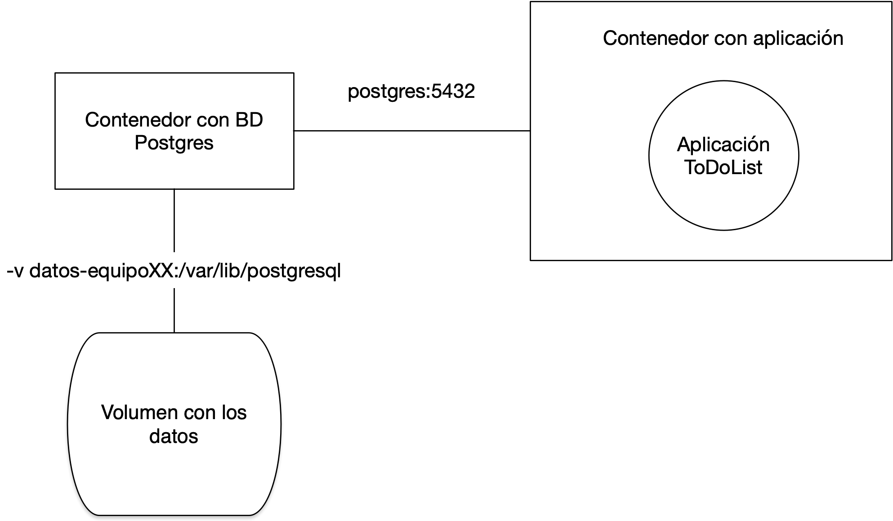

# Práctica 4: Trabajo en equipo con GitFlow y despliegue en producción

## 1. Objetivos y resumen de la práctica ##

En esta práctica se pretende conseguir:

1. Crear los equipos de trabajo en GitHub.
2. Adaptar el flujo de trabajo en Git y GitHub al trabajo en equipo.
3. Desplegar la aplicación usando una base de datos de producción y
   mantener esta base de datos.
4. Implementar GitFlow:
    - Desarrollar nuevas features con GitFlow.
    - Lanzamiento de una versión nueva usando GitFlow.

## 2. Formación de equipos ##

En esta práctica comenzamos a trabajar en equipos de 3 personas.

Cada equipo trabajará con un repositorio común seleccionado de uno de
los miembros del equipo. Utilizaremos _GitHub Classroom_ para crear el
_team_ y el repositorio.

### Pasos a seguir ###

- Debéis formar equipos de **3 personas**. 
  
    De forma excepcional, será posible crear equipos de 2 ó 4 personas. En esta
    práctica y en la siguiente se deberá adaptar la cantidad de trabajo y
    funcionalidades implementadas en función del número de personas del equipo.
  
    Enviad los componentes al foro de Moodle y os asignaré un nombre de
    equipo. Utilizad después el enlace de GitHub Classroom que enviaré al foro
    de Moodle para crear el equipo y apuntaros a él.
  
    El primero que use el enlace debe crear el repositorio,
    escribiendo el nombre del equipo, como se muestra en la siguiente
    imagen.

    

    El equipo trabajará con un repositorio creado por GitHub Classroom
    con el nombre `todolist--NOMBRE-EQUIPO`. Al igual que en
    la práctica 2, el repositorio se creará en la organización `mads-ua-22-23`.

    

    Una vez que la primera persona ha creado el equipo y el
    repositorio, las siguientes personas que usan el enlace pueden
    unirse al equipo creado o crear un nuevo equipo:
    
    

- Una vez creado el repositorio debéis crear en él un tablero para
  gestionar las tarjetas con los _issues_ y los pull
  requests. Ponedle como nombre el nombre del equipo y creadlo con las mismas
  columnas que en las prácticas 2 y 3.

- Escoged el proyecto que vais a usar como punto de partida de estas
  dos últimas prácticas de entre los proyectos de los miembros del
  equipo. Intentad que se un proyecto con código limpio y fácilmente
  ampliable.

    Subidlo al nuevo repositorio, cambiando la URL del `origin` del
    repositorio local y haciendo un push:

    ```
    $ git remote set-url origin https://github.com/mads-ua-22-23/todolist-NOMBRE-EQUIPO.git
    $ git push -u origin main
    ```
    Por último, los otros miembros del equipo deberán clonar el
    repositorio para que todos podáis trabajar con él en local.

- Cambiad el nombre del proyecto (en el fichero `POM.xml` y en el
  `about.html` a `todolist-equipo-XX`.

    Haced un commit directamente en `main` con estos
    cambios. Comprobad que GitHub Actions sigue funcionando
    correctamente. 

## 3. Nuevo flujo de trabajo para los _issues_ ##

Debemos adaptar el flujo de trabajo en GitHub al trabajo en equipo. En
cuanto a la gestión de los _issues_ y tablero del proyecto cambiaremos
lo siguiente:

- **Selección del _issue_**: Al pasar un _issue_ de `To do`a `In
  progress` se debe **asignar un responsable** del desarrollo del _issue_.
- **Nueva rama con el _issue_**: El responsable seleccionado será el que abra una
  rama nueva para el desarrollo del ticket y la subirá a
  GitHub.
- **Desarrollo**: Se trabaja en la rama. Cualquier compañero puede
  unirse al ticket y trabajar junto con el responsable, trabajando
  sobre la rama.
- **Pull request**: Cuando el ticket se ha terminado, el responsable
  abre un pull request en GitHub y pone la tarjeta en la columna
  `In pull request`.
- **Revisión de código**: Debéis configurar la opción de GitHub que obliga a que
  haya un [mínimo de 1 revisor](https://docs.github.com/en/free-pro-team@latest/github/administering-a-repository/enabling-required-reviews-for-pull-requests) en el pull request.
  
    Los miembros del equipo revisan el código en el pull request (consultar documentación en GitHub: [Reviewing
  proposed changes in a pull  request](https://help.github.com/articles/reviewing-proposed-changes-in-a-pull-request/)). Al
  menos uno de los miembros del equipo debe **dar el visto bueno al PR**, añadiendo una reacción. 
  
- **Integración del pull request**: Cuando un miembro da el OK, el
  responsable de la tarea integra el pull request.

Para implementar el trabajo en equipo será necesario trabajar sobre
ramas remotas compartidas. A continuación explicamos con más detalle
algunos aspectos comandos de Git necesarios.

### Comandos Git ###

Veamos algunos comandos de Git relacionados con el trabajo compartido
en repositorios y ramas remotas.

- Subir una rama al repositorio remoto (el responsable del issue):

    ```
    $ git checkout -b nueva-rama
    $ git push -u origin nueva-rama
    ```

- Descargar por primera vez una rama del repositorio remoto y moverse
  a ella (el resto de miembros del equipo):

    ```
    $ (main) git pull
       * [nueva rama] nueva-rama -> origin/nueva-rama
    $ (main) git branch -r (comprobamos las ramas remotas asegurarnos)
    $ (main) git checkout nueva-rama 
      rama 'nueva-rama' configurada para rastrear 'origin/nueva-rama'.
      Cambiado a nueva rama 'nueva-rama'
    $ (nueva-rama)
    ```

- Subir cambios de la rama remota:

    ```
    $ (nueva-rama) git add .
    $ (nueva-rama) git commit -m "Mis cambios"
    $ (nueva-rama) git push
    ```
    
    Si algún compañero ha subido cambios a la rama remota que tenemos
    pendientes de descargar, al hacer un `git push` tendremos un
    error en el que nos indica que debemos hacer antes un `git pull`:
    
    ```
    % (nueva-rama) git push
    To https://github.com/domingogallardo/prueba-clase.git
    ! [rejected]        nueva-rama -> nueva-rama (fetch first)
    error: falló el push de algunas referencias a 'https://github.com/domingogallardo/prueba-clase.git'
    ayuda: Actualizaciones fueron rechazadas porque el remoto contiene trabajo que
    ayuda: no existe localmente. Esto es causado usualmente por otro repositorio
    ayuda: realizando push a la misma ref. Quizás quieras integrar primero los cambios
    ayuda: remotos (ej. 'git pull ...') antes de volver a hacer push.
    ```
    
    Puede ser que al hacer `git pull` nos aparezca el siguiente mensaje de error:
    
    ```
    % (nueva-rama) git pull
    ayuda: Hacer un pull sin especificar cómo reconciliar las ramas es poco
    ayuda: recomendable. Puedes eliminar este mensaje usando uno de los
    ayuda: siguientes comandos antes de tu siguiente pull:
    ayuda: 
    ayuda:   git config pull.rebase false  # hacer merge (estrategia por defecto)
    ayuda:   git config pull.rebase true   # aplicar rebase
    ayuda:   git config pull.ff only       # aplicar solo fast-forward
    ayuda: 
    ayuda: Puedes reemplazar "git config" con "git config --global" para aplicar
    ayuda: la preferencia en todos los repositorios. Puedes también pasar --rebase,
    ayuda: --no-rebase, o --ff-only en el comando para sobrescribir la configuración
    ayuda: por defecto en cada invocación.
    fatal: Necesita especificar cómo reconciliar las ramas divergentes.
    ```
    
    Debemos especificar entonces cómo se van a mezclar los cambios que se bajan
    de la rama remota con los cambios locales. Para ello elegimos la
    primera opción, que no se haga un rebase sino un merge:
    
    ```
    $ (nueva-rama) git config pull.rebase false
    ```
    
    Ahora ya funciona el `git pull` (hará un merge de la rama remota
    con la rama local):

    ```
    $ (nueva-rama) git pull
    (aparecerá un editor en el que tenemos que especificar el mensaje
    del commit de merge, grabar y salir)
    ```
    
    Y ahora ya podemos hacer `push`. Se subirán nuestros cambios y el
    commit de merge:
    
    ```
    $ (nueva-rama) git push
    ```
    
- Comprobar el estado de las ramas locales:

    ```
    $ git branch -vv
    ```

    Con la opción `-a` (`git branch -vva`) se muestra también el
    estado de las ramas _remote tracking_ de solo lectura (en rojo, y
    precedidas con el nombre `remotes/`):
    
    ```
    $  git branch -vva
      main                  dd867ac [origin/main] Colocados esquemas en su directorio
    * prueba                8d2d093 [origin/prueba] Corrección
      remotes/origin/HEAD   -> origin/main
      remotes/origin/main   dd867ac Colocados esquemas en su directorio
      remotes/origin/prueba 8d2d093 Corrección
    ```
    
    Este comando no accede directamente al servidor, sino que muestra
    la información de la última vez que se accedió a él. Si queremos
    la información actualizada podemos hacer un `git fetch --all`
    antes:

    ```
    $ git fetch --all
    $ git branch -vva
    ```

    Es importante recordar que `git fetch` (a diferencia de `git
    pull`) no modifica los repositorios locales, sino que actualiza
    las ramas _remote tracking_.

- Comprobar cambios remotos: podemos comprobar si algún compañero ha subido
  algún commit a alguna rama, y comprobar esos cambios antes de hacer un `merge`:

    ```
    $ (main) git fetch --all
       * Los cambios se descargan a las ramas locales origin/nueva-rama
    $ (main) git diff nueva-rama origin/nueva-rama
    $ (main) git checkout nueva-rama
    $ (nueva-rama) git merge origin/nueva-rama
    ```

- Solución de conflictos en un _merge_:

    Supongamos que hay un conflicto al mezclar los cambios remotos del compañero
    en la nueva rama (haciendo `git pull` o `git merge`). Git detectará el
    conflicto, modificará los ficheros en conflicto y deberemos editarlos para
    quedarnos con los cambios deseados:
    
    ```
    $ (nueva-rama) git pull (o git merge origin/nueva-rama)
      CONFLICTO (contenido): Conflicto de fusión en README.md
      Fusión automática falló; arregle los conflictos y luego realice un commit con el resultado.
    $ git status
      Tienes rutas no fusionadas.
      (arregla los conflictos y ejecuta "git commit"
      (usa "git merge --abort" para abortar la fusion)

      Rutas no fusionadas:
         (usa "git add <archivo>..." para marcar una resolución)
         modificados por ambos:  README.md
    # Editamos los ficheros en conflicto y nos quedamos con los cambios deseados
    $ git add .
    $ git commit -m "Arreglado conflicto"
    $ git push
    ```

    Y el resto de compañeros deberán hacer un `git pull` para actualizar sus
    ramas locales.
    
- Información de los repositorios remotos:

    ```
    $ git remote show origin
    ```

    Proporciona información del repositorio remoto, todas sus ramas,
    del local y de la conexión entre ambos.

    ```
    $ git remote -v update
    ```

    Proporciona información del estado de las ramas remotas y locales
    (si están actualizadas o hay cambios en algunas no bajadas o
    subidas).

- Borrado de ramas remotas desde el terminal:

    ```
    $ git push origin --delete nueva-rama
    $ git remote prune origin
    ```

- Si necesitamos en la rama de _feature_ código que se haya añadido en
  la rama `main`.
  
    Podemos hacer un _merge_ de la rama `main` en la rama de
    _feature_ para incorporar los avances de código que se han hecho
    en `main` y que necesitamos en nuestra nueva rama:
    
    ```
    $ git checkout nueva-rama
    $ git merge main
    ```

- Solución de conflictos en un _pull request_:

    Supongamos que en un _pull request_ GitHub detecta un conflicto entre la
    nueva rama y la rama `main`. En lugar de resolver el conflicto en GitHub es
    recomendable hacerlo en el repositorio local:
    
    ```
    $ git checkout main
    $ git pull
    $ git checkout nueva-rama
    $ git merge main
    # arreglar el conflicto
    $ git push
    # ya se puede hacer el merge en GitHub
    ```

### Pasos a seguir ###

1. Añadid el milestone 1.3.0 y etiquetad todos los próximos issues con
  él. Vamos a probar el nuevo flujo de trabajo descrito anteriormente creando
  un nuevo _issue_ denominado `Actualizar la página Acerca de`. En la
  descripción de _issue_ comentad que se debe modificar la página para
  que muestren todos los miembros del equipo y el nuevo número de
  versión de la aplicación (`1.3.0-SNAPSHOT`).

2. Añadid la regla de que sea necesario un revisor en los pull
   requests. Para ello seleccionar _Settings > Branches > Add branch
   protection rule_, poned como patrón del nombre de rama el nombre
   completo `main` y seleccionad _Require a pull request before
   merging_ y _Require approvals_. Poned 1 como número de revisores
   requeridos.

3. Escoged una persona del equipo como responsable del _issue_. El
  responsable del _issue_ será el responsable de integrarlo en
  `main` y de solucionar los conflictos que puedan surgir.

4. Probad los comandos Git anteriores en una rama en la que se
  resuelva el _issue_. Cada miembro del equipo deberá descargar esa
  rama y realizar un commit en el que se añada su nombre a la lista de
  autores de la aplicación.
  
5. Cread un conflicto entre commits de dos miembros del equipo. Cambiar los dos
   la misma línea del fichero, haced commit (llamadlo "Provocando un conflicto")
   e intentad subir los commits a la rama. El último que lo haga no podrá,
   tendrá que hacer un `pull` y se generará un conflicto. Resolved el conflicto
   y subir el fichero corregido.

6. Cread el pull request en GitHub, poniendo como responsable del PR al
  mismo responsable del _issue_.

7. Provocad otro conflicto y arregladlo. Para ello se debe añadir un
  commit en `main` que entre en conflicto con los cambios realizados
  en la rama. Podéis añadir el commit editando directamente el fichero en
  GitHub. Arreglad el conflicto tal y como se explica en el apartado anterior.
  
8. Por último, revisad el código, aceptadlo e integrad el PR en
   _main_.


## 4. Contenedor con la aplicación ToDoList ##

Una de las cosas que vamos a hacer en esta práctica (en el siguiente
apartado) es poner en producción en uno de vuestros ordenadores la
aplicación ToDoList conectándola con la base de datos. En las
prácticas 1 y 2 ya hemos construido el contenedor Docker de la
aplicación, con el siguiente fichero Dockerfile:

```docker
FROM openjdk:8-jdk-alpine
COPY target/*.jar app.jar
ENTRYPOINT ["java","-Djava.security.egd=file:/dev/urandom","-jar","/app.jar"]
```

Este Dockerfile tiene un problema importante. El comando de ejecución
es fijo y no permite definir ningún parámetro de ejecución. No es
posible, por ejemplo, definir el perfil de Postgres, ni definir
ningún parámetro de configuración.

Debemos cambiarlo de la siguiente forma:

```docker hl_lines="3"
FROM openjdk:8-jdk-alpine
COPY target/*.jar app.jar
ENTRYPOINT ["sh","-c","java -Djava.security.egd=file:/dev/urandom -jar /app.jar ${0} ${@}"]
```

De esta forma podremos llamar al comando docker añadiendo al final
parámetros que se van a pasar al comando java. La forma de añadir
variables de entorno a ese comando java es precediéndolos con dos
guiones `--`. Por ejemplo:

```
$ docker run --rm <usuario>/mads-todolist-equipoXX --spring.profiles.active=postgres --POSTGRES_HOST=host-prueba 
```

Vamos a probarlo, creando y subiendo la nueva imagen a
DockerHub y desplegándola en uno de vuestros ordenadores. Este
despliegue es lo que haré yo para corregir la práctica.

### Pasos a seguir ###

Debéis hacer lo siguiente:

1. Creamos un issue llamado `Configuración imagen docker` y
   trabajamos en la rama `imagen-docker`.

2. Cambiad el fichero Dockerfile de la aplicación tal y como se indica en el listado
   anterior:
   
    ```docker title="./Dockerfile"
    FROM openjdk:8-jdk-alpine
    COPY target/*.jar app.jar
    ENTRYPOINT ["sh","-c","java -Djava.security.egd=file:/dev/urandom -jar /app.jar ${0} ${@}"]
    ```

3. Modificad el fichero en el directorio `main` con el perfil `postgres` para
   incluir la opción de usar variables de entorno, al igual que
   hicimos en el perfil `postgres` de test.
   
    ```title="src/main/resources/application-postgres.properties"
    POSTGRES_HOST=localhost
    POSTGRES_PORT=5432
    DB_USER=mads
    DB_PASSWD=mads
    spring.datasource.url=jdbc:postgresql://${POSTGRES_HOST}:${POSTGRES_PORT}/mads
    spring.datasource.username=${DB_USER}
    spring.datasource.password=${DB_PASSWD}
    spring.jpa.properties.hibernate.dialect = org.hibernate.dialect.PostgreSQL9Dialect
    ```

4. Cread la nueva imagen Docker con el nombre
   `mads-todolist-equipoXX` y la etiqueta `1.3.0-snapshot`. El usuario puede ser cualquier miembro
   del equipo, no es necesario que sea el autor del proyecto original.
   
    ```
    $ ./mvnw package
    $ docker build -t <usuario-docker>/mads-todolist-equipoXX:1.3.0-snapshot . 
    ```

5. Probad que funcionan correctamente los parámetros de configuración
   en la imagen Docker. Una forma sencilla de hacerlo es comprobar que
   se puede definir el perfil de Postgres y modificar alguno de sus
   parámetros. Deberá aparecer un mensaje de error de que no se puede
   conectar con la base de datos (lo que está bien, porque significa
   que sí que se ha cargado el perfil).
   
    ```
    $ docker run --rm <usuario>/mads-todolist-equipoXX:1.3.0-snapshot --spring.profiles.active=postgres --POSTGRES_HOST=host-prueba 
    ```

    
    

6. Subid, por último, la imagen a Docker Hub y cerrad el PR y el issue.
   
    ````
    $ docker login
    $ docker push <usuario-docker>/mads-todolist-equipoXX:1.3.0-snapshot
    ````


## 5. Despliegue en producción con BD ##

Vamos a ver cómo ejecutar en producción el contenedor con la
aplicación de forma que se conecte con una base de datos postgres.

En las prácticas 1 y 2 vimos cómo construir una versión en forma de
contenedor de nuestra aplicación Spring Boot y en la práctica 3 vimos
como usar un contenedor de Postgres para definir un servicio de base
de datos con el que conectar la aplicación.

En esta práctica vamos a definir la configuración en producción
definitiva de nuestra aplicación. Veremos cómo poner en marcha dos
contenedores y conectarlos entre si. En nuestro caso un contenedor
tendrá la base de datos postgres y el otro la aplicación Spring Boot.



La imagen anterior muestra los dos contenedores conectados por una
red. Desde el contenedor con la aplicación se accederá a la dirección
`postgres:5432` para conectarse con la base de datos. Veremos los
comandos de docker para definir una red y para lanzar el contenedor de
base de datos en esa dirección de la red.

El contenedor de base de datos montará el directorio actual del host en el
directorio `/mi-host` del contenedor. De esta forma este directorio será
compartido y cualquier fichero que coloquemos en ese directorio del contenedor
será visible en el directorio actual del host (y viceversa). Usaremos este
directorio para guardar datos de la base de datos, como copias de seguridad o
ficheros de migración.

El contenedor de base de datos implementará la base de datos en
producción. 

!!! Note "Base de datos de producción"
    La base de datos de producción es la que mantiene los datos
    introducidos por los usuarios de la misma. Hay que prestar una
    atención especial a esta base de datos y definir políticas de
    respaldo y de control de cambios para evitar que se produzca
    cualquier pérdida de información. Veremos que una
    de las cuestiones que hay que asegurar es que la aplicación no
    puede modificar el esquema de datos de esta base de datos. 
    
    Habrá que definir también un flujo de trabajo para actualizar la base de
    datos de producción con los cambios del modelo de datos
    introducidos por la nuevas funcionalidades (nuevas tablas y nuevas
    relaciones).

### Pasos a seguir ###

Veamos paso a paso cómo crear la configuración anterior en uno de
vuestros ordenadores, que usaréis como ordenador de despliegue.

1. Creamos en nuestro ordenador de despliegue una red gestionada por
   Docker: 

    ```
    $ docker network create network-equipo
    ```

2. Lanzamos el contenedor con la base de datos usando la red creada
  anteriormente y con el nombre `db-equipo`. Definimos el nombre del
  host creado en el contenedor como `postgres` con el modificador
  `--network-alias`.

    ```
    $ docker run -d --network network-equipo --network-alias postgres -v ${PWD}:/mi-host --name db-equipo -e POSTGRES_USER=mads -e POSTGRES_PASSWORD=mads -e POSTGRES_DB=mads postgres:13
    ```

    El modificador `-v` permite montar el directorio actual en el
    directorio `/mi-host` del contenedor. 
    
    !!! Note "Opción -v de Docker en Windows"
        Si estáis en Windows deberéis especificar el directorio actual explícitamente, sustituyendo las barras por barras dobles:
        ```
        $ docker run -d --network network-equipo --network-alias postgres -v C:\\users\\domingo\\tmp:/mi-host --name db-equipo -e POSTGRES_USER=mads -e POSTGRES_PASSWORD=mads -e POSTGRES_DB=mads postgres:13
        ```
    
    Vamos a probar que funciona  correctamente. 

3. Nos conectamos al contenedor lanzando un `bash`
   interactivo. Estando en el contenedor creamos un fichero en el
   directorio `/mi-host`, salimos del contenedor y comprobamos que
   está en el directorio actual

    ```
    $ docker exec -it db-equipo bash
    root@e470db191dc6:/# cd /mi-host
    root@e470db191dc6:/mi-host# echo "Hola" > prueba.txt
    root@e470db191dc6:/mi-host# exit
    $ ls
    prueba.txt
    $ more prueba.txt
    Hola
    ```

4. Con esto ya tenemos configurado y en marcha el contenedor con la
   base de datos Postgres. Esta va a ser nuestra base de datos de
   producción. Vamos ahora a poner en marcha la aplicación.

    Descargamos la última versión de nuestra aplicación y lanzamos el
    contenedor usando la red definida anteriormente. Los modificadores
    `--spring.profiles.active` y `--POSTGRES_HOST` permiten pasar al
    contenedor esas variables del entorno.

    ```
    $ docker pull <usuario>/mads-todolist-equipoXX:1.3.0-snapshot
    $ docker run --rm --network network-equipo -p8080:8080 <usuario>/mads-todolist-equipoXX:1.3.0-snapshot --spring.profiles.active=postgres --POSTGRES_HOST=postgres
    ```

    ¡¡¡Enhorabuena!!! ¡Ya tenemos la aplicación en producción
    trabajando con la base de datos!

    Podremos conectarnos a la aplicación usando el puerto 8080.

    Probamos la aplicación y creamos algún usuario de prueba. Por último
    paramos el contenedor y lo volvemos a arrancar para comprobar que los
    datos son persistentes.

5. Para comprobar que la base de datos está funcionando correctamente
   podemos conectarnos al contenedor y examinar la base de datos
   `mads` y alguna de sus tablas:

    ```
    $ docker exec -it db-equipo bash
    # psql -U mads -W mads (nos pedirá la contraseña: mads)
    # \l (lista las bases de datos)
    # \dt (lista las tablas)
    # SELECT * FROM usuarios;
    ```

    La base de datos se mantendrá mientras que no borremos el
    contenedor. Podemos pararlo y volver a ponerlo en marcha y seguiremos
    conservando los datos:

    ```
    $ docker stop db-equipo
    $ docker start db-equipo
    ```

## 6. Perfil de producción y mantenimiento de la base de datos de producción ##

### Perfil de producción ###

Una vez que vamos a trabajar en producción con una base de datos, esta
base de datos será un elemento clave de la aplicación. No debemos
bajo ningún concepto perder datos que se hayan introducido en ella,
ya que son datos de nuestros usuarios y clientes.

Es imprescindible para ello cambiar el modo con el que la aplicación
construye las tablas de la base de datos. Sabemos que nuestra
aplicación está trabajando con JPA/Hibernate y que las tablas de la
base de datos se construyen de forma automática. Si hay algún cambio
en las entidades (se añade algún atributo o alguna nueva entidad)
Spring Boot actualiza las tablas de la base de datos de forma
automática cuando se lanza la aplicación. Esto es razonable si estamos
trabajando en un entorno de desarrollo, pero está **totalmente
desaconsejado** en un entorno de producción.

El parámetro `spring.jpa.hibernate.ddl-auto` es el que determina el
funcionamiento de la actualización de las tablas de la base de
datos. Su valor puede ser:

- `CREATE`: El esquema de datos se crea de nuevo cada vez que se lanza
  la aplicación. Una vez creado, se añaden los datos definidos en el
  fichero `data.sql` si el
  `spring.sql.init.mode` tiene como valor `always`.

- `UPDATE`: El esquema de datos de la base de datos se actualiza
  automáticamente cuando hay un cambio en las entidades de la
  aplicación. Así es como tenemos configurado el perfil por defecto de
  nuestra aplicación. Si estamos trabajando con la base de datos
  Postgres, se actualizará el esquema de datos. Pero esto no es
  recomendable para producción, porque no tenemos control de las
  instrucciones de actualización y pueden resultar en alguna pérdida
  de datos.

- `VALIDATE`: El esquema de datos de la base de datos se valida con
  respecto al esquema de datos definido por las entidades JPA. Si hay
  alguna diferencia, salta una excepción. Este es el valor que hay que
  usar cuando lanzamos la aplicación en producción.
  
Vamos a definir en la aplicación un nuevo perfil de ejecución, llamado
`postgres-prod`, en el que pondremos el valor del parámetro
`spring.jpa.hibernate.ddl-auto` a `VALIDATE`. Y será este el perfil
que usaremos para lanzar la aplicación en uno de vuestros ordenadores,
que hará de servidor de producción.


### Mantenimiento de la base de datos de producción ###

En una aplicación en producción se deben configurar políticas
estrictas de realización de copias de seguridad y de integridad de los
datos. También en la gestión de las versiones y en la actualización
del esquema de datos. 

Esto último se denomina una _migración_ de la base de datos y
representa un elemento fundamental del mantenimiento en producción de
una aplicación, sobre todo cuando estamos trabajando de una forma ágil
e incremental. Es un tema avanzado muy importante, pero que no podemos
abordar en la asignatura por falta de tiempo. Un par de referencias
que os pueden ser de utilidad son el artículo [Evolutionary Database
Design](https://martinfowler.com/articles/evodb.html) y herramientas
como
[Flyway](https://www.baeldung.com/database-migrations-with-flyway) que
permiten automatizar las migraciones de la base de datos.

En la práctica vamos a trabajar con la base de datos de producción de
dos formas:

1. Realizaremos una copia de seguridad antes de instalar una nueva
   versión.
2. Actualizaremos el esquema de datos aplicando un fichero de
   migración que construiremos manualmente.

#### Copias de seguridad ####

Si eliminamos el contenedor con la base de datos se perderán todos los
datos. Para evitar perder los datos, con el contenedor en marcha
podemos hacer una copia de seguridad de la base de datos `mads` en el
directorio compartido:

```
$ docker exec -it db-equipo bash
# pg_dump -U mads --clean mads > /mi-host/backup03092021.sql
```

La copia de seguridad se guarda en el directorio compartido. Podemos
poner la fecha en el nombre del fichero. Por ejemplo, la copia
anterior ha sido creada el 3 de septiembre del 2021.

Para restaurar una copia de seguridad basta con ejecutar el fichero
SQL en la base de datos:

```
$ docker exec -it db-equipo bash
# psql -U mads mads < /mi-host/backup03092021.sql
# exit
```

#### Migración de la base de datos ####

Podemos obtener el esquema de datos de la aplicación (la definición de
las tablas, sin los datos) conectándonos al contenedor y ejecutando el
siguiente comando para guardar el fichero en el directorio compartido:

```
$ docker exec -it db-equipo bash
# pg_dump -U mads -s mads > /mi-host/schema.sql
# exit
```

Tendremos el esquema de datos en el directorio actual, que hemos
montado en el contenedor con la instrucción -V.

Los esquemas son instrucciones SQL en texto plano. Supongamos que
tenemos una nueva versión de la aplicación (`1.3.0`) en la que hemos
añadido el atributo `descripcion` a la entidad `Equipo`.

Si generamos el esquema de datos de esta nueva versión y lo llamamos
`schema-1.3.0.sql` lo podemos comparar con el esquema anterior usando
el comando de linux `diff`:

```
% diff sql/schema-1.3.0.sql sql/schema-1.2.0.sql 
41,42c41
<     nombre character varying(255),
<     descripcion character varying(255)
---
>     nombre character varying(255)
```

Por ejemplo, en el ejemplo mostrado, el fichero `schema-1.3.0.sql` tiene un
campo adicional que el fichero `schema-1.2.0.sql`. Se trata del
campo `descripcion`. En la versión anterior (`schema-1.2.0.sql`) la
tabla `equipo` se define como:

```sql
CREATE TABLE public.equipos (
    id bigint NOT NULL,
    nombre character varying(255)
);
```

Mientras que en la versión nueva (`schema-1.3.0.sql`) se define como:

```sql
CREATE TABLE public.equipos (
    id bigint NOT NULL,
    nombre character varying(255),
    descripcion character varying(255)
);
```

Si queremos migrar la base de datos de producción de una versión a
otra, debemos crear un script de migración en el que modifiquemos
únicamente el esquema de datos anterior para adaptarlo al nuevo.

En este caso el script lo llamaremos `schema-1.2.0-1.3.0.sql` y
contendrá únicamente la siguiente instrucción:

```sql
ALTER TABLE public.equipos
ADD COLUMN descripcion character varying(255)
```

Para actualizar la base de datos de producción sólo tenemos que
ejecutar el script anterior:

```
$ docker exec -it db-equipo bash
$ psql -U mads mads < /mi-host/schema-1.2.0-1.3.0.sql
ALTER TABLE
$ exit
```

De esta forma habremos añadido manualmente un campo en la tabla
`equipos`.

La aplicación deberá funcionar ahora perfectamente si la lanzamos en
modo producción, definiendo la variable que hemos mencionado antes con
el modo `validate`:

```
spring.jpa.hibernate.ddl-auto=validate
```

### Pasos a seguir ###

1. Creamos un issue llamado `Esquema de datos y perfil de producción` y trabajamos
   en la rama `esquema-datos` y en el pull request equivalente.
   
    ```
    $ git checkout -b esquema-datos
    $ git push -u origin esquema-datos
    ```

2. Lanzamos la aplicación en local con el modo `postgres`, trabajando
   sobre la base de datos. Previamente hemos lanzado el contenedor postgres
   montando el directorio actual en su directorio `/mi-host/`:
   
    ```
    $ docker run -d -p 5432:5432 -v ${PWD}:/mi-host --name db-equipo -e POSTGRES_USER=mads -e POSTGRES_PASSWORD=mads -e POSTGRES_DB=mads postgres:13
    $ ./mvnw spring-boot:run -D profiles=postgres
    ```

3. Al lanzar la aplicación se habrá creado en la base de datos el
   esquema de datos. Lo generamos y lo salvamos en el directorio
   actual:
   
    ```
    $ docker exec -it db-equipo bash
    # pg_dump -U mads -s mads > /mi-host/schema-1.2.0.sql
    # exit
    ```
   
4. Comprobamos que el esquema de datos se ha creado correctamente y lo
   movemos al directorio `sql` en el directorio raíz:
   
    ```
    $ ls -l
    Dockerfile
    README.md
    mvnw
    mvnw.cmd
    pom.xml
    schema-1.2.0.sql
    src
    target
    $ mkdir sql
    $ mv schema-1.2.0.sql sql
    ```

5. Creamos un commit con el nuevo fichero con el esquema de datos.

6. Creamos un nuevo fichero con el perfil de producción, que contiene
    exactamente la misma configuración del perfil postgres, excepto la
    propiedad `spring.jpa.hibernate.ddl-auto` que tiene el valor
    `validate`.

    **Fichero ``**:
    
    ```hl_lines="10" title="/src/main/resources/application-postgres-prod.properties"
    POSTGRES_HOST=localhost
    POSTGRES_PORT=5432
    DB_USER=mads
    DB_PASSWD=mads
    spring.datasource.url=jdbc:postgresql://${POSTGRES_HOST}:${POSTGRES_PORT}/mads
    spring.datasource.username=${DB_USER}
    spring.datasource.password=${DB_PASSWD}
    spring.jpa.properties.hibernate.dialect = org.hibernate.dialect.PostgreSQL9Dialect
    spring.jpa.hibernate.ddl-auto=validate
    ```

7. Probamos en local que el perfil funciona correctamente, lanzándolo:

    ```
    $ ./mvnw spring-boot:run -D profiles=postgres-prod
    ```

    Probamos que realmente valida el esquema de datos, en lugar de
    actualizarlo. Para ello, paramos y borramos el contenedor postgres
    y lo lanzamos de nuevo. Esto creará una base de datos vacía:
    
    ```
    $ docker container stop db-equipo
    $ docker container rm db-equipo
    $ docker run -d -p 5432:5432 -v ${PWD}:/mi-host --name db-equipo -e POSTGRES_USER=mads -e POSTGRES_PASSWORD=mads -e POSTGRES_DB=mads postgres:13
    ```
    
    Si ahora lanzamos la aplicación en modo `postgres-prod`
    obtendremos un error:
    
    ```
    $ ./mvnw spring-boot:run -D profiles=postgres-prod
    org.springframework.beans.factory.BeanCreationException: Error
    creating bean with name 'entityManagerFactory' defined in class
    path resource  [org/springframework/boot/autoconfigure/orm/jpa/HibernateJpaConfiguration.class]: 
    Invocation of init method failed; nested exception is
    javax.persistence.PersistenceException: [PersistenceUnit: default]
    Unable to build Hibernate SessionFactory; nested exception is 
    org.hibernate.tool.schema.spi.SchemaManagementException: 
    Schema-validation: missing table [equipo_usuario]
    ```
8. Actualizamos el contenedor postgres con el esquema de base de datos
   salvado anteriormente:
   
    ```
    $ docker exec -it db-equipo bash
    # psql -U mads mads < /mi-host/sql/schema-1.2.0.sql
    # exit
    ```

    Y arrancamos la aplicación y comprobamos que ahora sí que funciona
    correctamente (la base de datos ya tiene el esquema de datos correcto).
    
9.  Introducimos en la aplicación algunos datos de prueba y hacemos
    una copia de seguridad tal y como se explica
    anteriormente. Dejamos el fichero en el directorio `sql` del
    repositorio, indicando la fecha en el nombre del mismo. Por
    ejemplo `sql/backup15112022.sql`.

10. Hacemos un commit, subimos los cambios y cerramos el pull request y
   el issue.

## 7. Desarrollo de la nueva versión con GitFlow ##

El flujo de trabajo Git que vamos a seguir es muy similar al flujo de
trabajo GitFlow (recordad la [clase de
teoría](https://github.com/domingogallardo/apuntes-mads/blob/main/apuntes/08-git-workflows/git-workflow.md#gitflow))

### Ramas de largo recorrido ###

En GitFlow se publican las distintas versiones del proyecto en la rama
_long-lived_ `main` y se hace el desarrollo en la rama
`develop`. A partir de ahora no desarrollaremos directamente en
`main` sino en `develop`.

En la página de configuración del repositorio en GitHub en `Settings >
Branches > Default branch` se puede configurar la rama por defecto
contra la que se realizarán los commits y la que aparecerá en la
página del proyecto. Tendréis que definir `develop`.

### Ramas de feature ###

Desde el comienzo de trabajo con Git en las prácticas 2 y 3 estamos
haciendo un desarrollo basado en ramas de corto recorrido,
equivalentes a las ramas de _features_ de GitFlow. 

Tal y como se comenta en GitFLow estas ramas saldrán de `develop` y se
integrarán en `develop`. La diferencia es que en GitFlow estas ramas
se integran con la rama de desarrollo manualmente haciendo `merge`,
mientras que nosotros las integramos haciendo un pull request.

### Pasos a seguir ###

1. Cread la rama **`develop`** y configurarla como rama principal del
  proyecto en GitHub. Añadir en los ajustes del repositorio la regla
  para obligar a revisar todos los PR que se mezclen en esta rama. Todos
  los otros miembros deberán descargarla y moverse a ella en sus
  repositorios locales. Esta rama pasará a ser la de desarrollo
  principal.

2. Cread dos, tres o cuatro _issues_ (dependiendo del número de personas de
  vuestro grupo) distintos, simulando nuevas funcionalidades. Deben ser issues
  sencillos, que no cuesten demasiado de implementar (mejorar algún defecto de la aplicación,
  cambiar algún elemento de alguna de las vistas, o algo
  similar). **Uno de los cambios debe afectar a alguna entidad**, por
  ejemplo añadir un campo de descripción a los equipos y actualizar
  las vistas correspondientes para permitir su inicialización y su
  actualización.

    Cada uno de los miembros del equipo será el responsable de
    uno de los issues.
  
3. Configurad el repositorio GitHub para obligar a que cualquier _pull
  request_ tenga que tener la revisión de una persona distinta del
  responsable del PR.
  
4. Desarrollad e integrar los issues en `develop` siguiendo el flujo de
  trabajo planteado anteriormente. Debéis ir actualizando el tablero
  de GitHub se actualiza correctamente.

### Rama de release ###

Hasta ahora hemos hecho los _releases_ en la rama `main`. A partir
de ahora seguiremos la estrategia de GitFlow y haremos ramas de
_release_ que salen de `develop` y se integran en `main` y en
`develop`.

Haremos también la integración haciendo pull request.

Una cosa importante que tendremos que hacer en el release es crear el
guardar el de datos de la nueva versión y crear el script de migración
de la base de datos.

### Pasos a seguir ###

Vamos a probar el lanzamiento de una release usando el flujo de
trabajo GitFlow.

1. Cread un _issue_ con la tarea _Lanzar release 1.3.0_.

2. Siguiendo las indicaciones de GitFlow, crear la rama local
   `release-1.3.0` a partir de `develop`.
   
3. En esta rama se deben realizar los cambios específicos de la
   versión. En nuestro caso:
   
    - Cambiar en la página `Acerca de` "Versión 1.3.0-SNAPSHOT" a
          "Versión 1.3.0" y añadir la fecha de publicación.
    - Cambiar el fichero `pom.xml`.
    - Generad el **esquema de datos** de la base de datos postgres
      y guardarlo en `sql/schema-1.3.0.sql`. 
    - Comparar este esquema con el esquema anterior y crear el script
      de migración con las instrucciones `ALTER TABLE` necesarias para
      actualizar la base de datos de producción de la versión 1.2.0 a
      la 1.3.0. Guardar el script en `sql/schema-1.2.0-1.3.0.sql`.

4. Comprobad que funciona correctamente el script de migración. Para
   ello deberéis simular que ponéis en marcha la aplicación en modo
   producción trabajando con una actualización de la base de datos:
   
    - Poner en marcha una base de datos de producción vacía.
    - Actualizar la base de datos con la copia de seguridad guardada en
      el directorio `sql`.
    - Actualizar la base de datos con el script de migración
      `sql/schema-1.2.0-1.3.0.sql`, tal y como se explica en el apartado
      anterior. 
    - Lanzar el contenedor de la aplicación con el perfil
      `postgres-prod` y comprobar que funciona correctamente la
      aplicación en producción y que se mantienen los datos
      anteriores.
    - Añadir nuevos datos y hacer una nueva copia de seguridad que se
      debe guardar también en el directorio `src`, con la fecha actual
      como nombre como hicimos anteriormente. Por ejemplo,
      `src/backup-20112022.sql`.
    - Haced un commit para añadir esta nueva copia de seguridad al
      repositorio. 

5. Publicad la rama `release-1.3.0` en GitHub y hacer un pull
   request sobre `main`. Una vez mezclado el PR añadir la
   etiqueta con la nueva versión `1.3.0` en `main` creando la
   página de release en GitHub.

5.  Mezclar también la rama de release con `develop` (se puede hacer
    también con un PR).

6. Subir la nueva versión de la imagen de docker a Docker Hub.

7. Una vez hecho esto ya se puede borrar la rama `release-1.3.0` y las
  ramas `main` y `develop` estarán actualizadas a la nueva
  versión.
  
8. Debemos comprobar que GitHub Actions pasa correctamente todos los
   tests de las nuevas características que se añaden.


## 9. Documentación, entrega y evaluación ##

Deberéis añadir una página de documentación `/doc/practica4.md` en la
que deberéis incluir:

- Breve documentación técnica de los cambios introducidos en la
  aplicación.
- Detalles del despliegue de producción. Esquemas de datos de las
  versiones 1.2.0 y de la versión 1.3.0. Script de migración de la
  base de datos.
- URL de la imagen Docker de la aplicación.

Entrega:

- La práctica tiene una duración de 2 semanas y debe estar terminada
  el martes 28 de noviembre.
- La calificación de la práctica tiene un peso de un 15% en la nota
  final de prácticas.
- Para realizar la entrega **uno de los miembros del equipo** debe subir a
  Moodle un ZIP que contenga todo el proyecto, incluyendo el
  directorio `.git` que contiene la historia Git. Para ello comprime
  tu directorio local del proyecto después de haber hecho un `mvn
  clean` para eliminar el directorio `target` que contiene los
  binarios compilados.

Para la evaluación se tendrá en cuenta:

- Desarrollo continuo (los _commits_ deben realizarse a lo largo de
  las semanas y no dejar todo para la última).
- Correcto desarrollo de la metodología.
- Diseño e implementación del código y de los tests de las
  características desarrolladas.
- Funcionamiento de la aplicación con las bases de datos de producción
  y funcionamiento del script de migración.
- Documentación.

